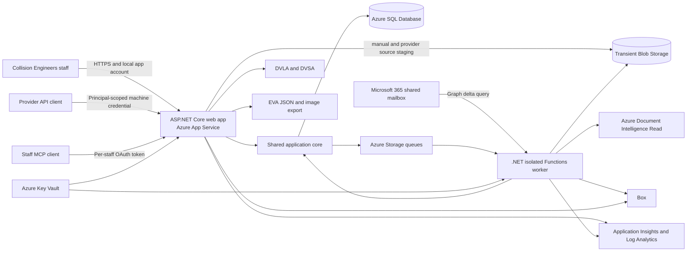

# ADR-0002: .NET modular monolith on Azure App Service

- Status: Accepted; provider API/MCP authentication boundary superseded by ADR-0004, deployment mechanism partially superseded by ADR-0007, the expand-and-contract schema clause superseded by ADR-0030 for pre-cutover releases only, and polling/timer-first intake triggering partially superseded by ADR-0032
- Date: 2026-07-23
- Owners: Alex and the Pegasus development team

## Context

Pegasus is a staff case-management application for approximately eight
concurrent users and 2,000 new cases per month. It must continuously ingest a
shared Outlook mailbox, process documents and images, manage the full QDOS case
workflow, use Box as the long-term file store, and expose provider API and MCP
capabilities. The application must be hosted in Azure and developed and operated
from PowerShell 7.

The previous application accumulated duplicated functions, behavioural drift,
and an unwieldy structure. The replacement therefore needs one authoritative
implementation of each business rule and strong dependency boundaries, without
introducing a microservice estate that is disproportionate to the workload.

This decision selects the application stack, code boundaries, Azure runtime,
data stores, integration patterns, deployment model, and initial cost envelope.
PDF extraction remains governed by
[ADR-0001](0001-hybrid-pdf-extraction.md).

The runtime, project, data, and Azure decisions in this ADR remain accepted.
[ADR-0004](0004-provider-api-and-staff-mcp-authentication.md) supersedes
only the combined provider API/MCP client and authentication model shown here.
[ADR-0007](0007-direct-terminal-azure-deployment.md) supersedes only this
ADR's GitHub Actions/OIDC deployment mechanism. The modular-monolith, runtime,
data, regional, and cost decisions remain accepted.

## Decision summary

Pegasus will be a .NET 10 LTS modular monolith with:

- ASP.NET Core 10 Razor Pages for the staff interface and ASP.NET Core HTTP APIs
  for machine integrations;
- ASP.NET Core Identity for application-managed staff usernames, passwords, and
  roles;
- one shared domain/application core used by both the web application and all
  background processing;
- Entity Framework Core 10 and one Azure SQL Database per environment;
- a Free F1 Linux Azure App Service for shared development and a Basic B1 Linux
  Azure App Service for production;
- a separate Azure Functions Flex Consumption application, using the .NET
  isolated worker model, for mailbox polling and queued background work;
- Azure Storage queues for internal asynchronous commands and transient Blob
  Storage for file processing;
- Box as the authoritative long-term store for original case files and their
  versions;
- Bicep and Azure Developer CLI for infrastructure and authorised-terminal
  deployments, as defined by ADR-0007.

The `0.1.0-alpha.1` will not use microservices, Kubernetes, a single-page application,
Blazor Server, Azure Service Bus, Cosmos DB, Redis, API Management, private
networking, multi-region deployment, or zone redundancy.

### 2026-07-25 scope clarification

Later authoritative product decisions make GitHub deployment/OIDC, separate
staging/QA/UAT/demo environments, S1/deployment slots, private networking,
zone redundancy, multi-region deployment, and malware scanning permanent
`Not planned` boundaries. The earlier deferred-scanning, `0.1.0-alpha.1` exclusion, and
S1/slot-upgrade passages below are retained as historical decision evidence;
they do not create an activation, migration, or upgrade path. Custom domain
remains conditional `Later`/`unallocated` and needs a direct future product decision.

## Technology stack

| Concern | Selected technology | Reason |
| --- | --- | --- |
| Runtime | .NET 10 LTS and C# | Current LTS release, natively available on Linux App Service and supported by Flex Consumption Functions. |
| Staff UI | ASP.NET Core Razor Pages, server-rendered HTML, CSS, and small JavaScript modules where required | Fits a form- and queue-heavy internal application without a second client application or duplicated validation model. |
| HTTP API and MCP transport | ASP.NET Core endpoints in the web application | Keeps API, MCP, authorization, permanent action history, and business rules in one deployable boundary. |
| Staff accounts | ASP.NET Core Identity with cookie authentication | Provides application-managed users, versioned password hashing, roles, lockout, and secure cookie support without making Entra the staff sign-in system. |
| Persistence | EF Core 10 with Azure SQL Database | Supports transactions, unique constraints, relational case data, durable action-history records, and simple scaling at this workload. |
| Background work | Azure Functions Flex Consumption, .NET isolated | Separates continuous ingestion and retries from the web process while reusing the same application core. |
| Internal messaging | Azure Storage queues | Provides inexpensive at-least-once delivery, retries, and poison queues without the operational surface of Service Bus. |
| Transient files | Azure Blob Storage, locally redundant | Buffers mailbox and upload content while it is processed and transferred to Box. |
| Long-term files | Box | Preserves the existing business file store and folder/version identifiers. |
| Infrastructure | Bicep under `infra/`, orchestrated by `azd` | Repeatable Azure environments using the mandated PowerShell/Azure toolchain. |
| Release route | Authorised terminal using committed Bicep and `azd` | Preserves a direct, reviewable route; ADR-0007 defines its required migration, package, identity, and evidence gates. |

The staff UI will use the Collision Engineers design system. A Node-based SPA
toolchain will not be introduced unless a later interaction demonstrably cannot
be delivered cleanly with server-rendered pages and small client-side modules.

## Runtime architecture



This is two runtime processes but one application. The web and worker must call
the same use cases and domain rules; the worker is not a second implementation
of the case system.

## Repository and dependency boundaries

The initial solution will contain four production projects rather than a project
per feature:

```text
src/
  Pegasus.Core/
  Pegasus.Infrastructure/
  Pegasus.Web/
  Pegasus.Worker/
tests/
  Pegasus.Core.Tests/
  Pegasus.IntegrationTests/
  Pegasus.ArchitectureTests/
infra/
```

The dependencies are deliberately one-way:

```text
Pegasus.Web ---------> Pegasus.Core
         |                            ^
         +--> Pegasus.Infrastructure
                                      |
Pegasus.Worker ------> Pegasus.Core
         |
         +--> Pegasus.Infrastructure
```

- `Pegasus.Core` owns the domain model, application use cases, ports, and
  provider-specific business rules. It must not reference EF Core, Azure, Graph,
  Box, HTTP, or a PDF SDK.
- `Pegasus.Infrastructure` implements Core ports for SQL, Box, Graph,
  Azure storage, OCR, PDF decoding, DVLA/DVSA, EVA export, clock, and other
  external systems. It depends on Core.
- `Pegasus.Web` owns Razor Pages, HTTP/API/MCP endpoints, staff cookie
  authentication, request validation, and dependency composition. It contains no
  authoritative case rules.
- `Pegasus.Worker` owns Function triggers and dependency composition. A
  trigger translates an external event into a Core use case; it contains no
  provider parsing, matching, numbering, or workflow rules.

Core will use feature folders such as `Intake`, `Cases`, `Principals`,
`Documents`, `Workflow`, `ActionHistory`, and `Integrations`. We will not split these into
separate assemblies until a measured dependency or ownership problem justifies
it. Cross-feature access goes through named use cases, not direct writes to
another feature's tables.

Architecture tests will mechanically prevent forbidden project references and
Infrastructure namespaces inside Core. These checks will be added when the
solution is scaffolded; no placeholder checker will be added before there is a
real project graph to validate.

## Data ownership and consistency

Each Azure environment has one Azure SQL logical server and one application
database. The application uses one EF Core `DbContext` and one ordered migration
stream. Tables may be grouped into purpose-named schemas, but there will not be a
database or migration project per feature.

Important consistency rules are:

- A case state change, its action event, and any outbound work item are written in
  one SQL transaction.
- A SQL outbox dispatcher places work-item identifiers on Storage queues. Queue
  messages contain identifiers, not documents or unnecessary personal data.
- Queue delivery is treated as at least once. Every handler has an idempotency
  key and can safely retry; exhausted messages go to a poison queue and generate
  an operational alert.
- External receipts are recorded in an inbox table before processing. Graph
  messages use the mailbox plus Microsoft Graph immutable item ID; Box and other
  systems use their own stable source/version IDs.
- Action events are appended through application code. Case closure, reopening,
  merge reversal, configuration changes, automated actions, and failed external
  operations are attributable and retained.
- Cases and file records are archived or logically removed, never hard-deleted by
  the application.

### Case reference allocation

The principal/year sequence is allocated transactionally in SQL and protected by
a unique constraint. It must never be implemented as an unprotected `MAX + 1`
query. One sequence number is consumed per principal case for the year,
irrespective of case type. `a.` and `ap.` references are derived from the same
base reference, including the secondary Audit reference created by an
Inspection + Audit case. This is the only authoritative numbering implementation
used by the web app, worker, API, MCP, EVA export, and Box naming.

## Outlook ingestion

The production worker will poll the `instructions@collisionengineers.co.uk`
mailbox Inbox with Microsoft Graph delta query approximately once per minute.
The delta cursor is persisted in SQL. Microsoft Graph immutable IDs are requested
so moving a message does not change its recorded identity.

Polling is selected instead of webhooks for the `0.1.0-alpha.1` because it avoids a
second public callback endpoint and expiring subscription lifecycle while still
meeting the required intake latency. A lost or expired cursor causes an
idempotent resynchronisation, not duplicate cases.

The worker uses a dedicated production managed identity or service principal with
Exchange Online Application RBAC scoped only to the required mailbox. This
machine identity is separate from staff authentication. Development ingestion is
disabled by default and must never consume the production Inbox; controlled
integration testing uses an explicitly designated mailbox folder and genuine
approved examples.

## Files, Box, and document processing

The file path is:

1. Receive the raw email MIME content, attachment, or manual/provider upload into
   a private transient Blob container and calculate its content hash. The Web
   process stages bytes received by its manual and provider HTTP callers through
   the Infrastructure storage adapter; the Worker stages Graph-received bytes.
   Queue messages contain identifiers, never source bytes.
2. Record its source, hash, processing status, and idempotency key in SQL.
   The receiving caller also commits a processing-outbox row before acknowledging
   receipt; a Worker-hosted SQL outbox dispatcher places only that work-item ID
   on the Storage queue.
3. Extract embedded content or invoke OCR according to ADR-0001. ADR-0005 and
   the later settled questionnaire supersede the earlier VRM-image wording:
   Document Intelligence is limited to persisted scan-like PDF page candidates;
   ordinary images and automated VRM OCR/VLM remain deferred.
4. Run deterministic provider extraction and validation in Core.
5. Create or locate the correct Box case folder and upload the original content.
6. Record the Box file ID, version ID, hash, and folder association in SQL.
7. Delete the transient Blob copy only after the Box version is confirmed. A
   lifecycle rule removes completed transient objects after seven days; failed
   or unmatched items remain visible for recovery rather than silently expiring.

Box is authoritative for original case files. SQL is authoritative for workflow,
relationships, processing state, permanent action history, and the Box identifiers needed to locate
each version. Large file bytes are not stored in SQL and queue messages never
carry file content.

### Deferred malware scanning

Automated malware scanning is explicitly deferred beyond the `0.1.0-alpha.1`. No
Microsoft Defender for Storage, ClamAV service, or alternative scanner will be
provisioned in this architecture. The inbound file boundary and processing state
must allow a scanner to be inserted later, but the `0.1.0-alpha.1` must not label files
as scanned or safe. This decision should be reviewed before introducing external
users or automatic outbound distribution of received files.

## Authentication and authorization

Staff sign in with Pegasus-managed usernames and passwords. Entra accounts
are not used for staff sign-in.

- Accounts are created, disabled, and assigned roles by authorised Pegasus
  administrators; public registration is disabled.
- ASP.NET Core Identity's versioned password hasher is used. Passwords and reset
  tokens are never stored in readable form.
- Authentication uses secure, HTTP-only, same-site cookies over HTTPS. The
  application enforces global authentication, anti-forgery protection, lockout,
  sensible password policy, security-stamp invalidation, and rate limiting.
- Administrator, Engineer, and User permissions are implemented through named
  authorization policies, not page-level role string checks scattered through
  the UI.
- Application role/configuration changes are recorded in permanent action history.

Provider APIs do not accept a staff username/password or staff cookie. They use
separately issued principal-scoped client IDs and opaque secrets. Only a hash of
each secret is stored, the clear value is displayed once, and credentials can be
rotated or revoked. Internal staff MCP uses per-staff OAuth tokens and the staff
member's current application role. Each provider API or MCP operation passes
through the same Core authorization and permanent-action-history boundary as the staff UI. ADR-0004
defines the current contract and supersedes the earlier combined credential model.

## Secrets and Azure identities

- Each environment has its own Key Vault and managed identities.
- App Service and Functions read runtime secrets from Key Vault using managed
  identity. Secrets are not copied into source control or ordinary app settings.
- Local development secrets are supplied through Infisical or a developer-only
  Key Vault path.
- An authorised terminal authenticates using the approved operator identity. This
  ADR does not authorise a GitHub Actions/OIDC deployment path; ADR-0007 defines
  the terminal preflight and least-privilege requirements.
- Box credentials and any third-party secrets are held in Key Vault. Provider
  client secrets are non-recoverable hashes in SQL because they are application
  credentials, not reusable vendor secrets.

## Azure environments and resources

All `0.1.0-alpha.1` resources use one Azure subscription and UK South unless deployment
validation identifies a service or quota constraint. Development and production
have separate resource groups, identities, configuration, databases, storage,
telemetry, and third-party integration boundaries.

| Resource | Shared development | Production |
| --- | --- | --- |
| Resource group | Dedicated development group | Dedicated production group |
| App Service plan | Linux Free F1 | Linux Basic B1 |
| Web app | Development Azure hostname; may sleep when idle | Production Azure hostname; direct deployment |
| Functions | Flex Consumption, .NET 10 isolated, zero always-ready instances initially | Flex Consumption, .NET 10 isolated, zero always-ready instances initially |
| Azure SQL | Basic, 2 GB | Standard S0, 10 DTU and 250 GB included storage |
| Storage | Standard general-purpose v2, LRS | Standard general-purpose v2, LRS |
| Key Vault | Standard | Standard |
| Telemetry | Application Insights and Log Analytics with sampling/cap | Application Insights and Log Analytics with sampling/cap |
| Document Intelligence | S0, development endpoint | S0, production endpoint |

S0 is the initial production SQL size, not a permanent ceiling. Database metrics
and query timings determine whether it moves to S1; the application architecture
does not change when it scales. Flex Functions begin with zero always-ready
instances. Add one only if measured cold-start or ingestion latency requires it.

The F1 development web app has shared compute, a 60-minute daily CPU quota, no
Always On feature, and no deployment slots. Those constraints are acceptable for
the initial shared development environment because continuous ingestion runs in
the separate Functions app. Upgrade development to B1 only when measured F1
limits obstruct testing.

Production B1 is the lowest dedicated Linux App Service tier. It does not support
deployment slots. A short restart during a direct release is an accepted
`0.1.0-alpha.1` trade-off; upgrade production to S1 only if that becomes operationally
unacceptable.

No VNet, private endpoints, NAT Gateway, API Management, Redis, Service Bus,
Container Apps, Kubernetes, or separate analytics database will be provisioned
for the `0.1.0-alpha.1`.

## Deployment and database changes

Infrastructure is declared in Bicep under `infra/` and deployed through `azd`.
`what-if` or preview is required before production infrastructure changes. The
following historical release sequence is superseded by ADR-0007; it is retained
to preserve the decision record rather than to authorise GitHub deployment.

Historical GitHub Actions sequence:

1. Restore, build, test, run architecture tests, and publish immutable artifacts.
2. Apply reviewed, backward-compatible database migrations as an explicit release
   step; the web application must not migrate production on startup.
3. Schedule the direct production deployment outside office hours and retain the
   previous immutable web artifact for rollback.
4. Deploy the web artifact to production B1. A short application restart is
   expected and accepted.
5. Wait for liveness and readiness checks, then run production smoke checks. If
   they fail, redeploy the previous artifact.
6. Deploy the separately versioned worker artifact. Its idempotent handlers and
   durable queues tolerate a rolling restart.
7. Run post-deployment smoke checks and record the release result.

Schema changes use expand-and-contract deployment. A release must not require the
old and new code to disagree about a destructive schema change during deployment
or rollback. Rolling back application code does not automatically reverse a
database migration.

## Monitoring and recovery

The web app and worker use OpenTelemetry/Application Insights with correlation
IDs propagated through HTTP, SQL outbox records, queue messages, Graph receipts,
Box operations, and OCR work. Logs must not contain file content, passwords,
tokens, or unnecessary personal data.

Application Insights sampling and Log Analytics daily caps control telemetry
cost. Alerts cover application availability, authentication anomalies, mailbox
cursor/ingestion failures, poison queues, OCR/PDF failures, Box failures, overdue
work, chase generation, EVA export, database pressure, and unexpected cost.

Azure SQL automated point-in-time restore is the database recovery mechanism.
Azure SQL creates transaction-log backups approximately every ten minutes and
retains seven days by default, which supports the 15-minute recovery-point target
for this design. The actual restore procedure and source-system reconciliation
require a `0.1.0-alpha.1` release-gated restore proof. Outlook and Box IDs make ingestion and file state
reconcilable after a restore. The `0.1.0-alpha.1` restoration target is four hours.

## Initial Azure cost forecast

This is a bottom-up planning estimate, not an Azure Cost Management forecast.
There are no deployed application resources or 28-day usage history from which
Cost Management can forecast. Prices were checked on 2026-07-23 against the Azure
Retail Prices feed in GBP for UK South and should be refreshed before deployment.
Retail prices exclude negotiated discounts, VAT, Box/Microsoft 365 licensing,
and other non-Azure vendors.

### Fixed monthly baseline

Azure uses usage units rather than a calendar-month invoice guarantee. The
following normalises hourly products to 730 hours and daily SQL products to
365/12 days.

| Resource | Retail meter | Estimated monthly cost |
| --- | --- | ---: |
| Production Linux App Service B1 | £0.0136/hour | £9.93 |
| Development Linux App Service F1 | Free tier | £0.00 |
| Production Azure SQL S0 | £0.4584/day | £13.94 |
| Development Azure SQL Basic | £0.1523/day | £4.63 |
| **Fixed baseline** |  | **£28.50** |

There is no `0.1.0-alpha.1` production staging slot or separate staging environment.

### Variable monthly planning allowance

| Resource | Working assumption | Allowance |
| --- | --- | ---: |
| Flex Consumption Functions | Low-volume one-minute polling and queue work, zero always-ready instances | £0-£5 |
| Blob and Queue Storage | Transient LRS objects, short retention, and low operation count | £1-£5 |
| Key Vault | Standard operations only | less than £1 |
| Application Insights and Log Analytics | Source sampling, 31-day interactive retention, daily cap; first 5 GB per billing account is currently free | £0-£10 |
| Document Intelligence Read | OCR only when required; £1.14 per first 1,000 S0 Read pages in the current retail feed | £2-£15 |
| SQL backup overage and bandwidth | Expected to remain within included/low usage at launch | £0-£5 |

The practical combined development and production forecast is therefore
approximately **£35-£70 per month** before VAT and third-party licences. Use
**£75 per month as an initial alerting envelope**, not a spending cap, and alert
on both actual and forecast cost. Replace assumptions with measured ingestion,
OCR page, storage, telemetry, and database usage after the first full month.

Malware scanning has no `0.1.0-alpha.1` cost because it is explicitly deferred.

## Alternatives considered

### React or Next.js single-page application

Not selected. It would introduce a separate client deployment, client/server
contract generation, duplicated validation concerns, and a Node build toolchain
without a demonstrated interaction requirement that justifies them.

### Blazor Server

Not selected. Its persistent SignalR circuit model is unnecessary for this
queue- and form-oriented application and introduces connection/state behaviour
that provides no `0.1.0-alpha.1` advantage over Razor Pages.

### Microservices, AKS, or Container Apps for the whole application

Not selected. Eight concurrent users and 2,000 cases per month do not justify
distributed data ownership, network failure modes, container orchestration, or
multiple independent deployments. The selected module boundaries allow a later
extraction only if measurements and ownership eventually justify it.

### Standard S1 App Service and a production deployment slot

Not selected initially. S1 is the lowest App Service tier that supports a
production deployment slot, but its fixed UK South Linux retail cost is about
£55.33 per month. The `0.1.0-alpha.1` accepts a short outside-office-hours restart on
B1 instead. S1 remains the upgrade path if release frequency or disruption later
justifies the additional cost.

### Run background ingestion inside the web process

Not selected. App Service restarts, direct deployments, and web scaling should not own
mailbox cursors or interrupt/repeat continuous processing. A small Functions app
provides independent triggers and retries while sharing the same Core code.

### Microsoft Graph webhooks for `0.1.0-alpha.1` mailbox intake

Not selected initially. Webhooks require a public callback, subscription renewal,
and missed-notification recovery. One-minute delta polling is simpler, remains
incremental, and meets the stated operational need. Webhooks can be added if
measured mailbox volume or latency makes polling unsuitable.

### Azure SQL serverless

Not selected initially. Continuous mailbox activity may prevent useful auto-pause
and make the bill less predictable. The low fixed DTU tiers are simpler and can
scale vertically without an application redesign.

### Microsoft Entra staff authentication

Not selected because the business explicitly requires usernames and passwords
managed by Pegasus. Entra identities remain appropriate for Azure resource,
deployment, and mailbox machine access; they are not staff application accounts.

### Microsoft Defender for Storage or self-hosted ClamAV

Deferred by explicit product decision. Neither is provisioned for the `0.1.0-alpha.1`.

## Consequences

### Positive

- One codebase and one application core own all business rules.
- The UI, API, MCP, and workers cannot legitimately drift into separate numbering,
  matching, extraction, or workflow implementations.
- The architecture is small enough to understand and run but has explicit ports
  for Box, Outlook, PDF/OCR, vehicle data, EVA, and future providers.
- Managed Azure hosting supports continuous processing, controlled releases,
  point-in-time recovery, monitoring, and scaling without server administration.
- The estimated fixed Azure cost is low and visible before resources are created.

### Costs and risks

- The modular boundaries must be enforced in tests and review; a modular monolith
  can still become tangled if projects and feature APIs are bypassed.
- Razor Pages requires discipline to keep page models thin and business logic in
  Core.
- Storage queues deliver at least once, so every handler and external side effect
  must be idempotent.
- The S0 database is deliberately small and may need an early scale-up if action-history or
  inbox queries are poorly indexed.
- Direct production deployment to B1 causes a short planned application restart;
  rollback requires redeploying the prior artifact rather than swapping slots.
- The F1 shared-development web app can sleep and has a daily CPU quota; it must
  be upgraded to B1 if those limits obstruct testing.
- Polling has up to approximately one minute of intentional ingestion latency.
- Automated malware scanning is a known deferred security control.
- Provider API credentials require careful issuance, hashing, rotation,
  revocation, rate limiting, and principal action attribution.
- Staff MCP OAuth clients and tokens require revocation, expiry, per-user role
  enforcement, rate limiting, and action attribution as defined by ADR-0004.

## Required follow-up

1. Scaffold the four-project solution, tests, and dependency-direction checks.
2. Add the `infra/` Bicep/`azd` environment skeleton without deploying resources.
3. Define the first QDOS vertical slice and acceptance fixtures from genuine
   repository-provided material.
4. Implement and concurrency-test the principal/year sequence allocator before
   any UI assigns references.
5. Run the PDF engine benchmark required by ADR-0001.
6. Validate UK South quotas and refresh the Azure price table immediately before
   the first deployment.
7. Document the deferred-malware-scanning risk and reconsider it before external
   user access or automatic outbound file distribution is introduced.
8. Measure F1 development quota use and B1 production release interruption; only
   upgrade the affected plan if the recorded limits justify it.

## Sources

- [.NET releases and support](https://learn.microsoft.com/dotnet/core/releases-and-support)
- [Introduction to Identity on ASP.NET Core](https://learn.microsoft.com/aspnet/core/security/authentication/identity?view=aspnetcore-10.0)
- [Configure ASP.NET Core Identity](https://learn.microsoft.com/aspnet/core/security/authentication/identity-configuration?view=aspnetcore-10.0)
- [Azure App Service deployment slots](https://learn.microsoft.com/azure/app-service/deploy-staging-slots)
- [Azure App Service plans](https://learn.microsoft.com/azure/app-service/overview-hosting-plans)
- [Azure App Service limits](https://learn.microsoft.com/azure/azure-resource-manager/management/azure-subscription-service-limits#azure-app-service-limits)
- [Azure Functions Flex Consumption plan](https://learn.microsoft.com/azure/azure-functions/flex-consumption-plan)
- [Azure Queue Storage trigger for Functions](https://learn.microsoft.com/azure/azure-functions/functions-bindings-storage-queue-trigger)
- [Azure SQL DTU purchasing model](https://learn.microsoft.com/azure/azure-sql/database/service-tiers-dtu?view=azuresql)
- [Azure SQL automated backups](https://learn.microsoft.com/azure/azure-sql/database/automated-backups-overview?view=azuresql)
- [Microsoft Graph message delta query](https://learn.microsoft.com/graph/delta-query-messages)
- [Microsoft Graph immutable Outlook IDs](https://learn.microsoft.com/graph/outlook-immutable-id)
- [Exchange Online Application RBAC](https://learn.microsoft.com/exchange/permissions-exo/application-rbac)
- [Azure Document Intelligence Read model](https://learn.microsoft.com/azure/ai-services/document-intelligence/prebuilt/read?view=doc-intel-4.0.0)
- [Azure Monitor Logs cost controls](https://learn.microsoft.com/azure/azure-monitor/logs/cost-logs)
- [Azure Retail Prices API](https://learn.microsoft.com/rest/api/cost-management/retail-prices/azure-retail-prices)
