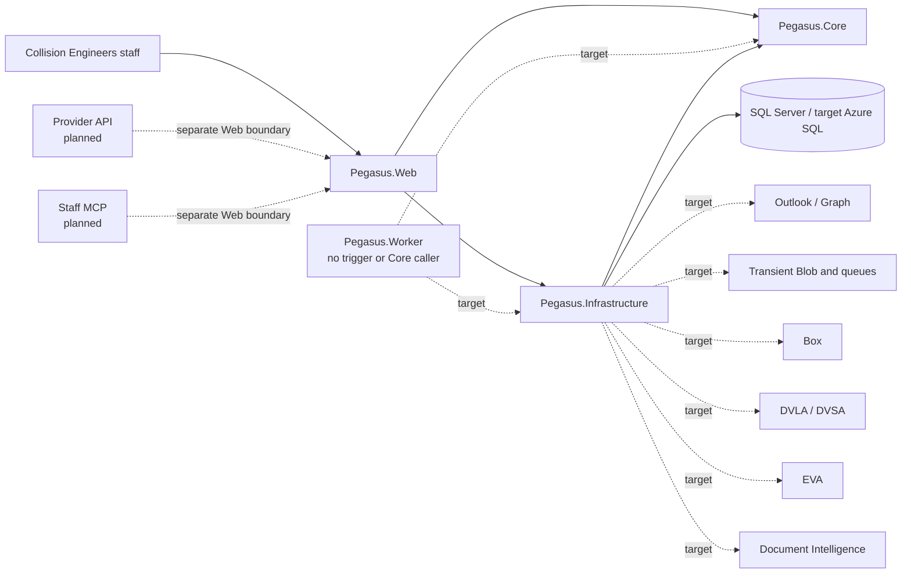

# Architecture

This document is the canonical owner for the current system architecture, caller evidence, dependency direction, and application boundaries. Requirements, capability scope, unresolved decisions, operations, and historical decisions remain with their respective canonical owners.

Implementation, caller proof, deployment, and acceptance are distinct:

- **Intended** describes an approved or proposed design.
- **Implemented** means code exists.
- **Caller-proved** means a real entry point executes that code.
- **Deployed** means the relevant application and infrastructure are running in the named environment.
- **Accepted** requires the applicable technical, security, operational, and operator evidence.

Registration, tests, migration presence, generated infrastructure, predecessor behavior, and source imports do not by themselves prove a caller, deployment, authority, or acceptance.

## System shape

Pegasus is a four-project modular monolith:



The current repository exposes an ASP.NET Core Razor Pages host, and dated local HTTP integration evidence exercises one Development-only manual intake mutation. That evidence does not show staff use of a deployed Pegasus application, a supported non-Development intake route, live traffic, or operator acceptance. Future accepted provider API and staff MCP calls would enter through separate Web boundaries. The .NET 10 isolated Azure Functions Worker is the intended mailbox and background composition root, but currently has no trigger, input, or Core caller.

The repository identifies itself as `0.0.0-development`; it is local-only, with no Pegasus Azure deployment.

## Components and dependency direction

| Component | Ownership and permitted dependencies |
| --- | --- |
| `src/Pegasus.Core/` | Business use cases, invariants, models, decisions, and ports. It must not depend on Web, Worker, Infrastructure, EF Core, Azure, Graph, Box, or other adapter implementations. |
| `src/Pegasus.Core/ReferenceData/` | Exact provider/domain-suffix package validation, deterministic candidate semantics, and the catalog port. It contains no workbook, package-file, or EF implementation. |
| `src/Pegasus.Infrastructure/` | EF persistence and source, artifact, package, and future external-system adapters implementing Core ports. It depends on Core. |
| `src/Pegasus.Web/` | Razor Pages and HTTP composition root, request translation, configuration, route gates, and health endpoints. It invokes Core through configured ports and Infrastructure adapters. |
| `src/Pegasus.Worker/` | Isolated Functions composition root. It currently builds and runs a telemetry-capable host but contains no timer, queue, mailbox trigger, input, or Core caller. |

Web and Worker may translate transport, identity, and configuration. They must not reproduce business policy. Infrastructure may implement Core ports but does not own business decisions.

A new project, runtime, store, migration stream, deployment unit, or top-level application boundary requires an accepted ADR demonstrating that these owners cannot carry the change. Decision status and supersession are maintained in the [decision index](adr/README.md).

## Architecture invariants

`Pegasus.Core` is the single owner of business policy. Each business rule,
classifier, allocator, parser, workflow transition, and external effect has
one implementation; a third implementation is a stop condition requiring
consolidation and removal of the replaced path.

Organize source by business capability and Collision Engineers' business
language. Do not introduce horizontal `Common`, `Helpers`, `Utilities`, or
undifferentiated `Services` folders, or names such as `V2`, `New`, `Manager`,
`Helper`, or `Util` as a substitute for a capability boundary. `Audit` and
`Triage` retain their reserved business meanings, and operator UI must not
expose internal deployment, extraction, or orchestration mechanics.

Add an abstraction only for a real external boundary, two concrete callers or
implementations, or an accepted architecture decision. Deferred capabilities
remain in capability allocation, an accepted decision, or open decisions until
a current caller exists; do not express them as dormant registration,
disabled flags, placeholders, or speculative compatibility shims.

Classifier and extraction precedence must be explicit, ordered, documented, and
covered by contradiction tests. External clients and catch paths distinguish
`terminal`, `transient`, and `unknown`; terminal outcomes stop retries,
unknown outcomes remain unknown, and metrics count successful effects rather
than attempts.

## Current callers and entry points

### Current local entry point and dated caller proof

- `POST /Intake/Upload` is the only current mutating product entry point. Dated local integration evidence exercised the HTTP route with genuine input; the route is available only under the Development-only local-intake gate.
- Its PageModel calls Core `ProcessIntake`, which uses the source reader, one contained QDOS instruction-extraction policy, the local content-addressed artifact store, and the EF receipt/draft store.
- `/`, `/Intake/Queue`, and `/Intake/Review` query persisted receipt and typed-draft state.
- The review download handler calls `IIntakeArtifactStore`.
- This is local HTTP caller evidence, not current browser-acceptance, staff-use, non-Development, deployment, or live-service evidence.

### Technical entry points

- `/health/live` reports liveness.
- `/health/ready` invokes the registered database health check.
- These endpoints are technical probes, not evidence of a product mutation or external integration.

### Implemented host without a business caller

`src/Pegasus.Worker/Program.cs` constructs and runs a Functions host. It has no trigger and makes no Core call. Dependency registration and host startup are not caller evidence.

A Worker `local.settings.json` is unnecessary at this baseline. Copy `src/Pegasus.Worker/local.settings.example.json` to the ignored `local.settings.json` only when an actual trigger requires local Functions storage.

### Absent or target callers

The following are planned or absent, not merely unverified:

- Graph mailbox intake and mailbox categorisation;
- private Blob staging and queue processing;
- Box source custody and writes;
- Document Intelligence OCR;
- automated legacy DOC and MSG extraction;
- vehicle-registration OCR or VLM recognition;
- DVLA/DVSA lookup;
- EVA export;
- provider API, which is deferred to the exact target owned by the [capability inventory](capabilities.md);
- staff MCP, identified as a `0.1.0-alpha.1` target;
- authenticated case lifecycle actions;
- live Azure telemetry and deployed Azure callers.

No production route should be enabled from the current slice.

## Current intake and extraction boundary

The implemented slice is provider-neutral intake with one concrete QDOS extraction policy. It proves one thin local path; it does not prove the full MVP, a second provider, mailbox automation, production custody, or operator acceptance.

This is implementation evidence toward [INT-01, INT-08–13, INT-18–20, and INT-23](capabilities.md); the inventory owns allocation only, and each broader capability contract remains unproved.

```text
Development-only Razor Page
  -> Core ProcessIntake
  -> QDOS IInstructionExtractionPolicy
  -> MimeKit/PdfPig/Open XML source reader
  -> ignored content-addressed artifact storage
  -> EF Core receipt and typed-draft persistence
  -> dashboard, queue, and review queries
```

### Accepted local inputs

The PageModel accepts one file no larger than 10 MiB with one of these extensions:

- `.eml`
- `.pdf`
- `.docx`
- `.doc`
- `.msg`
- `.jpg`
- `.jpeg`
- `.png`

One manual upload occurrence is identified by an opaque receipt token generated by the page.

The current enforced resource limits are:

| Boundary | Limit |
| --- | --- |
| ASP.NET Core multipart request | 10 MiB file allowance plus 64 KiB for the multipart envelope |
| PageModel file | One file; 10 MiB |
| PDF reader | 5,242,880 extracted characters; 512 discrete image objects; 100,000,000 decoded image-sample pixels; 25 MiB extracted image bytes; 30 seconds |
| EML reader | Eight nested-message levels; 128 MIME entities; 25 MiB cumulatively decoded MIME bytes |
| DOCX reader | 512 package entries; 50 MiB total uncompressed bytes; 10 MiB for each XML or relationship part; 25 MiB total image bytes |

The multipart boundary is enforced before Core. Reader-limit outcomes remain visible and cannot allocate a case or reference.

### Source reading and retained evidence

The current reader can:

- read email bodies and bounded nested EML;
- enumerate supported attachments;
- read PDF embedded text and discrete image streams;
- read DOCX text and internal images;
- retain the uploaded source and each supported attachment, inline image, DOCX image, and discrete PDF image as separate review occurrences.

SQL stores metadata and opaque artifact keys, not file bytes.

Legacy DOC and MSG are retained but routed to `Needs sorting` without a reference; their automated extraction remains deferred. Ordinary images are review evidence and are not sent to OCR.

For PDFs, only low-text pages with a dominant raster are marked as scan-like OCR candidates. No OCR service is currently called. Document- and attachment-level OCR-required state is visible during review.

The reader constructs no network client, launches no process, and does not retrieve external links, images, relationships, keys, or other remote content. Graph, Box, Blob, OCR, DVLA/DVSA, EVA, workspace extractors, and any other external service remain outside the current caller.

### QDOS applicability and drafts

QDOS is the sole concrete extraction policy until another principal has approved rules and genuine evidence. It is applied only to fully readable input.

- Positive instruction content is required; QDOS is not a fallback principal.
- Strong instruction content may outrank a weak transport signal such as a staff-forwarding sender.
- A QDOS-looking sender or filename alone creates neither a draft nor a principal suggestion.
- The review surface shows classification evidence, ten field suggestions, missing values, conflicts, page-labelled extracted text, OCR-required state, and failure details.
- When applicability and conversion are unambiguous, the ten typed instruction-draft values are shown read-only while original candidates and provenance remain available.
- An absent instruction date defaults from the receipt clock.
- The test clock is fixed to 2031, so integration assertions use a 2031 default instruction date.

Suggestions and typed drafts are neither editable nor approved case records. Receipt and extraction create no case, counter, year-based reference, or external categorisation.

### Idempotency and persisted semantics

- Replaying the same source occurrence returns the existing receipt.
- Equal source bytes under a different occurrence identity remain separate evidence.
- Stable decision, channel, evidence, and asset codes plus versioned JSON envelopes are persisted instead of CLR enum names.
- Unknown persisted codes and inconsistent policy results fail rather than being silently reinterpreted.
- “Instruction draft” and `Needs sorting` counts and filtered queues are persisted and queryable.

## Business-rule ownership

Core owns:

- intake decisions;
- transport-normalised evidence passed into routing;
- route-policy selection;
- provider, type, principal, and case determinations;
- case and reference invariants;
- lifecycle, matching, and classification;
- shared business actions later exposed through Web, Worker, provider API, or MCP;
- exact provider/domain package validation and deterministic catalog outcomes.

Shared intake code may normalize transport, reconstruct an original sender where staff forwarding is proved, extract subject, body, attachments, and assets, invoke exactly one applicable route policy, and record that policy’s evidence and version. It does not impose a universal case-matching precedence.

Direct-provider and intermediary policies are separate, code-versioned owners. They may identify the same provider, but each policy applies only to its own message shape and evidence.

The following invariants remain in force even where their activating callers are deferred:

- no case deletion;
- no reference reuse;
- no mutation of the principal after allocation;
- no second meaning for Audit, Triage, `Needs sorting`, or Blocked intake;
- no case or reference allocation until configured principal identity, durable custody, and the accepted allocation transaction are available.

No rule engine may be copied into Web, Worker, a workspace, or an integration adapter.

## Provider/domain-suffix package boundary

The accepted package increment is based on revision `d0965e1264dadc8d9942ac54fd68a4b45fd06f28`; exact repository head must be verified before relying on file locations or test counts. The Pegasus identity cutover occurred at `f69ea31dfdf0a59b8a2c176da90ae22a538fbc9c`.

The immutable package has these qualifications:

| Property | Value |
| --- | --- |
| Package identity | `provider-domains-v1` |
| Package version | `0.1.0-alpha.1` |
| Schema version | `1` |
| Providers | `11` |
| Provider/intermediary domain-suffix associations | `16` |
| SHA-256 | `f6b5ad8ecdd428db4316b23e16aa7e0ffc93562aec33374c03ea68cd4f0370a3` |
| Current logical resource | `Pegasus.Infrastructure.Persistence.ReferenceData.provider-domains.v1.json` |
| Pre-cutover logical resource | `CollisionSpike.Infrastructure.Persistence.ReferenceData.provider-domains.v1.json` |

Core validates exact package tuples and defines deterministic results:

- `Found`
- `Unknown`
- `Ambiguous`
- `InvalidSuffix`
- `PackageNotFound`
- `PackageRejected`

Infrastructure implements the catalog through one bounded EF query against the requested immutable package version. A committed migration seeds the versioned, cumulative SQL snapshot from the validated embedded package.

A stored suffix is candidate evidence only. It does not:

- activate a route;
- authenticate or resolve a principal by itself;
- create an inspection location or default;
- map a Case ID;
- prove provider acceptance.

No Web or Worker caller currently consumes the catalog. Package presence, migration registration, and passing tests do not constitute route activation or operator acceptance. Neither Web nor Worker may parse the workbook or package directly.

## Data and custody boundaries

### Current Development data

`DevelopmentOffline` uses SQL Server Express LocalDB through connection name `Pegasus`, database `PegasusDevelopment`, and the committed SQL Server migration stream.

Current source and extracted bytes are retained under the ignored content-addressed root:

```text
artifacts/local-development/default/intake
```

This is local development evidence, not production Blob staging, Box custody, backup, or accepted recovery.

There is no supported non-Development intake or production filesystem fallback: when the two Development gates are not active, every `/Intake` route returns `404`. The current artifact port exposes store and read operations only; Pegasus has no receipt/artifact deletion API, backup command, or proved restore path. Test-harness cleanup and manual removal of an owned ignored run directory are not application deletion or recovery evidence.

The application retains the original source before recording a reviewable receipt:

- retention failure is retryable and stores no receipt;
- a later SQL failure may leave reusable content-addressed bytes;
- those bytes must not be mistaken for an accepted receipt or production custody.

Sequential receipt-token/content conflicts are rejected before artifact storage. A simultaneous first-use collision can leave the losing hash unreferenced in ignored local storage. Production custody must close that race before activation.

### Target ownership

| Data or evidence | Intended authority |
| --- | --- |
| Case workflow, identity, configuration, permanent action history, and source/file relationships | Azure SQL |
| Long-term original-file custody | Box |
| Mailbox content and exact sent-message evidence | Outlook |
| Accepted classification and source associations | Pegasus |
| Named Engineer assignment and downstream engineering | EVA until an accepted replacement slice |
| Transient processing bytes and delivery work | Private Azure Blob and queues; never long-term custody |
| Local content-addressed artifacts | Development evidence only |

No Pegasus migration has been applied to a live database.

Pegasus starts with fresh application data. The predecessor’s pre-release test cases and application state are not migrated or preserved as a `0.1.0-alpha.1` requirement.

## Database and migration boundary

EF migrations under `src/Pegasus.Infrastructure/Persistence/Migrations/` own application schema evolution.

Normal Web or Worker startup never applies migrations. Development migration is a separate explicit command. The local guard accepts an empty database or the exact current migration history; unexpected schema or history, or a pending model change, fails before normal application use.

A release-owned migration bundle or explicit operation must apply deployed migrations before the application package. Schema recovery is not an automatic down-migration.

Disposable SQL Server/LocalDB results prove only local caller and migration behavior. They do not prove Azure SQL locking, upgrade behavior, recovery, or live deployment.

## Authentication and authorization boundary

There is currently:

- no application authentication;
- no role enforcement;
- no authenticated action actor;
- no authenticated draft-confirmation mutation.

The bounded next security boundary is intended to:

1. add self-managed staff sign-in, roles, and an authenticated action actor;
2. deny anonymous intake review;
3. fail closed for disabled or stale staff sessions;
4. make draft confirmation a separate authenticated mutation with optimistic-concurrency evidence.

This sequence does not authorize case creation. Case and reference allocation remain absent until principal identity, durable custody, and the accepted allocation transaction are ready. Decisions that withhold slices remain authoritative in [open decisions](open-decisions.md).

Secrets must use managed identity and RBAC where supported. Infisical or Key Vault may hold only unavoidable third-party credentials.

## Integration boundaries and deferred seams

Deferred capabilities retain only the stable identities and ports necessary for later activation. They add no caller, Azure resource, credential, route, schema, feature flag, dormant integration, or UI placeholder before activation.

### Mailbox intake

A future Graph trigger must call the existing provider-neutral `ProcessIntake` use case. It must not copy receipt, extraction, categorisation, or workflow rules into Worker.

Its adapter boundary must add:

- managed-identity access;
- private Blob staging;
- Box custody;
- delivery identity and duplicate-delivery handling;
- bounded retries and terminal failure visibility;
- exact Outlook sent-message evidence where required.

The current QDOS extraction policy must not be reinterpreted as mailbox categorisation.

### OCR and recognition

A first Document Intelligence caller may submit only persisted scan-like PDF page candidates. Ordinary images and vehicle photographs are outside that slice. Vehicle-registration OCR/VLM recognition and DVLA/DVSA lookup require separate accepted callers and evidence.

### Provider API and staff MCP

Provider API and staff MCP are separate Web ingress boundaries. They must invoke the same Core business actions as staff UI or Worker callers rather than introducing parallel policy engines.

### EVA and case lifecycle

EVA remains authoritative for named Engineer assignment and downstream engineering until an accepted replacement. Export, lifecycle management, and replacement authority are not implemented.

### Workspaces

`workspaces/` contains three independently buildable source workspaces imported from four sources:

- document extraction;
- report rendering;
- AI Centre, with the agent-skill source merged under `ai-centre/skills/`.

They are not:

- projects in `Pegasus.slnx`;
- application dependencies;
- runtime-loaded components;
- current callers;
- deployment units;
- business-policy authorities.

They build and test independently. `Pegasus.Core` remains the sole business-policy owner.

A workspace may enter the application only through a separately accepted contract with:

- a real caller;
- representative parity evidence;
- security and licence evidence;
- migration or coexistence behavior;
- failure and recovery behavior;
- operator acceptance.

Workspace provenance and source manifests are owned by [the workspace index](../workspaces/README.md).

## Release dependency provenance

Exact release allocation in [capabilities](capabilities.md) does not by itself define implementation order. The restored [dependency-ordered delivery roadmap](history/plans/delivery-roadmap.md) is subordinate, source-labelled pre-conversion planning evidence retained because it uniquely records prerequisite edges, safe parallel branches, and rejoin gates. Its historical `CollisionSpike` labels do not name a current caller, and every edge must be revalidated against current requirements, allocation, decisions, architecture, and code before use.

The retained alpha spine orders relational intake state before staff identity and action history; those before principal/configuration, durable custody, image/address evidence, and the allocator; those before definitive acceptance; and acceptance before case files, edit leases, lifecycle, UI, the real Outlook Worker, Triage, vehicle/EVA work, staff MCP, Azure/recovery evidence, and operator acceptance. Provider activation and later parallel branches rejoin only after their shared actor, source, case, Worker, and history contracts are stable. This summary neither activates a capability nor proves implementation, deployment, recovery, or acceptance.

## Failure and recovery boundaries

Source limits, incomplete processing, identity ambiguity, unsupported formats, integrity conflicts, and persistence or custody failures fail closed before case or reference creation.

Transient work may retry only within named bounds. Terminal failures must remain visible. Local bytes may outlive a failed SQL write and are not evidence of accepted custody.

The current Web path has no background retry coordinator, poison queue, or automated recovery caller. A retention failure asks the local user to retry with the same receipt token; a later persistence failure can leave unreferenced content-addressed bytes for diagnosis. Those source-level behaviors are not production retry, deletion, or recovery proof.

Production recovery is forward-oriented:

1. retain prior immutable application packages;
2. apply explicit migrations before application deployment;
3. verify health and smoke evidence;
4. restore data through the accepted backup and recovery path;
5. avoid automatic schema down-migration.

The four-hour restoration and 15-minute recovery-point outcomes remain unproved acceptance gates.

## Deployment boundary

The intended topology consists of:

1. isolated local development;
2. one shared Azure development/integration environment;
3. production.

Target Bicep describes fresh `rg-pegasus-dev` and `rg-pegasus-prod` resource groups containing:

- a .NET 10 Web App;
- a .NET 10 isolated Functions Worker;
- Azure SQL database `pegasus`;
- Azure Storage;
- Key Vault;
- Application Insights and Log Analytics;
- managed identities.

The intended release owner uses an authorized Windows terminal, committed Bicep, and `azd`. GitHub Actions deployment is not planned. An explicit database migration must precede application deployment.

This route is documented but not runnable or production-ready. Remaining gaps include:

- immutable application packages;
- a migration bundle and operation;
- identity and Entra resolution;
- provenance and hashes;
- removal of remote-build dependence.

Bicep compilation proves syntax and type consistency only. Neither Bicep nor `azure.yaml` proves a runnable release path. No resource has been provisioned or changed by the Pegasus target definition, and the legacy `rg-collisionspike-dev` estate remains untouched.

Any Azure resource creation, deployment, role or credential change, setting change, or retirement requires explicit user approval for the exact target. Ownership of shared Foundry, ACR/ValuationBot, capture, or default-workspace assets must not be inferred from the predecessor resource group.

The release design, live-inventory qualifications, and deployment procedures are owned by [Azure documentation](azure/README.md) and [operations](operations.md).

## Local development procedure

From PowerShell 7 at the repository root:

```powershell
dotnet restore ./Pegasus.slnx
dotnet build ./Pegasus.slnx --configuration Release --no-restore
dotnet test ./Pegasus.slnx --configuration Release --no-build --filter "Category!=Corpus"
sqllocaldb start MSSQLLocalDB
dotnet run --project ./src/Pegasus.Web --launch-profile https -- --migrate-development
dotnet run --project ./src/Pegasus.Web --launch-profile https --no-build
```

Open:

```text
https://localhost:7139/Intake/Upload
```

Development configuration selects:

- runtime profile `DevelopmentOffline`;
- SQL Server Express LocalDB;
- connection name `Pegasus`;
- database `PegasusDevelopment`;
- artifact root `artifacts/local-development/default/intake`;
- `Features:LocalIntake=true`.

The `--migrate-development` process validates the local-only profile, applies the committed migration stream, prints completion, and exits. The Web host must then be started separately.

The upload route is deny-by-default and returns `404` unless both the Development-only runtime profile and local-intake feature gate are active.

## Implementation map

| Responsibility | Current source |
| --- | --- |
| Business intake use case | `src/Pegasus.Core/Intake/ProcessIntake.cs` |
| Core intake contracts and ports | `src/Pegasus.Core/Intake/IntakeContracts.cs` |
| QDOS extraction policy | `src/Pegasus.Core/Intake/QdosInstructionExtractionPolicy.cs` |
| Multi-format source adapter | `src/Pegasus.Infrastructure/Intake/MimeKitPdfPigOpenXmlIntakeSourceReader.cs` |
| Local artifact adapter | `src/Pegasus.Infrastructure/Intake/FileSystemIntakeArtifactStore.cs` |
| EF receipt and typed-draft persistence | `src/Pegasus.Infrastructure/Persistence/EfIntakeReceiptStore.cs` |
| Database model and migrations | `src/Pegasus.Infrastructure/Persistence/PegasusDbContext.cs`, `src/Pegasus.Infrastructure/Persistence/Migrations/` |
| Web composition and route safety | `src/Pegasus.Web/Program.cs` |
| Manual mutation caller | `src/Pegasus.Web/Pages/Intake/Upload.cshtml.cs` |
| Review, queue, and dashboard callers | `src/Pegasus.Web/Pages/Intake/`, `src/Pegasus.Web/Pages/Index.cshtml.cs` |
| Genuine-input Web evidence | `tests/Pegasus.IntegrationTests/QdosIntakeWebTests.cs` |
| Route-denial evidence | `tests/Pegasus.IntegrationTests/LocalIntakeAccessTests.cs` |
| Stable persistence and unsupported-source evidence | `tests/Pegasus.IntegrationTests/IntakeStablePersistenceTests.cs` |
| SQLite baseline-refusal evidence | `tests/Pegasus.IntegrationTests/IntakeSqliteBaselineGuardTests.cs` |
| Dependency-direction evidence | `tests/Pegasus.ArchitectureTests/DependencyDirectionTests.cs` |

Relevant architectural decisions include ADR-0003 for PdfPig, ADR-0005 for multi-format assets, ADR-0006 for provider-neutral intake with a contained QDOS policy, and ADR-0007 for direct-terminal Azure deployment. Their status and supersession must be read through the [decision index](adr/README.md).

## Source and generated-material roles

| Path | Role | Qualification |
| --- | --- | --- |
| `src/Pegasus.Infrastructure/Persistence/Migrations/` | Live migration source | Generated from the reviewed EF model and migrations; consumed only by explicit schema-apply procedures. |
| `docs/reference/workproviders-and-repairers/initial.xlsx` | Immutable `0.1.0-alpha.1` provider-domain source evidence | Owner-supplied workbook used only by the offline authoring process. |
| `scripts/Build-ProviderReferenceData.ps1` | Offline authoring command | Never an application-runtime parser. |
| `scripts/reference_data/build_provider_reference_data.py` | Reviewed standard-library authoring implementation | Generates and verifies immutable package output from the source contract. |
| `src/Pegasus.Infrastructure/Persistence/ReferenceData/provider-domains.v1.json` | Canonical immutable provider-domain package | Embedded build resource and reviewed migration seed. |
| `artifacts/bicep/main.json` | Ignored generated Bicep output | Produced by `az bicep build --file infra/main.bicep`; compile evidence only. |
| `artifacts/test-results/` | Ignored generated evidence | Used for local review and diagnosis. |
| `artifacts/local-development/` and LocalDB databases | Ignored Development state | Produced by explicit migration and real local callers; not production custody. |
| `docs/reference/` | Preserved supplied evidence | Used for planning and evaluation only after authority reconciliation; see the [reference index](reference/README.md). |
| `workspaces/` | Independently validated non-caller source imports | Workspace-specific build and test only until separately accepted integration. |
| `design/references/mockups/` | Approved comparison rasters | Direction-selection evidence, not runtime behavior or requirements; see the [design index](../design/README.md). |

Infrastructure and release definitions under `infra/` describe target infrastructure; they do not prove a live deployment.

## Evidence qualifications

Evidence applies only to the revision, environment, inputs, and caller exercised.

At accepted provider-domain revision `d0965e1264dadc8d9942ac54fd68a4b45fd06f28`, Release runs passed 62 Core, 33 Architecture, and 98 Integration tests. Those counts prove that revision only.

An earlier implementation checkpoint covered repository structure and ignored-boundary guards, Release restore/build, 13 integration tests, 5 architecture tests, Bicep compilation, and project-skill validation. It included a now-retired checkbox-driven reference-allocation proof. The current relational-draft design removed that allocator and replaced it with pre-case source identity, typed-draft, and no-case-schema evidence.

At the 2026-07-23 multi-format checkpoint:

- synthetic multi-format tests and 11 SHA-pinned genuine-corpus tests were caller evidence;
- genuine smoke coverage included DOCX, DOC, MSG, JPEG, and PNG without exposing source filenames or content;
- 11 Core, 57 non-corpus Integration, 29 Architecture, and 11 corpus tests ran with no failures or skips.

At the 2026-07-24 provider-neutral intake checkpoint:

- Release build completed without warnings or errors;
- 28 Core, 82 non-corpus Integration, 30 Architecture, and 11 genuine-corpus tests ran with no failures or skips;
- repository structure, Bicep compilation, ignored-boundary checks, and project-skill validation passed;
- a disposable LocalDB cohort passed 11 tests with no skips, applying the single provider-neutral initial migration and covering constraints, concurrency, action-history rollback, and retry;
- independent checks reran the actual upload no-default path, unknown persisted-code failures, inconsistent policy-result guards, and case-variant receipt replay.

The local corpus changed between checkpoints:

- the historical implementation checkpoint recorded 9,443 files and 6,041,636,339 bytes;
- the 2026-07-23 checkout recorded 166 files and 321,396,569 bytes with redacted-manifest SHA-256 `90EFBFD7A2C730BB73839AC031CA1FB3394BA9309CCA87F353D97F707D53D958`.

Both inventories were local and ignored. The later inventory does not replace or reinterpret the historical one.

These results do not prove:

- extraction accuracy beyond the exercised assertions;
- live database upgrade or Azure SQL behavior;
- production Blob or Box custody;
- backup or recovery outcomes;
- application authentication or authorization;
- route activation for provider-domain data;
- Azure deployment;
- operator acceptance.

## Architectural constraints

- Do not add duplicated rule engines, dormant integrations, generic services, speculative abstractions, or compatibility shims for unreleased behavior.
- Do not infer authority from a predecessor, local corpus, supplied references, plans, tests, dependency registration, migration presence, or workspace import.
- Do not enable a route because a package, adapter, port, migration, or test exists.
- Do not copy the current intake rules into Worker when adding mailbox automation.
- Do not treat local artifacts or transient Blob storage as Box custody.
- Do not treat accepted design as implementation, implementation as caller proof, caller proof as deployment, or deployment as operator acceptance.

Product behavior is governed by [requirements](requirements.md), capability scope by [capabilities](capabilities.md), unresolved gates by [open decisions](open-decisions.md), operational procedures by [operations](operations.md), repository-development workflow by the [installed skills](../.agents/skills/ask-matt/SKILL.md), and business authority by [operator notes](operator-notes.md). Repository navigation is maintained by the [documentation index](index.md), and durable change history by the [change index](changes/README.md).