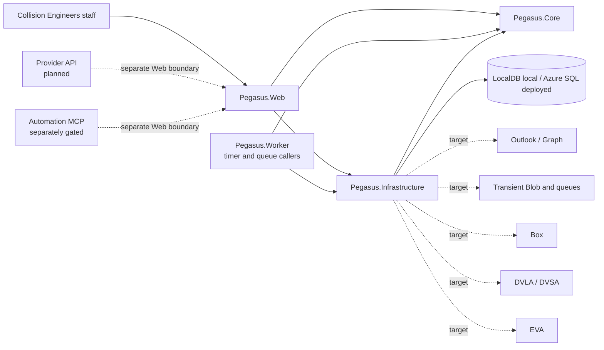

# Architecture

This document is the canonical owner for the current system architecture, caller evidence, dependency direction, and application boundaries. Requirements, capability scope, unresolved decisions, operations, and historical decisions remain with their respective canonical owners.

Implementation, caller proof, deployment, and acceptance are distinct:

- **Intended** describes an approved or proposed design.
- **Implemented** means code exists.
- **Caller-proved** means a real entry point executes that code.
- **Deployed** means the relevant application and infrastructure are running in the named environment.
- **Accepted** requires the applicable technical, security, operational, and operator evidence.

Registration, tests, migration presence, generated infrastructure, predecessor behavior, and source imports do not by themselves prove a caller, deployment, authority, or acceptance.

## System shape

Pegasus is a four-project modular monolith:



The current repository exposes an ASP.NET Core Razor Pages host and a .NET 10 isolated Azure Functions Worker. The Worker has timer and queue-trigger callers that translate bounded work into Core use cases. Any provider API caller remains separately gated. The Automation MCP ingress is implemented inside `Pegasus.Web` behind a composition gate that is off by default; when the gate is off no automation route exists, and live activation remains separately approved.

The repository identifies its package and release target as `0.1.0-alpha.1`. Pegasus is deployed to its sole production environment; the current production state is owned exclusively by [operations § Production environment](operations.md#production-environment) and is not restated here. Operator acceptance remains outstanding.

## Components and dependency direction

| Component | Ownership and permitted dependencies |
| --- | --- |
| `src/Pegasus.Core/` | Business use cases, invariants, models, decisions, and ports. It must not depend on Web, Worker, Infrastructure, EF Core, Azure, Graph, Box, or other adapter implementations. |
| `src/Pegasus.Core/ReferenceData/` | Exact provider/domain-suffix package validation, deterministic candidate semantics, and the catalog port. It contains no workbook, package-file, or EF implementation. |
| `src/Pegasus.Infrastructure/` | EF persistence and source, artifact, package, and future external-system adapters implementing Core ports. It depends on Core. |
| `src/Pegasus.Web/` | Razor Pages and HTTP composition root, request translation, configuration, route gates, and health endpoints. It invokes Core through configured ports and Infrastructure adapters. |
| `src/Pegasus.Worker/` | Isolated Functions composition root. Its timer and queue triggers translate persisted intake, external-work, mailbox, sent-evidence, and reconciliation signals into Core use cases; it contains no duplicate business policy. |

Web and Worker may translate transport, identity, and configuration. They must not reproduce business policy. Infrastructure may implement Core ports but does not own business decisions.

A new project, runtime, store, migration stream, deployment unit, or top-level application boundary requires an accepted ADR demonstrating that these owners cannot carry the change. Decision status and supersession are maintained in the [decision index](adr/README.md).

## Architecture invariants

`Pegasus.Core` is the single owner of business policy. Each business rule,
classifier, allocator, parser, workflow transition, and external effect has
one implementation; a third implementation is a stop condition requiring
consolidation and removal of the replaced path.

Organize source by business capability and Collision Engineers' business
language. Do not introduce horizontal `Common`, `Helpers`, `Utilities`, or
undifferentiated `Services` folders, or names such as `V2`, `New`, `Manager`,
`Helper`, or `Util` as a substitute for a capability boundary. `Audit` and
`Triage` retain their reserved business meanings, and operator UI must not
expose internal deployment, extraction, or orchestration mechanics.

Add an abstraction only for a real external boundary, two concrete callers or
implementations, or an accepted architecture decision. Deferred capabilities
remain in capability allocation, an accepted decision, or open decisions until
a current caller exists; do not express them as dormant registration,
disabled flags, placeholders, or speculative compatibility shims.

Classifier and extraction precedence must be explicit, ordered, documented, and
covered by contradiction tests. External clients and catch paths distinguish
`terminal`, `transient`, and `unknown`; terminal outcomes stop retries,
unknown outcomes remain unknown, and metrics count successful effects rather
than attempts.

## Current callers and entry points

### Staff Web callers

- `GET /Inbox` calls Core `ListRetainedMail` and `GetRetainedMailFreshness` for the mail workspace: retained messages newest first, scoped by mailbox and folder through the query string alone, with an explicit manual refresh that carries that scope. `GET /Inbox/{id}` calls `GetRetainedMail` for one retained message, its attachments, its retained-scope thread, and its current classification, queue, processing outcome and case association. Both are read-only: the pages carry no handler, and the Web runtime role holds `SELECT` alone on the retained-mail tables.
- `GET /Operations` calls the Core Operations projection for retryable external work and active unexpired Pegasus-generated upload links. It has no approval controls, general receipt ledger, manual/email/Automation receipt display, or Box request caller. The separately planned principal-scoped provider API is not inferred from the Automation/MCP ingress. `GET /Received/{id}` calls `GetIntake`, and its retained receipt mutations call the named Core intake commands with a server-derived actor, expected versions or case lease, operation key, and reason as applicable.
- `GET /Received/{id}/Source` calls Core `DownloadIntakeSource`, which authorises the current staff actor, resolves the receipt-owned source, validates retained length and SHA-256, and returns only a no-sniff attachment with a safe filename and content type.
- `GET /VehicleImages` calls Core `IImageIntakeQueries` for the association-filtered image-intake receipt list and the exact Image Intake Reference lookup. `GET /VehicleImages/{id}` calls the same detail query plus the receipt's VRM suggestions and, while the record holds no case association, the registration-matched eligible-case candidates; both are read-only authenticated staff pages.
- `/Triage` and `/Triage/{id}` are the physical list/detail owners for Core triage queries and commands. The former Development web evaluator is not an application caller; the separately owned desktop evaluator remains outside the Web runtime.
- Anonymous request submission exists only at `/Uploads/{token}`. The PageModel calls `GetRequestUpload` and one `UploadToRequest` command, uses antiforgery and an idempotent operation key, and presents generic non-disclosing outcomes through PRG.
- The Case documents surface still implements Box File Request create/revoke (`src/Pegasus.Web/Pages/Cases/Shared/_CaseDocuments.cshtml`). That mechanism is superseded by the operator decision in favour of request-scoped upload links (INT-31) and is pending removal; it must gain no new callers.
- These callers are source-state evidence; deployment state is owned by [operations § Production environment](operations.md#production-environment). Caller evidence alone does not establish browser accessibility acceptance or operator acceptance.

### Technical entry points

- `/health/live` reports liveness.
- `/health/ready` invokes the registered database health check.
- These endpoints are technical probes, not evidence of a product mutation or external integration.

### Worker callers

`src/Pegasus.Worker/Program.cs` constructs the Functions host. The concrete functions in `IntakeFunctions.cs`, `MailboxFunctions.cs`, `EmailEvidenceFunctions.cs`, and `Functions/ExternalWorkFunctions.cs` are the caller evidence for their timer and queue paths. Registration and host startup alone remain insufficient evidence of external-system activation or operator acceptance.

A Worker `local.settings.json` is unnecessary at this baseline. Copy `src/Pegasus.Worker/local.settings.example.json` to the ignored `local.settings.json` only when an actual trigger requires local Functions storage.

### Implemented production targets and absent callers

Worker production composition registers bounded Graph Inbox/Sent, Box
custody, and DVLA/DVSA adapters plus Azure Blob/queue transport. These are
**Deployed**, but deployment is not current execution evidence: production
containment on 2026-08-10 disabled all nine functions after the enabled estate
executed zero times. Graph Inbox/Sent processing was live-verified for release
1; that historical proof does not establish the current retained-mail or
administrator-estate path. Exact current state is owned by
[operations § Production environment](operations.md#production-environment),
and operator acceptance remains outstanding.

Web production composition registers Box-backed case custody and managed
document content, the staff document and EVA handoff surface, and Azure Blob
intake artifact stores behind one storage profile. These are **Deployed**
(release 3); the current production state is owned by
[operations § Production environment](operations.md#production-environment).

In-process ONNX vehicle-registration recognition (ADR-0019) is implemented
in `src/Pegasus.Infrastructure/Vision/` behind the Core `ImageIntake`
automation; the ADR-0019 index entry owns the accepted evaluation numbers.
Implementation is not live-caller acceptance.

The following remain planned or absent, not merely unverified:

- broad Graph mailbox categorisation or any Graph mutation;
- Document Intelligence OCR;
- automated legacy DOC and MSG extraction;
- EVA export;
- provider API, which is deferred to the exact target owned by the [capability inventory](capabilities.md);
- live activation of the vendor-neutral Automation MCP: the ingress, actor contract, and tools are implemented but composition-gated off outside DevelopmentOffline evidence runs, non-blocking for `0.1.0-alpha.1`;
- an in-process Web telemetry exporter (the Worker exports Application Insights telemetry; the Web host does not).

## Current intake and extraction boundary

The locally verified slice includes provider-neutral intake, one concrete QDOS
extraction policy, and bounded production adapter implementations. It does not
prove deployed mailbox automation, live production custody/enrichment, the
full MVP, a second provider, or operator acceptance.

This is implementation evidence toward [INT-01, INT-08–13, INT-18–20, and INT-23](capabilities.md); the inventory owns allocation only, and each broader capability contract remains unproved.

```text
Staff Intake Razor Page
  -> Core ProcessIntake
  -> QDOS IInstructionExtractionPolicy
  -> MimeKit/PdfPig/Open XML source reader
  -> ignored content-addressed artifact storage
  -> EF Core receipt and typed-draft persistence
  -> dashboard, queue, and review queries
```

### Accepted local inputs

The PageModel accepts one file no larger than 10 MiB with one of these extensions:

- `.eml`
- `.pdf`
- `.docx`
- `.doc`
- `.msg`
- `.jpg`
- `.jpeg`
- `.png`

One manual upload occurrence is identified by an opaque receipt token generated by the page.

The current enforced resource limits are:

| Boundary | Limit |
| --- | --- |
| ASP.NET Core multipart request | 10 MiB file allowance plus 64 KiB for the multipart envelope |
| PageModel file | One file; 10 MiB |
| Received mailbox message | One message, envelope and attachments together; 750 MiB |
| PDF reader | 5,242,880 extracted characters; 512 discrete image objects; 100,000,000 decoded image-sample pixels; 25 MiB extracted image bytes; 30 seconds |
| EML reader | Eight nested-message levels; 128 MIME entities; 25 MiB cumulatively decoded MIME bytes |
| DOCX reader | 512 package entries; 50 MiB total uncompressed bytes; 10 MiB for each XML or relationship part; 25 MiB total image bytes |

The multipart boundary is enforced before Core. Reader-limit outcomes remain visible and cannot allocate a case or reference.

A received message and an uploaded file are bounded separately. The upload figure bounds one file arriving in one HTTP request; an instruction email carries the covering message plus the documents and photographs of the job, and the two shared one figure until a 16.7 MB QDOS instruction was refused unread on 2026-08-05. The mailbox figure is permissive by intent rather than a capacity claim: the reader limits above still apply to what it admits, the poll materialises a message in memory, and no mail transport carries anything near it — the practical ceiling is set by the Worker instance.

### Source reading and retained evidence

The current reader can:

- read email bodies and bounded nested EML;
- enumerate supported attachments;
- read PDF embedded text and discrete image streams;
- read DOCX text and internal images;
- retain the uploaded source and each supported attachment, inline image, DOCX image, and discrete PDF image as separate review occurrences.

SQL stores metadata and opaque artifact keys, not file bytes.

Legacy DOC and MSG are retained but routed to `Needs sorting` without a reference; their automated extraction remains deferred. Ordinary images are retained review evidence; they are scanned by the in-process ONNX VRM engine (ADR-0019) and are never sent to an external OCR or vision service.

For PDFs, only low-text pages with a dominant raster are marked as scan-like OCR candidates. No OCR service is currently called. Document- and attachment-level OCR-required state is visible during review.

The reader constructs no network client, launches no process, and does not retrieve external links, images, relationships, keys, or other remote content. Graph, Box, Blob, OCR, DVLA/DVSA, EVA, workspace extractors, and any other external service remain outside the reader; bounded production adapters attach only at the Web and Worker composition roots.

### QDOS applicability and drafts

QDOS is the sole concrete extraction policy until another principal has approved rules and genuine evidence. It is applied only to fully readable input.

- Positive instruction content is required; QDOS is not a fallback principal.
- Strong instruction content may outrank a weak transport signal such as a staff-forwarding sender.
- A QDOS-looking sender or filename alone creates neither a draft nor a principal suggestion.
- The review surface shows classification evidence, ten field suggestions, missing values, conflicts, page-labelled extracted text, OCR-required state, and failure details.
- The typed instruction-draft values are read-only on the review surface. They are editable in one place, the create screen; original candidates and provenance stay visible beside every box. A value a person keys becomes a candidate of its own, sourced to the staff correction, so the case records who said it. Review does not withhold a definitive instruction's Case/PO allocation.
- An absent instruction date defaults from the receipt clock.
- The test clock is fixed to 2031, so integration assertions use a 2031 default instruction date.

Suggestions and typed drafts are neither editable nor approved case records. Receipt and extraction create no case, counter, year-based reference, or external categorisation.

**Definitive authorised intake attempts typed case allocation at processing time.** QDOS classification persists `Inspection`, `Audit`, or `Inspection + Audit` beside its policy version. With no definitive existing-case match, the durable processing path calls the Core `IAllocateIntake` owner for a `CaseCreated` processing decision and consumes only that persisted type and the extracted principal. The case enters `Not ready` with nothing confirmed by a person, because thin ordinary detail is never a reason to withhold the reference. The evaluation-scoped automatic attempt and its outcome are durable and replay-safe. A failed attempt leaves the completed receipt and a bounded operator-safe failure; completed-work replay cannot call acceptance again. Only an authenticated, reasoned staff retry can reuse the frozen failed command.

Only an **ambiguous** case match is withheld from automatic allocation. An Audit is definitive only where the retained email contains its instruction and a separate original report carrying one literal outcome, `repairable` or `total loss`; that creates its `a.` or `ap.` reference automatically without a staff confirmation. Missing, conflicting, or unclear Audit evidence is `Needs sorting`. A missing or disabled Principal is instead a visible recoverable allocation failure on the completed receipt. The create screen (`INT-26`) records detail and settles the inspection address. `EfCaseAcceptanceStore` still applies `IntakeDecisionPolicy.CanBecomeCase` inside the transaction, so eligibility does not depend on which caller asks, while actual success is projected only from the Case intake link.

### Idempotency and persisted semantics

- Replaying the same source occurrence returns the existing receipt.
- Equal source bytes under a different occurrence identity remain separate evidence.
- Stable decision, channel, evidence, and asset codes plus versioned JSON envelopes are persisted instead of CLR enum names.
- Unknown persisted codes and inconsistent policy results fail rather than being silently reinterpreted.
- `Needs sorting` and `Blocked intake` counts and filtered queues are persisted and queryable, and both exclude receipts that have produced a case, so they measure what is still waiting for a person rather than everything ever received. The `case_created` decision code supersedes `draft_ready`, which stays readable as the same processing outcome; neither code is case-existence authority. Operations, retained Mail, Upload, MCP, and retry surfaces join the current allocation state and actual Case link.

## Business-rule ownership

Core owns:

- intake decisions;
- transport-normalised evidence passed into routing;
- route-policy selection;
- provider, type, principal, and case determinations;
- case and reference invariants;
- lifecycle, matching, and classification;
- shared business actions later exposed through Web, Worker, provider API, or MCP;
- exact provider/domain package validation and deterministic catalog outcomes.

Shared intake code may normalize transport, reconstruct one original sender
where a staff forward is proved (from an attached email or the strict ordered
Outlook `From:`, `Sent:`, `To:`, `Subject:` header quartet), extract subject,
body, attachments, and assets, invoke exactly one applicable route policy, and
record that policy’s evidence and version. It does not impose a universal
case-matching precedence. Partial, conflicting, or malformed forwarding
evidence remains reviewable rather than becoming route identity.

Direct-provider and intermediary policies are separate, code-versioned owners. They may identify the same provider, but each policy applies only to its own message shape and evidence.

The following invariants remain in force even where their activating callers are deferred:

- no case deletion;
- no reference reuse;
- no mutation of the principal after allocation;
- no second meaning for Audit, Triage, `Needs sorting`, or Blocked intake;
- no case or reference allocation until configured principal identity, durable custody, and the accepted allocation transaction are available.

No rule engine may be copied into Web, Worker, a workspace, or an integration adapter.

## Provider/domain-suffix package boundary

The accepted package increment is based on revision `d0965e1264dadc8d9942ac54fd68a4b45fd06f28`; exact repository head must be verified before relying on file locations or test counts. The Pegasus identity cutover occurred at `f69ea31dfdf0a59b8a2c176da90ae22a538fbc9c`.

The immutable package has these qualifications:

| Property | Value |
| --- | --- |
| Package identity | `provider-domains-v1` |
| Package version | `0.1.0-alpha.1` |
| Schema version | `1` |
| Providers | `11` |
| Provider/intermediary domain-suffix associations | `16` |
| SHA-256 | `f6b5ad8ecdd428db4316b23e16aa7e0ffc93562aec33374c03ea68cd4f0370a3` |
| Current logical resource | `Pegasus.Infrastructure.Persistence.ReferenceData.provider-domains.v1.json` |
| Pre-cutover logical resource | `CollisionSpike.Infrastructure.Persistence.ReferenceData.provider-domains.v1.json` |
| Immutable source provenance | `docs/reference/workproviders-and-repairers/initial.xlsx` |
| Current physical authoring source | `reference/workproviders-and-repairers/initial.xlsx` (mapped only by authoring and test resolution) |

Core validates exact package tuples and defines deterministic results:

- `Found`
- `Unknown`
- `Ambiguous`
- `InvalidSuffix`
- `PackageNotFound`
- `PackageRejected`

Infrastructure implements the catalog through one bounded EF query against the requested immutable package version. A committed migration seeds the versioned, cumulative SQL snapshot from the validated embedded package.

A stored suffix is candidate evidence only. It does not:

- activate a route;
- authenticate or resolve a principal by itself;
- create an inspection location or default;
- map a Case ID;
- prove provider acceptance.

No Web or Worker caller currently consumes the catalog. Package presence, migration registration, and passing tests do not constitute route activation or operator acceptance. Neither Web nor Worker may parse the workbook or package directly.

## Data and custody boundaries

### Current Development data

`DevelopmentOffline` uses the platform's supported SQL Server — SQL Server Express LocalDB on Windows, a per-run container on Linux — through connection name `Pegasus`, database `PegasusDevelopment`, and the committed SQL Server migration stream. Deployed Pegasus uses Azure SQL through that SQL Server migration stream; there is no supported database-provider choice.

Current source and extracted bytes are retained under the ignored content-addressed root:

```text
artifacts/local-development/default/intake
```

This is local development evidence, not production Blob staging, Box custody, backup, or accepted recovery.

There is no supported non-Development filesystem fallback: outside the DevelopmentOffline profile, intake artifacts live in Azure Blob, never on the local filesystem. The staff `/Received/{id}`, `/Received/{id}/Source`, and `/Inbox` routes are served wherever intake is composed, including the Production runtime profile (composition merged; deployed state is owned by [operations § Production environment](operations.md#production-environment)), and return `404` everywhere else. The current artifact port exposes store and read operations only; Pegasus has no receipt/artifact deletion API, backup command, or proved restore path. Test-harness cleanup and manual removal of an owned ignored run directory are not application deletion or recovery evidence.

The application retains the original source before recording a reviewable receipt:

- retention failure is retryable and stores no receipt;
- a later SQL failure may leave reusable content-addressed bytes;
- those bytes must not be mistaken for an accepted receipt or production custody.

Sequential receipt-token/content conflicts are rejected before artifact storage. A simultaneous first-use collision can leave the losing hash unreferenced in ignored local storage. Production custody must close that race before activation.

### Target ownership

| Data or evidence | Intended authority |
| --- | --- |
| Case workflow, identity, configuration, permanent action history, and source/file relationships | Azure SQL |
| Long-term original-file custody | Box |
| Mailbox content and exact sent-message evidence | Outlook |
| Accepted classification and source associations | Pegasus |
| Named Engineer assignment and downstream engineering | EVA until an accepted replacement slice |
| Transient processing bytes and delivery work | Private Azure Blob and queues; never long-term custody |
| Local content-addressed artifacts | Development evidence only |

Deployed migrations are applied through the release-owned migration bundle
before application activation; the executed production record is owned by
[operations § Production environment](operations.md#production-environment).

Pegasus starts with fresh application data. The predecessor’s pre-release test cases and application state are not migrated or preserved as a `0.1.0-alpha.1` requirement.

## Database and migration boundary

EF migrations under `src/Pegasus.Infrastructure/Persistence/Migrations/` own application schema evolution.

Normal Web or Worker startup never applies migrations. Development migration is a separate explicit LocalDB command. The LocalDB guard accepts an empty database or the exact current SQL Server migration history; unexpected schema or history, or a pending model change, fails before normal application use.

A release-owned migration bundle or explicit operation must apply deployed migrations before the application package. Schema recovery is not an automatic down-migration.

The platform's supported local SQL Server (LocalDB on Windows, a per-run container on Linux) is the canonical local provider for persistence, migration, concurrency, and recovery evidence. Each disposable result proves only the exercised local behavior; it does not prove Azure SQL locking, upgrade behavior, recovery, or live deployment.

## Authentication and authorization boundary

Staff authentication and authorization are implemented and enforced:

- self-managed ASP.NET Core Identity staff sign-in with Account pages for sign-in, sign-out, password change, and access denial (`src/Pegasus.Web/Pages/Account/`);
- named authorization policies including the enforced Administrator role (`src/Pegasus.Web/Program.cs`), with Core-owned staff authorization and account administration (`src/Pegasus.Core/Identity/`);
- a server-derived authenticated action actor on intake and case mutations;
- anonymous intake review denied; disabled or stale staff sessions fail closed;
- draft confirmation as a separate authenticated mutation with optimistic-concurrency evidence;
- a gated production first-Administrator path (`--bootstrap-production-administrator`).

Login protection uses generic authentication failure plus transient request throttling rather than persistent Identity account lockout (ADR-0013 clause 12). Authentication alone does not authorize case creation; allocation still requires principal identity, durable custody, and the accepted allocation transaction. Decisions that withhold slices remain authoritative in [open decisions](open-decisions.md).

Secrets must use managed identity and RBAC where supported. Infisical or Key Vault may hold only unavoidable third-party credentials.

## Integration boundaries and deferred seams

Deferred capabilities retain only the stable identities and ports necessary for later activation. They add no caller, Azure resource, credential, route, schema, feature flag, dormant integration, or UI placeholder before activation.

### Mailbox intake

The implemented Graph source feeds the existing provider-neutral intake and
sent-evidence use cases through Worker. It must not copy receipt, extraction,
categorisation, or workflow rules into Worker.

Which mailboxes inbound intake reads is Core-owned and database-backed: Core
asks the approved-mailbox estate for the pollable mailboxes and iterates them,
so the decision never sits in a Worker function or in an adapter. The sources
are stateless with respect to the mailbox — every mailbox and folder identity
comes from the lease, not from configuration closed over at composition — which
is what lets one Graph client serve the whole estate. Each mailbox holds its own
lease, its own cursor, and its own last-failure code, so a mailbox that fails is
released alone and the rest of the tick continues
([ADR-0022](adr/0022-approved-mailbox-identity-and-enablement-database-setting.md)).
Sent-evidence polling remains configuration-driven for one mailbox.

The current implementation uses the Graph mailbox identity as the inbound
poll-state key, carries a cursor when the configured fallback identity is
adopted, and builds the receipt token from that identity. The target is the
stable-identity model — `ApprovedMailbox.Id` as the durable source identity, a
versioned Graph cursor-scope fingerprint, an immutable receipt-token identity,
and one explicit fresh-start activation time per mailbox, with global Worker,
individual-Function, and per-mailbox controls kept separate. That technical
decision is
[ADR-0024](adr/0024-stable-approved-mailbox-identity-and-explicit-baseline.md)
and the required behaviour is specified in
[FRD-08](frd/frd-08-email-mailbox-and-background-processing.md); the migration to
it is tracked on the Kanmer board and is not yet implemented. The production
Worker is enabled (see [operations](operations.md#production-environment)); until
that migration lands, production inbound Graph coordinates are not rebound or
replaced and cursors are not cleared outside it.

The poll also writes a retained-message read model — mailbox, folder scope,
immutable and conversation identities, sender, recipients, subject, received
time, excerpt, attachment names, media types and decoded sizes, and read state
— which is what the `/Inbox` workspace displays. It is written once, between
the accepted `ReceiveIntake` and the cursor advance, and never updated: a
redelivery is refused by the unique index on mailbox and message identity, so
what the row records is what arrived. The Worker holds `SELECT, INSERT` on
those tables and Web holds `SELECT` alone.

That read model stores `BodyPlainText`, not only the excerpt. The alternative —
re-reading the retained MIME artifact on every view, or waiting for the
processed receipt's evidence — leaves the viewer blank exactly where it is most
needed: on a workstation with no Worker running, nothing has processed the
message, and re-reading the artifact per view puts a blob fetch and a MIME
parse on the read path of a list-and-detail screen. The body is already
flattened inert text when it is written, so it is stored as the text it will be
rendered as. Message-level retention starts from the tick that first wrote it;
nothing backfills earlier mail, and the list surfaces that gap rather than
presenting an empty scope as "nothing was received"
([open decisions](open-decisions.md#mail-workspace-freshness-threshold-and-retention-start)).

The Graph mailbox intake route was live-verified under exact Exchange
Application RBAC for release 1. Its current production trigger is disabled by
the 2026-08-10 containment operation; exact current state is owned by
[operations § Production environment](operations.md#production-environment).
The historical verification predates the administrator-managed estate and the
retained-message read model described above, and does not extend to them: both
are proven at local-caller tier only, and neither has run against a deployed
environment.

Its adapter boundary provides:

- managed-identity access;
- Azure Blob staging;
- Box custody behind the existing Core port;
- delivery identity and duplicate-delivery handling;
- bounded retries and terminal failure visibility;
- exact Outlook sent-message evidence where required.

The current QDOS extraction policy must not be reinterpreted as mailbox categorisation.

### OCR and recognition

A first Document Intelligence caller may submit only persisted scan-like PDF page candidates. Ordinary images and vehicle photographs are outside that slice. Vehicle-registration recognition is implemented as the in-process ONNX engine selected by ADR-0019, scanning image-only intake automatically; it performs no image egress and no external OCR call. Document Intelligence OCR for scan-like PDFs remains absent. DVLA/DVSA adapters are implemented, but live entitlement, enabled Worker caller evidence, and acceptance remain separate gates.

### Provider API and Automation MCP

Provider API and Automation MCP are separate Web ingress boundaries. They must invoke the same Core business actions as staff UI or Worker callers rather than introducing parallel policy engines. The provider API's exact client, actor, authentication, and activation evidence remain separately gated.

The Automation MCP ingress is implemented in `Pegasus.Web` per ADR-0011, ADR-0013 clause 10, and ADR-0021: `ActorKind.Automation` is a Core actor granted exactly the ordinary casework surface (every administration, system-work, and request-upload right is denied and unknown rights fail closed), one seeded OpenIddict client-credentials registration authenticates the single vendor-neutral Automation client, and a streamable-HTTP MCP endpoint at `/mcp` exposes fifteen tools wrapping existing Core case, intake-queue, document, and assessment use cases with per-area scopes (`automation.cases`, `automation.intake`, `automation.documents`, `automation.assessment`). Automation writes are direct writes with logging parity: they present the same edit lease, operation-key replay, and version guard as staff saves, they renew that lease through the same Core use case as the staff renew control rather than re-claiming, their assessment values are stored unconfirmed for review at manual engineer assignment, professional-finding confirmation stays staff-Engineer-only, and no confirmation, report-approval, or outward-dispatch tool exists. Every tool invocation and material denial is attributable permanent history. The whole surface registers only when `Features:AutomationMcp` enables it in the DevelopmentOffline profile; production exposure and any live caller remain separately approved activation work.

The Send to AI hand-off (AI-09, ADR-0021) is a second gated boundary beside it: `Pegasus.Core` owns the work-request lifecycle (`AiWork`), `Pegasus.Web` composes the loopback channel transport behind `Features:SendToAi` (DevelopmentOffline only), and the channel carries operator chat only — a case-reference pointer and short instruction out, a short confirmation reply back. Business content returns exclusively through the Automation MCP ingress above; the external channel connector is a non-owned client, never a policy owner, and never part of any deployment.

### EVA and case lifecycle

EVA remains authoritative for named Engineer assignment and downstream engineering until an accepted replacement. Pegasus now implements the focused manual handoff locally: `Pegasus.Core` owns Review-only generation, required-custody and current-evidence eligibility, deterministic bundle composition, frozen revisions, reasoned download, and the once-per-Case `First sent to Engineer` proxy. The authenticated Case surface and composition-gated Automation ingress call those Core use cases; EF persists revision/download truth, and no EVA network client exists. Custody retry is a separate human-only Core use case reached by the Case surface, while the Worker processes the same persisted custody work through Infrastructure adapters.

The Box adapters use the immutable Case/PO and Audit references for final folder names. A predeclared creation-owner token is used only in a transient staging folder so a lost create response can be reconciled without adopting an unrelated same-name folder; exact binding verification and an ETag-guarded same-parent promotion precede acceptance. Managed source, document, version, and nested Audit paths remain business-readable. Local in-memory-adapter and SQL caller proof does not establish production Box migration, deployment, external receipt, named-Engineer assignment, or operator drag-and-drop acceptance.

### Workspaces

`workspaces/` contains three independently buildable source workspaces imported from four sources:

- document extraction;
- report rendering;
- AI Centre, with the agent-skill source merged under `ai-centre/skills/`.

They are not:

- projects in `Pegasus.slnx`;
- application dependencies;
- runtime-loaded components;
- current callers;
- deployment units;
- business-policy authorities.

They build and test independently. `Pegasus.Core` remains the sole business-policy owner.

A workspace may enter the application only through a separately accepted contract with:

- a real caller;
- representative parity evidence;
- security and licence evidence;
- migration or coexistence behavior;
- failure and recovery behavior;
- operator acceptance.

Workspace provenance and source manifests are owned by [the workspace index](../workspaces/README.md).

## Release dependency provenance

Exact release allocation in [capabilities](capabilities.md) does not by itself define implementation order. The predecessor delivery roadmap (git history) recorded prerequisite edges; revalidate any of its claims against current requirements, allocation, decisions, architecture, and code before use.

The retained alpha spine orders relational intake state before staff identity and action history; those before principal/configuration, durable custody, image/address evidence, and the allocator; those before definitive acceptance; and acceptance before case files, edit leases, lifecycle, UI, Worker callers, Triage, vehicle/EVA work, Automation MCP, Azure/recovery evidence, and operator acceptance. Provider activation and later parallel branches rejoin only after their shared actor, source, case, Worker, and history contracts are stable. This summary neither activates an external capability nor proves deployment, recovery, or acceptance.

## Failure and recovery boundaries

Source limits, incomplete processing, identity ambiguity, unsupported formats, integrity conflicts, and persistence or custody failures fail closed before case or reference creation.

Transient work may retry only within named bounds. Terminal failures must remain visible. Local bytes may outlive a failed SQL write and are not evidence of accepted custody.

Worker timer and poison-queue callers reconcile persisted intake and external-work failures. For Box custody, an initial failed operation remains terminal and visible for authorised staff to retry; no automatic business retry is permitted. These source-level callers do not prove live Azure queue delivery, deployment, or operator acceptance.

Production recovery is forward-oriented:

1. retain prior immutable application packages;
2. apply explicit migrations before application deployment;
3. verify health and smoke evidence;
4. restore data through the accepted backup and recovery path;
5. avoid automatic schema down-migration.

The four-hour restoration and 15-minute recovery-point outcomes remain unproved (OPS-09 — deferred; gates no release).

## Deployment boundary

The intended topology consists of isolated local development and production only.
There is no Azure development, test, integration, or staging environment; see
[ADR-0014](adr/0014-local-to-production-deployment.md). Target Bicep must
describe only the approved production resource group containing:

- a .NET 10 Linux/AMD64 Razor Pages Web Container App on Azure Container Apps Consumption, kept at one replica and pulled by digest from a separate production Basic ACR;
- a .NET 10 isolated Functions Worker;
- Azure SQL database `pegasus`;
- separate transport/deployment and custody/protection Azure Storage accounts;
- Key Vault;
- Application Insights and Log Analytics;
- a Container Apps environment and Basic ACR with admin credentials disabled;
- managed identities, including Web identity `AcrPull` at the production ACR.

The intended release owner uses an authorized Windows terminal, required by the `win-x64` migration bundle fixed in ADR-0007 rather than by the development platform, committed Bicep, `azd`, the .NET SDK OCI publisher, and ORAS. GitHub Actions deployment is not planned. Base infrastructure is provisioned without the public Web resource; the reviewed OCI digest is uploaded and verified, then an explicit database migration and Administrator bootstrap precede Container App activation.

This route executed on 2026-08-02. The current production state — deployed
resources, revisions, integrations, and their qualifications — is owned
exclusively by [operations § Production environment](operations.md#production-environment);
the full runbook and hashes are in git history. Deployment does not prove an
untested provider outcome.

Bicep compilation proves syntax and type consistency only.

Any Azure resource creation, deployment, role or credential change, setting change, or retirement requires explicit user approval for the exact target. Ownership of shared Foundry, ACR/ValuationBot, capture, or default-workspace assets must not be inferred from the predecessor resource group.

The release design and live-inventory qualifications are owned by
[operations](operations.md#production-environment); deployment procedures are
owned by the [runbook](runbook.md#deployment-and-release).

## Local development procedure

The local development procedure, its platform differences, and its evidence
limits are owned by the [runbook](runbook.md#supported-platform); the
platform-specific database is owned by the
[local database](runbook.md#local-database). This section describes only what
the resulting configuration selects.

Development configuration selects:

- runtime profile `DevelopmentOffline`;
- the platform's supported SQL Server, which is SQL Server Express LocalDB on Windows and a per-run container on Linux;
- connection name `Pegasus`;
- database `PegasusDevelopment`;
- artifact root `artifacts/local-development/default/intake`;
- `Features:LocalIntake=true`.

The `--migrate-development` process validates the local-only profile, applies the committed migration stream, prints completion, and exits. The Web host must then be started separately.

The staff `/Received/{id}`, `/Received/{id}/Source`, and `/Inbox` routes are served wherever intake is composed and return `404` everywhere else. Manual upload has its own `/Upload` page and no longer runs through a separately gated handler on a received-item list.

## Implementation map

| Responsibility | Current source |
| --- | --- |
| Core intake receipt/query/command use cases | `src/Pegasus.Core/Intake/` |
| Core source-download contract and policy | `src/Pegasus.Core/Intake/DownloadIntakeSource.cs`, `src/Pegasus.Core/Intake/IntakeContracts.cs` |
| QDOS extraction policy | `src/Pegasus.Core/Intake/DirectProviders/Qdos/QdosInstructionExtractionPolicy.cs` |
| QDOS mail route (`qdos_mail_route` v4), classification, and case-match policies | `src/Pegasus.Core/Intake/DirectProviders/Qdos/QdosMailRoutePolicy.cs`, `src/Pegasus.Core/Intake/DirectProviders/Qdos/QdosMailClassificationPolicy.cs`, `src/Pegasus.Core/Intake/DirectProviders/Qdos/QdosCaseMatchPolicy.cs` |
| Core case-match evaluator and `CaseMatchIndex` read model | `src/Pegasus.Core/Intake/CaseMatching/`, `src/Pegasus.Infrastructure/Persistence/CaseMatchEntities.cs` |
| Core image-intake registration, pairing, and lifecycle use cases | `src/Pegasus.Core/ImageIntake/` |
| In-process ONNX VRM recognition engine (ADR-0019) | `src/Pegasus.Infrastructure/Vision/` |
| Multi-format source adapter | `src/Pegasus.Infrastructure/Intake/MimeKitPdfPigOpenXmlIntakeSourceReader.cs` |
| Local artifact adapter | `src/Pegasus.Infrastructure/Intake/FileSystemIntakeArtifactStore.cs` |
| EF receipt, current-association and action-history persistence | `src/Pegasus.Infrastructure/Persistence/EfIntakeReceiptStore.cs`, `src/Pegasus.Infrastructure/Persistence/EfIntakeMutationStore.cs`, `src/Pegasus.Infrastructure/Persistence/EfCaseAcceptanceStore.cs` |
| EF image-intake persistence | `src/Pegasus.Infrastructure/Persistence/EfImageIntakeStore.cs` |
| Database model and migrations | `src/Pegasus.Infrastructure/Persistence/PegasusDbContext.cs`, `src/Pegasus.Infrastructure/Persistence/Migrations/` |
| Web composition, feature gates and route safety | `src/Pegasus.Web/Program.cs` |
| Core retained-mail read model, use cases and freshness policy | `src/Pegasus.Core/Intake/RetainedMail.cs` |
| EF retained-mail store (poll write path and workspace read path) | `src/Pegasus.Infrastructure/Persistence/EfRetainedMailboxMessageStore.cs` |
| Canonical Operations and receipt-detail callers | `src/Pegasus.Web/Pages/Operations/Index.cshtml.cs`, `src/Pegasus.Web/Pages/Intake/Details.cshtml.cs`, `src/Pegasus.Web/Pages/Intake/Source.cshtml.cs` |
| Canonical mail-workspace callers (`/Inbox`) | `src/Pegasus.Web/Pages/Mail/Index.cshtml.cs`, `src/Pegasus.Web/Pages/Mail/Message.cshtml.cs` |
| Canonical Triage and public-upload callers | `src/Pegasus.Web/Pages/Triage/`, `src/Pegasus.Web/Pages/Uploads/Request.cshtml.cs` |
| Genuine-input Web evidence | `tests/Pegasus.IntegrationTests/QdosIntakeWebTests.cs` |
| Route-denial evidence | `tests/Pegasus.IntegrationTests/LocalIntakeAccessTests.cs` |
| Stable persistence and unsupported-source evidence | `tests/Pegasus.IntegrationTests/IntakeStablePersistenceTests.cs` |
| Retained-mail persistence and mail-workspace Web evidence | `tests/Pegasus.IntegrationTests/RetainedMailPersistenceTests.cs`, `tests/Pegasus.IntegrationTests/MailWorkspaceWebTests.cs` |
| LocalDB migration, concurrency, rollback, and retry evidence | `tests/Pegasus.IntegrationTests/IntakePersistenceIntegrationTests.cs` |
| Dependency-direction evidence | `tests/Pegasus.ArchitectureTests/DependencyDirectionTests.cs` |

Relevant architectural decisions include ADR-0003 for PdfPig, ADR-0005 for multi-format assets, ADR-0006 for provider-neutral intake with a contained QDOS policy, and ADR-0007 for direct-terminal Azure deployment. Their status and supersession must be read through the [decision index](adr/README.md).

## Source and generated-material roles

| Path | Role | Qualification |
| --- | --- | --- |
| `src/Pegasus.Infrastructure/Persistence/Migrations/` | Live migration source | Generated from the reviewed EF model and migrations; consumed only by explicit schema-apply procedures. |
| `reference/workproviders-and-repairers/initial.xlsx` | Immutable `0.1.0-alpha.1` provider-domain source evidence | Owner-supplied workbook used only by the offline authoring process. |
| `scripts/Build-ProviderReferenceData.ps1` | Offline authoring command | Never an application-runtime parser. |
| `scripts/reference_data/build_provider_reference_data.py` | Reviewed standard-library authoring implementation | Generates and verifies immutable package output from the source contract. |
| `src/Pegasus.Infrastructure/Persistence/ReferenceData/provider-domains.v1.json` | Canonical immutable provider-domain package | Embedded build resource and reviewed migration seed. |
| `artifacts/bicep/main.json` | Ignored generated Bicep output | Produced by `az bicep build --file infra/main.bicep`; compile evidence only. |
| `artifacts/test-results/` | Ignored generated evidence | Used for local review and diagnosis. |
| `artifacts/local-development/` and LocalDB databases | Ignored Development state | Produced by explicit migration and real local callers; not production custody. |
| `reference/` | Preserved supplied evidence | Used for planning and evaluation only after authority reconciliation; see the [reference index](../reference/README.md). |
| `workspaces/` | Independently validated non-caller source imports | Workspace-specific build and test only until separately accepted integration. |
| `design/references/mockups/` | Approved comparison rasters | Direction-selection evidence, not runtime behavior or requirements; see the [design index](design.md). |

Infrastructure and release definitions under `infra/` describe target infrastructure; they do not prove a live deployment.

## Evidence qualifications

Evidence applies only to the revision, environment, inputs, and caller exercised.

At accepted provider-domain revision `d0965e1264dadc8d9942ac54fd68a4b45fd06f28`, Release runs passed 62 Core, 33 Architecture, and 98 Integration tests. Those counts prove that revision only.

An earlier implementation checkpoint covered repository structure and ignored-boundary guards, Release restore/build, 13 integration tests, 5 architecture tests, Bicep compilation, and project-skill validation. It included a now-retired checkbox-driven reference-allocation proof. The current relational-draft design removed that allocator and replaced it with pre-case source identity, typed-draft, and no-case-schema evidence.

At the 2026-07-23 multi-format checkpoint:

- synthetic multi-format tests and 11 SHA-pinned genuine-corpus tests were caller evidence;
- genuine smoke coverage included DOCX, DOC, MSG, JPEG, and PNG without exposing source filenames or content;
- 11 Core, 57 non-corpus Integration, 29 Architecture, and 11 corpus tests ran with no failures or skips.

At the 2026-07-24 provider-neutral intake checkpoint:

- Release build completed without warnings or errors;
- 28 Core, 82 non-corpus Integration, 30 Architecture, and 11 genuine-corpus tests ran with no failures or skips;
- repository structure, Bicep compilation, ignored-boundary checks, and project-skill validation passed;
- a disposable LocalDB cohort passed 11 tests with no skips, applying the committed SQL Server initial migration and covering constraints, concurrency, action-history rollback, and retry;
- independent checks reran the actual upload no-default path, unknown persisted-code failures, inconsistent policy-result guards, and case-variant receipt replay.

The local corpus changed between checkpoints:

- the historical implementation checkpoint recorded 9,443 files and 6,041,636,339 bytes;
- the 2026-07-23 checkout recorded 166 files and 321,396,569 bytes with redacted-manifest SHA-256 `90EFBFD7A2C730BB73839AC031CA1FB3394BA9309CCA87F353D97F707D53D958`.

Both inventories were local and ignored. The later inventory does not replace or reinterpret the historical one.

These results do not prove:

- extraction accuracy beyond the exercised assertions;
- live database upgrade or Azure SQL behavior;
- production Blob or Box custody;
- backup or recovery outcomes;
- application authentication or authorization;
- route activation for provider-domain data;
- Azure deployment;
- operator acceptance.

## Architectural constraints

- Do not add duplicated rule engines, dormant integrations, generic services, speculative abstractions, or compatibility shims for unreleased behavior.
- Do not infer authority from a predecessor, local corpus, supplied references, plans, tests, dependency registration, migration presence, or workspace import.
- Do not enable a route because a package, adapter, port, migration, or test exists.
- Do not copy the current intake rules into Worker when adding mailbox automation.
- Do not treat local artifacts or transient Blob storage as Box custody.
- Do not treat accepted design as implementation, implementation as caller proof, caller proof as deployment, or deployment as operator acceptance.

Product intent is owned by the [PRD](prd/README.md), functional behaviour by the [FRDs](frd/README.md), capability scope by [capabilities](capabilities.md), unresolved gates by [open decisions](open-decisions.md), operational procedures by the [runbook](runbook.md), current operational evidence by [operations](operations.md), repository-development workflow by [engineering](engineering.md), and business authority by [operator notes](operator-notes.md). Repository navigation is maintained by the [documentation index](index.md), and durable change history by git history.
