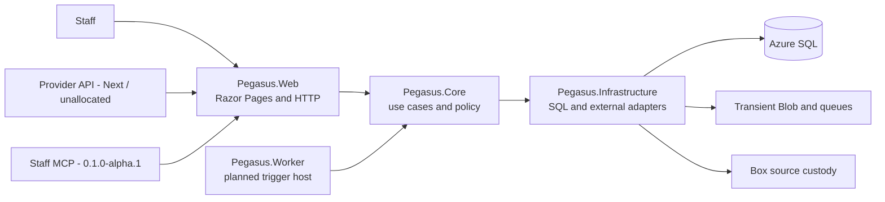

# Architecture context

The canonical current architecture is [docs/architecture.md](../architecture.md).
Durable current and historical decisions are indexed in the
[canonical decision index](../decisions/README.md). This page provides
architecture context only; it does not duplicate decision ownership.

It is not the current implementation inventory: dated caller evidence lives in
[the implementation handoff](../agent-notes/current-implementation-handoff.md),
and live Azure facts live in [the Azure inventory](../azure/current-inventory.md).
Business requirements remain under `docs/operator-notes/` and are not edited here.

## System shape

The four production projects are `Pegasus.Core`,
`Pegasus.Infrastructure`, `Pegasus.Web`, and
`Pegasus.Worker`. Web and Worker are the two composition roots; Core owns
business policy and must not depend on Azure, EF Core, Graph, Box, or Web.
Infrastructure implements Core ports. SQL owns workflow, action history, and
source/file relationships; Box owns long-term original files; Blob and queues
are transient processing infrastructure.

### Current evidence versus target

The sole proven mutating intake path is the Development-only
`/Intake/Upload` -> `ProcessIntake` path. The dashboard, `/Intake/Queue`, and
`/Intake/Review` are query callers; review download calls
`IIntakeArtifactStore`. The Worker has no trigger or Core caller. Mailbox,
Box, Blob, OCR service, provider API, staff MCP, EVA adapter, live telemetry,
and Azure deployment are planned or absent, not merely unverified. See the
dated handoff for source evidence and limitations.

The intended Azure environments are isolated local development, Azure
development/integration, and production. The release design is an authorised
terminal using committed Bicep and `azd`; it requires an explicit migration
before application deployment. It is documented, not runnable or production
ready. [ADR-0009](../decisions/ADR-0009-direct-terminal-azure-deployment.md) and
[the Azure release plan](../azure/README.md) own the route and its gaps.

## Architecture decisions

For every decision's status, historical context, and supersession chain, use the
[canonical decision index](../decisions/README.md).

## Architecture work still required

1. Prove SQL migrations and reference allocation against SQL Server/Azure SQL,
   including concurrency and duplicate delivery.
2. Replace ignored local retention with caller-backed Blob staging and Box source
   custody before deployed intake.
3. Implement target OCR, Azure integrations, provider API, and staff MCP through
   their real callers and shared Core use cases.
4. Build and prove the separate migration, package, identity, and release path
   recorded by ADR-0009; do not infer it from the current Bicep or `azure.yaml`.

The complete product gap is maintained in `docs/product/qdos-alpha-gap.md`.
