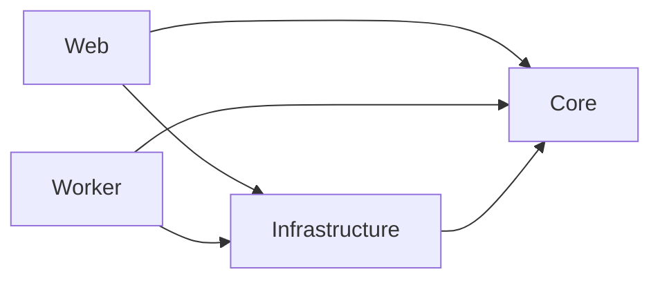

# Source architecture

Reviewed source baseline: `af1625fae8ac8018054c95e988907f6c44fa4639`. This is a source-structure snapshot,
not a claim that this revision is deployed or externally accepted. Refresh it
when the source structure changes. [Operations](operations.md) owns dated
deployed observations and exact runtime identities.

The 9 September 2026 corrective change updates the intake OCR and estimate
import boundaries described below; it does not change the dependency direction.

## Components and dependency direction

Core owns policy and ports. Infrastructure implements Core ports. Web and Worker
are composition roots depending on both. No additional application project,
workflow engine or imported source becomes a second business-policy owner.

## Flows and data ownership

- Receipt persists original bytes, source identity and durable work before
  publication. Worker owns queued processing and recovery; notification and
  recovery scheduling use the accepted unified queue boundary.
- Core route/classification/matching policy determines formal Case, Triage,
  image-origin and Unidentified outcomes. Their identities remain distinct.
- SQL owns application state and provenance. Box owns durable file custody;
  Azure provides processing storage and a derived idle cache.
- Staff, Provider API and Automation callers share Core authorization, state,
  version and policy gates. Automation's unconfirmed writes do not confer
  professional approval or outward-send permission.
- Native engineering and retained report generation use the integrated renderer
  in the existing Web/Infrastructure boundary. EVA is an optional adapter.
- Mail sending tracks attempted operations separately from observed Sent evidence.
- AiWork push and AiJobs pull remain distinct supported integration boundaries.

## Implementation map

| Responsibility | Current source |
| --- | --- |
| Core intake receipt/query/command use cases | `src/Pegasus.Core/Intake/` |
| Core source-download contract and policy | `src/Pegasus.Core/Intake/DownloadIntakeSource.cs`, `src/Pegasus.Core/Intake/IntakeContracts.cs` |
| QDOS extraction policy | `src/Pegasus.Core/Intake/DirectProviders/Qdos/QdosInstructionExtractionPolicy.cs` |
| Evidenced principal mail route, classification, and case-match policies | `src/Pegasus.Core/Intake/PrincipalMailRoutePolicy.cs`, `src/Pegasus.Core/Intake/Classification/PrincipalMailClassificationPolicy.cs`, `src/Pegasus.Core/Intake/CaseMatching/PrincipalCaseMatchPolicy.cs` |
| Core typed classification-to-operational-destination policy (`mail_operational_destination` v1) | `src/Pegasus.Core/Intake/Classification/MailOperationalDestinationPolicy.cs`; every known detailed classification remains in the result, reasoned Other is reserved for novel classifications, and the pure mapping performs no Outlook mutation |
| Core case-match evaluator and `CaseMatchIndex` read model | `src/Pegasus.Core/Intake/CaseMatching/`, `src/Pegasus.Infrastructure/Persistence/CaseMatchEntities.cs` |
| Core image-intake registration, pairing, and lifecycle use cases | `src/Pegasus.Core/ImageIntake/` |
| In-process ONNX VRM recognition engine (ADR-0019) | `src/Pegasus.Infrastructure/Vision/` |
| Multi-format source adapter | `src/Pegasus.Infrastructure/Intake/MimeKitPdfPigOpenXmlIntakeSourceReader.cs` |
| Incoming scanned-instruction OCR | `src/Pegasus.Core/Intake/IntakeOcr.cs` owns receipt/asset-bound operations; `DurableIntake.cs` and `AnalyzeRetainedInstruction.cs` qualify incoming sources and merge selected-page results. Infrastructure implements Azure Document Intelligence; Worker runs durable processing. [ADR-0047](adr/0047-scanned-instruction-ocr-only.md) defines the source boundary. |
| Estimate import | `src/Pegasus.Core/Assessment/EstimateImport.cs` invokes deterministic Infrastructure parsers. Ordinary retained-source recovery remains available; estimates do not enter OCR. |
| Local artifact adapter | `src/Pegasus.Infrastructure/Intake/FileSystemIntakeArtifactStore.cs` |
| EF receipt, current-association and action-history persistence | `src/Pegasus.Infrastructure/Persistence/EfIntakeReceiptStore.cs`, `src/Pegasus.Infrastructure/Persistence/EfIntakeMutationStore.cs`, `src/Pegasus.Infrastructure/Persistence/EfCaseAcceptanceStore.cs` |
| EF image-intake persistence | `src/Pegasus.Infrastructure/Persistence/EfImageIntakeStore.cs` |
| Database model and migrations | `src/Pegasus.Infrastructure/Persistence/PegasusDbContext.cs`, `src/Pegasus.Infrastructure/Persistence/Migrations/` |
| Web composition, feature gates and route safety | `src/Pegasus.Web/Program.cs` |
| Core retained-mail read model, use cases and freshness policy | `src/Pegasus.Core/Intake/RetainedMail.cs` |
| EF retained-mail store (poll write path and workspace read path) | `src/Pegasus.Infrastructure/Persistence/EfRetainedMailboxMessageStore.cs` |
| Canonical Operations and receipt-detail callers | `src/Pegasus.Web/Pages/Operations/Index.cshtml.cs`, `src/Pegasus.Web/Pages/Intake/Details.cshtml.cs`, `src/Pegasus.Web/Pages/Intake/Source.cshtml.cs` |
| Manual upload staging and staged-receipt status callers | `src/Pegasus.Web/Pages/Upload.cshtml.cs`, `src/Pegasus.Web/Pages/UploadStatus.cshtml.cs`, `src/Pegasus.Infrastructure/Persistence/EfQueuedIntakeStatusQueries.cs` |
| Canonical mail-workspace callers (`/Inbox`) | `src/Pegasus.Web/Pages/Mail/Index.cshtml.cs`, `src/Pegasus.Web/Pages/Mail/Message.cshtml.cs` |
| Canonical Triage and public-upload callers | `src/Pegasus.Web/Pages/Triage/`, `src/Pegasus.Web/Pages/Uploads/Request.cshtml.cs` |
| Case workspace and its capability pages | `src/Pegasus.Web/Pages/Cases/Details.cshtml.cs` owns the one scrolling Case record, its Valuation, Estimate and Report sections, query, edit lease, completeness and saves. `Workflow`, `Tasks`, `Custody`, `Vehicle` and `Closure` `.cshtml.cs` beside it each carry a family of named handlers on the shared `src/Pegasus.Web/Pages/Cases/CaseMutationPageModel.cs`. That base owns the edit-mode state and `HeartbeatLease` handler — `Pages/Shared/_EditHeartbeat.cshtml` posts it at `CaseEditAuthority.HeartbeatInterval` so an open editor is never timed out mid-edit, while the manual `RenewLease` control remains the no-script path and is hidden where script runs. The former `Pages/Cases/Assessment/Index.cshtml.cs` route permanently redirects to the Case record's Estimate section. Partials under `src/Pegasus.Web/Pages/Cases/Shared/` post to the owning page; every mutation redirects back to the workspace, while `Documents/Export` answers with a file from two POST handlers — `?handler=Bundle` for the EVA package, and the unnamed one for a selective export of chosen document versions |
| Genuine-input Web evidence | `tests/Pegasus.IntegrationTests/QdosIntakeWebTests.cs` |
| Route-denial evidence | `tests/Pegasus.IntegrationTests/LocalIntakeAccessTests.cs` |
| Stable persistence and unsupported-source evidence | `tests/Pegasus.IntegrationTests/IntakeStablePersistenceTests.cs` |
| Retained-mail persistence and mail-workspace Web evidence | `tests/Pegasus.IntegrationTests/RetainedMailPersistenceTests.cs`, `tests/Pegasus.IntegrationTests/MailWorkspaceWebTests.cs` |
| LocalDB migration, concurrency, rollback, and retry evidence | `tests/Pegasus.IntegrationTests/IntakePersistenceIntegrationTests.cs` |
| Dependency-direction evidence | `tests/Pegasus.ArchitectureTests/DependencyDirectionTests.cs` |
| Core assessment-report draft contract and caller | `src/Pegasus.Core/Reports/AssessmentReportRendering.cs` |
| Integrated Scriban/Playwright/PDFsharp report adapter and governed resources | `src/Pegasus.Infrastructure/Reports/`, composed by `src/Pegasus.Infrastructure/DependencyInjection.cs` in the existing Web boundary |

## Technical decisions

Read the [ADR index](adr/README.md) and each record's surviving clauses and
successors. Hosting, queued intake, mailbox identity, automation authorization,
renderer packaging and custody each retain their technical owner. Partial
supersession must not be mistaken for whole-record replacement.

## Reference inputs

Provider/principal generators consume supplied evidence and emit review/reference
data. These artifacts do not activate routes. Admitted runtime policy lives in
Core. [Reference authoring](runbook.md)
owns generator commands; supplied vendor specifications live in
[external component documents](external-component-documents/README.md).

## Configuration and deployment

[Configuration](engineering/configuration.md) defines settings. The existing
release skill owns packaging/deployment; one workstation platform produces the
authorized artifacts. A source composition flag or built adapter alone does not
establish the deployed configuration or acceptance. Retired source imports are
described by the [workspace boundary](../workspaces/README.md).
