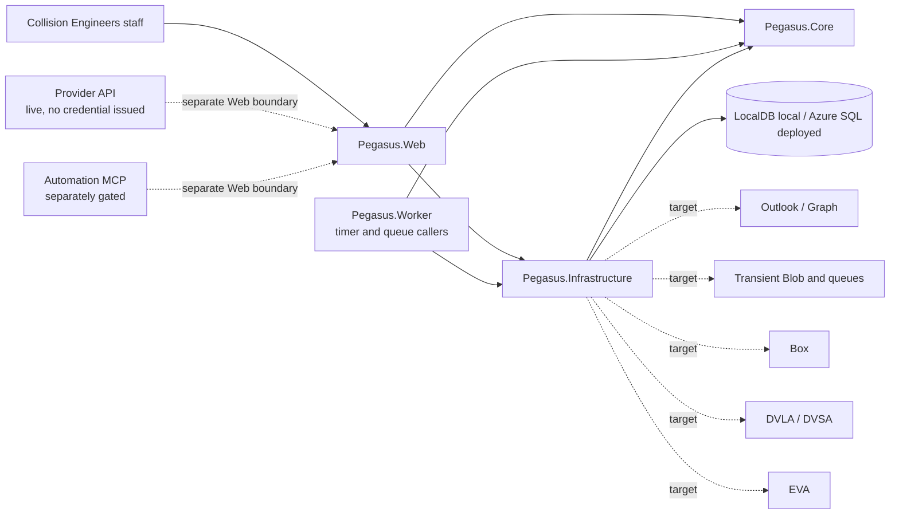

# Architecture

## Unidentified intake boundary

Safely retained material without a unique identity, meaning, owner, or destination is
represented by one Core-owned Unidentified item per source occurrence or inseparable
submission group. It has an immutable `U<n>` reference, one canonical reason, and
open/resolved history. This is distinct from Triage, Blocked intake, Audit, Image
Intake, and formal Case/PO identity; existing architecture notes that describe the
former broad `Needs sorting` destination are historical compatibility descriptions and
must not be used as current operator vocabulary.

> This file is the current **as-built snapshot**: what components exist and how the running system is wired *now*. It is not the owner of rules. Product intent and invariants live in the [PRD](prd/pegasus-product.md) and [AGENTS.md](../AGENTS.md#product-invariants); required behaviour in the [FRDs](frd/README.md); durable technical decisions in the [ADRs](adr/README.md); repository governance in [AGENTS.md](../AGENTS.md); deployed/runtime state and dated evidence in [operations](operations.md); the schedule and capability IDs in [capabilities](capabilities.md). Where this file describes a rule, it is reporting how the system is wired, not competing with those owners. **Keep it current: after any deployment or release, update this file (and [operations](operations.md)) to match reality in the same task.**

This document is the canonical owner for the current system architecture, caller evidence, dependency direction, and application boundaries. Requirements, capability scope, unresolved decisions, operations, and historical decisions remain with their respective canonical owners.

Implementation, caller proof, deployment, and acceptance are distinct:

- **Intended** describes an approved or proposed design.
- **Implemented** means code exists.
- **Caller-proved** means a real entry point executes that code.
- **Deployed** means the relevant application and infrastructure are running in the named environment.
- **Accepted** requires the applicable technical, security, operational, and operator evidence.

Registration, tests, migration presence, generated infrastructure, predecessor behavior, and source imports do not by themselves prove a caller, deployment, authority, or acceptance.

## System shape

### v1 development assembly

PLAT-075 owns platform changes; CASE-047 owns Case engineering and reports;
INTK-060 owns intake, directories and the shell. They consume identical shared
Foundation commits and later shared corrections. This source assembly is not
the release-38 deployment recorded in Operations.

The platform extends the existing staff-account and Data Protection owners
for access deletion, forced logout/reset, lease recovery and per-user external
credentials. Approved mailboxes own generation-scoped Inbox/Sent polling.
The staff-send engine persists draft/upload/submission progress; the retained
MIME pipeline alone confirms Sent after exact operation/artifact correlation.
The staged-artifact reconciliation function resumes Pending custody by its
durable logical version. Box remains the durable content owner; the SQL-indexed
Azure cache validates hashes and expires after 24 hours idle.

Queued intake re-evaluation resolves the receipt's single retained source asset
through the same logical content reader after its transient staging copy has
been deleted. The Worker supplies the exact receipt, current Case, source hash
and length; both content adapters require its system-work right and preserve
the source association checks. Re-evaluation reuses the durable source identity
and does not recreate staging or upload a second source copy.

Request-link custody checks the current upload-link identity and Case binding.
A short SQL transaction orders revocation against the Pending custody intent;
provider storage runs after that acceptance commit. Worker retention uses its
system-work right. Custody status reads also admit the exact active upload link
for its own accepted artifacts. The status lookup can recover logical identities
by the original operation key after a lost response; an absent row does not
prove that an in-flight acceptance cannot commit or permit a new operation key.
Matching Pending or Failed retention replays return the existing intent without
another provider write; accepted Pending work remains owned by reconciliation.

The `/mcp` adapters use persistent signing/encryption certificates and separate
grant attribution. Authorized metadata precedes content reads; large documents
use the same bearer-scoped exact-version streaming route. The source tool
inventory contains the 43 existing tools plus `pegasus_estimate_import`.
The import adapter refuses execution without B's canonical command binding;
its combined caller validation remains pending. Discovery, working domain
composition and real external-client acceptance remain distinct.

Administration adds Action Logs, AI Jobs, Reports and Health over existing
Core query owners. Action Logs combines permanent action history and security
events in one SQL-paged projection with search, area, actor, operation, record,
result, correlation and time filters plus chronological sorting.
Source wiring and local validation do not establish that
these pages, certificates or provider integrations are deployed.

Pegasus is a four-project modular monolith:



The current repository exposes an ASP.NET Core Razor Pages host and a .NET 10 isolated Azure Functions Worker. The Worker has timer and queue-trigger callers that translate bounded work into Core use cases. Any provider API caller remains separately gated. The Automation MCP ingress is implemented inside `Pegasus.Web` behind a composition gate that is off by default; when the gate is off no automation route exists, and live activation remains separately approved.

The repository identifies its package and release target as `0.1.0-alpha.1`.
Pegasus is deployed to its sole production environment by exact-SHA
fast-forward releases of `main`; this topology was rechecked after release 38
on 2026-09-02 and is unchanged. The current production state (release,
revision, migration head, gate settings) is owned exclusively by
[operations § Production environment](operations.md#production-environment)
and is not restated here. Operator acceptance remains outstanding.

The implemented release toolchain now admits new release artifacts only from
an authorised Linux x64 terminal. One clean exact SHA produces Linux Web and
Worker packages, a linux/amd64 OCI archive and a self-contained Linux
`efbundle`; manifest schema 3 binds their hashes and platform identity. This is
repository tooling state, not evidence that the change has been promoted or
deployed.

## Components and dependency direction

| Component | Ownership and permitted dependencies |
| --- | --- |
| `src/Pegasus.Core/` | Business use cases, invariants, models, decisions, and ports. It must not depend on Web, Worker, Infrastructure, EF Core, Azure, Graph, Box, or other adapter implementations. |
| `src/Pegasus.Core/ReferenceData/` | Exact provider/domain-suffix package validation, deterministic candidate semantics, and the catalog port. It contains no workbook, package-file, or EF implementation. |
| `src/Pegasus.Infrastructure/` | EF persistence and source, artifact, package, and future external-system adapters implementing Core ports. It depends on Core. |
| `src/Pegasus.Web/` | Razor Pages and HTTP composition root, request translation, configuration, route gates, and health endpoints. It invokes Core through configured ports and Infrastructure adapters. |
| `src/Pegasus.Worker/` | Isolated Functions composition root. Its timer and queue triggers translate persisted intake, external-work, mailbox, sent-evidence, and reconciliation signals into Core use cases; it contains no duplicate business policy. |

Web and Worker may translate transport, identity, and configuration. They must not reproduce business policy. Infrastructure may implement Core ports but does not own business decisions.

A new project, runtime, store, migration stream, deployment unit, or top-level application boundary requires an accepted ADR demonstrating that these owners cannot carry the change. Decision status and supersession are maintained in the [decision index](adr/README.md).

## Architecture invariants

These invariants — `Pegasus.Core` is the single owner of business policy;
duplicate business implementation is a stop condition; a new top-level project,
store, runtime, migration stream, or deployment unit requires an accepted ADR
proving the existing boundary cannot carry it; and `Audit`, `Triage`, and
`Blocked intake` keep their settled distinct meanings, with `Unidentified`
superseding `Needs sorting` for that meaning — are owned by
[AGENTS.md § Product invariants](../AGENTS.md#product-invariants). This
section reports how the running system is wired to them; it does not restate or
compete with that owner.

Shared-code naming, classifier precedence and external-outcome conventions
are owned by [AGENTS.md](../AGENTS.md#simplicity-rails). This snapshot describes
their implementation rather than defining another operating contract.

## Current callers and entry points

### Staff Web callers

- Staff Razor Pages resolve request claims through the metadata-free
  `StaffPageModel`, which is the Web-owned adapter to Core
  `StaffActorFactory` and the shared operation-key generator. Administration,
  case-mutation, upload-confirmation, and direct staff page models inherit it;
  endpoint authorization remains on concrete pages or the authenticated
  fallback policy. Anonymous `/Uploads/{token}` remains outside this inheritance
  tree and reuses only the static operation-key generator. Manual upload receipt
  tokens remain a separate intake replay identity.
- `GET /Inbox` calls Core `ListRetainedMail` and `GetRetainedMailFreshness` for the mail workspace: retained messages newest first, scoped by mailbox and folder through the query string alone, with an explicit manual refresh that carries that scope; it is read-only and the page carries no handler. Its optional search filters retained mail in SQL before paging across the retained body, attachment filenames, and receipt-owned `IntakeSearchDocuments` projected atomically from the canonical intake-reader output. Deleted Items search instead calls Core `SearchDeletedMail`, which caps a request at the 100 newest messages and uses GET-only Graph reads against each exact approved mailbox and its resolved `deleteditems` folder; MIME is parsed once by the same intake reader and is neither retained nor backfilled. The durable queued-intake caller also applies MAIL-09's advisory association after evaluation: it derives candidates from current non-archived Case registration data and exact mailbox/conversation current associations, then delegates a fresh evidence fingerprint to the existing serializable, idempotent association transaction. `GET /Inbox/{id}` calls `GetRetainedMail` for one retained message, its attachments, its retained-scope thread, current classification, queue, processing outcome, current manual-or-accepted case association and latest folder-move result. For an unassociated exact receipt it also uses the canonical Case search/detail queries to show a searched business summary; the confirmed link POST re-resolves the message and receipt, verifies reviewed versions, acquires the existing Case edit lease and delegates to `ILinkIntake`. The confirmed unlink POST applies the same server-bound checks to the exact current Case and delegates to `IReverseIntakeLink`; replacement is a later independent search and link, not an active-to-active swap. That read also derives zero or one concrete suggested Move from the current folder recommendation and move eligibility; the advice is not stored and the page delegates its control to the existing confirmed move handler. `OnPostCorrectClassificationAsync` corrects classification. `OnPostMoveToRecommendedFolderAsync` accepts only the internal message id, current classification/recommendation/mailbox versions, operation key and required reason; Core revalidates the exact approved binding and Infrastructure reserves one `RetainedMailFolderMoves` record before the narrow provider port. A successful record overlays current location so the immutable arrival row remains unchanged and Inbox queries exclude the moved message. The provider is unavailable by default and the control is absent in that composition; fake-HTTP/local-SQL tests supply it, while no production writer, Graph permission, deployment or live mailbox mutation is active. The Web runtime role holds `SELECT` alone on the retained-mail and receipt search-projection tables and `SELECT, INSERT, UPDATE` on the move-operation table; the Worker projection writer holds `SELECT, INSERT, DELETE` on `IntakeSearchDocuments` because replacement removes and recreates rows rather than updating them. Web also holds `SELECT, UPDATE` on `IntakeMailClassificationDecisions` and `SELECT, INSERT` on `IntakeMailClassificationHistory` (`UPDATE, DELETE` denied there).
- `GET /Operations` calls the Core Operations projection for retryable external work and active unexpired Pegasus-generated upload links. It has no approval controls, general receipt ledger, manual/email/Automation receipt display, or Box request caller. The separately planned principal-scoped provider API is not inferred from the Automation/MCP ingress. `GET /Received/{id}` calls `GetIntake`, and its retained receipt mutations call the named Core intake commands with a server-derived actor, expected versions or case lease, operation key, and reason as applicable.
- `GET /Received/{id}/Source` calls Core `DownloadIntakeSource`, which authorises the current staff actor, resolves the receipt-owned source, validates retained length and SHA-256, and returns only a no-sniff attachment with a safe filename and content type.
- `GET /VehicleImages/{id:guid}` calls Core `IImageIntakeQueries` for the image-intake detail query plus the receipt's VRM suggestions and, while the record holds no case association, the registration-matched eligible-case candidates; it is a read-only authenticated staff page. **EPIC-011 removed the standalone `/VehicleImages` list page only** — the detail page remains, and is now reached from `/Cases`, the case Files view, the received-material detail page and Search rather than from a list of its own. The association-filtered list query it served is now part of those surfaces.
- `/Triage/{id:guid}` is the physical detail owner for Core triage queries and commands. **`/Triage` is no longer a list page**: since EPIC-011 it is a `RedirectPermanent` to `/Cases`, carrying its queue through as a tab, and the list itself is served by `/Cases`. The former Development web evaluator is not an application caller; the separately owned desktop evaluator remains outside the Web runtime.
- Anonymous request submission exists only at `/Uploads/{token}`. The PageModel calls `GetRequestUpload` and one `UploadToRequest` command, uses antiforgery and an idempotent operation key, and presents generic non-disclosing outcomes through PRG.
- The Case documents surface links confirmed custody directly to the case's real
  Box folder. The superseded internal Box File Request create/revoke mechanism
  has no caller or persistence model; request-scoped public upload links remain
  the separate INT-31 capability.
- These callers are source-state evidence; deployment state is owned by [operations § Production environment](operations.md#production-environment). Caller evidence alone does not establish browser accessibility acceptance or operator acceptance.

### Technical entry points

- `/health/live` reports liveness.
- `/health/ready` invokes the registered database health check.
- These endpoints are technical probes, not evidence of a product mutation or external integration.

### Worker callers

`src/Pegasus.Worker/Program.cs` constructs the Functions host. The concrete functions in `IntakeFunctions.cs`, `MailboxFunctions.cs`, and `EmailEvidenceFunctions.cs` are the caller evidence for their timer and queue paths. Registration and host startup alone remain insufficient evidence of external-system activation or operator acceptance.

A Worker `local.settings.json` is unnecessary at this baseline. Copy `src/Pegasus.Worker/local.settings.example.json` to the ignored `local.settings.json` only when an actual trigger requires local Functions storage.

### Implemented production targets and absent callers

Worker production composition registers bounded Graph Inbox/Sent, Box
custody, and DVLA/DVSA adapters plus Azure Blob/queue transport. These are
**Deployed**, but deployment is not current execution evidence: the production
Worker is enabled, and its live runtime and estate state are owned by
[operations § Production environment](operations.md#production-environment).
Graph Inbox/Sent processing was live-verified for release
1; that historical proof does not establish the current retained-mail or
administrator-estate path. Exact current state is owned by
[operations § Production environment](operations.md#production-environment),
and operator acceptance remains outstanding.

Web production composition registers Box-backed case custody and managed
document content, the staff document and EVA export surface, and Azure Blob
intake artifact stores behind one storage profile. These are **Deployed**
(release 3); the current production state is owned by
[operations § Production environment](operations.md#production-environment).

In-process ONNX vehicle-registration recognition (ADR-0019) is implemented
in `src/Pegasus.Infrastructure/Vision/` behind the Core `ImageIntake`
automation; [operations § dated evidence](operations.md#dated-evidence-qualifications) owns the accepted evaluation numbers.
Implementation is not live-caller acceptance.

The following boundaries distinguish source capability from live proof:

- Broad Graph mailbox categorisation, flag/delete/folder mutation and
  unattended sending remain excluded. v1 adds the separately authorized
  staff-initiated draft/send adapter; this branch has not been deployed.
  `DevelopmentOffline` composes an explicit report-send refusal and no
  Graph mail transport; it does not simulate a submitted or sent operation.
- Document Intelligence OCR remains subject to C's qualified-page caller and
  later operator activation evidence.
- DOC/MSG extraction is implemented by the bounded in-process readers below;
  format recognition is not proof for every genuine sample.
- Provider API and Automation MCP are composed, with their production ingress
  flags observed enabled on 6 September in [operations](operations.md#production-environment).
  Ingress activation does not establish external-client acceptance or v1
  certificate deployment.
- correlated live telemetry retention for a full working day remains unproved.
  Both hosts are instrumented: the Worker has reported continuously throughout
  the retained window, and release 19 instrumented the Web host, which had
  carried the connection string since the estate was built while never calling
  `AddApplicationInsightsTelemetry`. Release 35 (2026-08-27, MAIL-020) raised
  the component `dataVolumeCap.cap` on `pegasus-prod-appi-252ow37gij` and the
  workspace `dailyQuotaGb` on `pegasus-prod-logs-252ow37gij` from 0.1 to
  **0.5 GB** (one variable, `telemetryDailyCapGb`, binds both) and the deployed
  Worker now registers `SqlDependencyTelemetryFilter`, dropping only successful
  SQL dependency items — `AppDependencies` had been 64.7 MB of a single day's
  0.1 GB component cap. Both caps read back 0.5 immediately after the release
  35 provision. That raises the ceiling and cuts the largest single
  contributor; it does not by itself prove the new cap survives a full working
  day of both hosts' combined volume, and the two alert rules remain unproved
  against a capped window until that evidence exists. Sampling is on
  (`APPLICATIONINSIGHTS_ENABLEADAPTIVESAMPLING`). Correlation, retention and
  alert delivery remain unproved until the window covers a working day at the
  new cap (PLAT-034, open).
- an automated check that a runtime role may write what the code writes. The
  least-privilege grant matrix (`20260729199000_RuntimeRoleReconciliation`) is
  the one list of what Web and Worker may touch, and nothing verifies it against
  the stores each composition root actually registers. Tests and LocalDB runs are
  full-privilege, so the suite is green while the deployed estate refuses the
  write. This has now shipped three times — `20260814092852`, `20260821095500`
  and `20260822044425`, the last of which broke case custody for every case
  created after release 17 (PLAT-035, open).

## Current intake and extraction boundary

The locally verified slice includes provider-neutral intake, one concrete QDOS
extraction policy, and bounded production adapter implementations. It does not
prove deployed mailbox automation, live production custody/enrichment, the
full MVP, a second provider, or operator acceptance.

This is implementation evidence toward [INT-01, INT-08–13, INT-18–20, and INT-23](capabilities.md); the inventory owns allocation only, and each broader capability contract remains unproved.

```text
Staff Intake Razor Page
  -> ReceiveIntake stages original bytes and Pending work
  -> committing Web or Worker caller publishes the staged receipt id immediately
  -> one-minute Worker recovery republishes only interrupted Pending work
  -> intake-work queue
  -> Worker ProcessQueuedIntake
  -> QDOS IInstructionExtractionPolicy
  -> MimeKit/PdfPig/Open XML source reader
  -> ignored content-addressed artifact storage
  -> EF Core receipt and typed-draft persistence
  -> staged-receipt status, dashboard, queue, and review queries
```

### Accepted local inputs

The PageModel accepts one file no larger than 10 MiB with one of these extensions:

- `.eml`
- `.pdf`
- `.docx`
- `.doc`
- `.msg`
- `.jpg`
- `.jpeg`
- `.png`

One manual upload occurrence is identified by an opaque receipt token generated by the page.

The current enforced resource limits are:

| Boundary | Limit |
| --- | --- |
| ASP.NET Core multipart request | 10 MiB file allowance plus 64 KiB for the multipart envelope |
| PageModel file | One file; 10 MiB |
| Received mailbox message | One message, envelope and attachments together; 750 MiB |
| PDF reader | 5,242,880 extracted characters; 512 discrete image objects; 100,000,000 decoded image-sample pixels; 25 MiB extracted image bytes; 30 seconds |
| EML reader | Eight nested-message levels; 128 MIME entities; 25 MiB cumulatively decoded MIME bytes |
| DOCX reader | 512 package entries; 50 MiB total uncompressed bytes; 10 MiB for each XML or relationship part; 25 MiB total image bytes |
| DOC reader | 10 MiB input; 16,777,216 extracted characters; 1,000,000 piece-table pieces; the compound-file bounds below |
| MSG reader | Eight nested-message levels; the compound-file bounds below |
| Compound-file container (DOC and MSG) | 16 MiB input; 32,768 sectors; 131,072 directory entries; 16 MiB per stream; 64 MiB total stream bytes |

The multipart boundary is enforced before Core. Reader-limit outcomes remain visible and cannot allocate a case or reference.

A received message and an uploaded file are bounded separately. The upload figure bounds one file arriving in one HTTP request; an instruction email carries the covering message plus the documents and photographs of the job, and the two shared one figure until a 16.7 MB QDOS instruction was refused unread on 2026-08-05. The mailbox figure is permissive by intent rather than a capacity claim: the reader limits above still apply to what it admits, the poll materialises a message in memory, and no mail transport carries anything near it — the practical ceiling is set by the Worker instance.

### Source reading and retained evidence

The current reader can:

- read email bodies and bounded nested EML;
- enumerate supported attachments;
- read PDF embedded text and discrete image streams;
- read DOCX text and internal images;
- read legacy DOC (Word binary) text through the bounded compound-file and
  piece-table readers;
- read Outlook MSG bodies (plain, HTML, and compressed RTF), sender/subject
  transport evidence, and attachments, which re-enter the same dispatch so a
  PDF inside a message reaches the PDF reader;
- retain the uploaded source and each supported attachment, inline image, DOCX image, and discrete PDF image as separate review occurrences.

SQL stores metadata and opaque artifact keys, not file bytes.

Legacy DOC and MSG are extracted in-process since release 14 by the
CollisionDocNet-derived readers under `Pegasus.Infrastructure` (SIMPLI-013,
[ADR-0025](adr/0025-integrate-renderer-and-extractor-into-the-application.md));
unreadable, encrypted, or over-limit containers fail closed into Unidentified
without a reference. Ordinary images are retained review evidence; they are scanned by the in-process ONNX VRM engine (ADR-0019) and are never sent to an external OCR or vision service.

For PDFs, only low-text pages with a dominant raster are marked as scan-like OCR candidates. No OCR service is currently called. Document- and attachment-level OCR-required state is visible during review.

The reader constructs no network client, launches no process, and does not retrieve external links, images, relationships, keys, or other remote content. Graph, Box, Blob, OCR, DVLA/DVSA, EVA, workspace extractors, and any other external service remain outside the reader; bounded production adapters attach only at the Web and Worker composition roots.

### QDOS applicability and drafts

QDOS is the sole concrete extraction policy until another principal has approved rules and genuine evidence. It is applied only to fully readable input.

- Positive instruction content is required; QDOS is not a fallback principal.
- Strong instruction content may outrank a weak transport signal such as a staff-forwarding sender.
- A QDOS-looking sender or filename alone creates neither a draft nor a principal suggestion.
- The review surface shows classification evidence, ten field suggestions, missing values, conflicts, page-labelled extracted text, OCR-required state, and failure details.
- The typed instruction-draft values are read-only on the review surface. They are editable in one place, the create screen; original candidates and provenance stay visible beside every box. A value a person keys becomes a candidate of its own, sourced to the staff correction, so the case records who said it. Review does not withhold a definitive instruction's Case/PO allocation.
- An absent instruction date defaults from the receipt clock.
- The test clock is fixed to 2031, so integration assertions use a 2031 default instruction date.

Suggestions and typed drafts are neither editable nor approved case records. Receipt and extraction create no case, counter, year-based reference, or external categorisation.

**Definitive authorised intake attempts typed case allocation at processing time.** QDOS classification persists `Inspection`, `Audit`, or `Inspection + Audit` beside its policy version. With no definitive existing-case match, the durable processing path calls the Core `IAllocateIntake` owner for a `CaseCreated` processing decision and consumes only that persisted type and the extracted principal. The case enters `Not ready` with nothing confirmed by a person, because thin ordinary detail is never a reason to withhold the reference. The evaluation-scoped automatic attempt and its outcome are durable and replay-safe. A failed attempt leaves the completed receipt and a bounded operator-safe failure; completed-work replay cannot call acceptance again. Only an authenticated, reasoned staff retry can reuse the frozen failed command.

Only an **ambiguous** case match is withheld from automatic allocation. An Audit is definitive only where the retained email contains its instruction and a separate original report carrying one literal outcome, `repairable` or `total loss`; that creates its `a.` or `ap.` reference automatically without a staff confirmation. Missing, conflicting, or unclear standalone Audit evidence withholds the later Audit reference; it does not withhold an otherwise eligible normal Case/PO reference. A missing or disabled Principal is instead a visible recoverable allocation failure on the completed receipt. The create screen (`INT-26`) records detail and settles the inspection address. `EfCaseAcceptanceStore` still applies `IntakeDecisionPolicy.CanBecomeCase` inside the transaction, so eligibility does not depend on which caller asks, while actual success is projected only from the Case intake link.

### Idempotency and persisted semantics

- Replaying the same source occurrence returns the existing receipt.
- Equal source bytes under a different occurrence identity remain separate evidence.
- Stable decision, channel, evidence, and asset codes plus versioned JSON envelopes are persisted instead of CLR enum names.
- Unknown persisted codes and inconsistent policy results fail rather than being silently reinterpreted.
- `Unidentified` and `Blocked intake` counts and filtered queues are persisted and queryable, and both exclude receipts that have produced a case, so they measure what is still waiting for a person rather than everything ever received. A `case_created` decision is not case-existence authority. Operations, retained Mail, Upload, MCP, and retry surfaces join the current allocation state and actual Case link.

## Operations workspace subsystems

EPIC-011 replaced the operator surfaces and added four subsystems. This section
describes current state, not a release note; the release that introduced them is
recorded in [operations](operations.md#production-environment). Each is Core-owned with its
persistence in `Pegasus.Infrastructure`; none introduces a parallel policy
engine.

- **Integrated Operations Workspace.** The operator surfaces are one workspace
  rather than separate pages: the Work Centre at `/`, `/Cases` with its tabbed
  queues, `/Operations`, and the case workspace at `/Cases/{id:guid}` with its
  `?section=` views. The list surfaces they replaced — `/Triage` and
  `/Administration/MailCategories` — are **not** removed: each survives as a
  `RedirectPermanent` shim carrying its tab through, so bookmarks and existing
  links land on the same work. Only the `/VehicleImages` list page was deleted
  outright.
- **`AiJobs`** — the pull-based AI job ledger (AUTO-011). One durable row per
  requested job with its state and attribution. **Web is the only runtime that
  touches it**: staff create, cancel and confirm from the application, and
  external AI clients work it through the `/mcp` ingress Web hosts. The Worker
  runs no AI timer (ADR-0035) and is granted nothing on the table. The
  Automation Actor's writes return through the MCP ingress; the ledger never
  writes case data itself.
- **`NamedEstimates`** — a reshape of `CaseRepairSpecifications` rather than a
  new table, giving an estimate a name and a current-version flag so a case can
  carry several and one is current.
- **`CaseValuations`** — Engineer-entered valuations on a case (ENG-027), read
  by the Assessment workspace in the same process. Worker has no caller and no
  grant; valuations are Case records, so `DELETE` is deliberately absent.

Two surfaces became reachable in production for the first time at this release:
the Provider API (`Features:ProviderApi`, no credential issued) and document
upload links (`DocumentRequests:AcceptedLimitsVersion`, INT-31 interim limits).
The upload-link surface was built earlier and composed out. The Provider API
was **not**: it did not exist at release 36 at all, and its routes, scheme,
flag and two of the eleven migrations were introduced inside the release-37
range. See [operations](operations.md#production-environment).

The public-upload persistence path now enters the same managed-document
custody boundary as staff uploads. It allocates the next persisted case
document ordinal, carries that ordinal and the case's persisted Box root into
`ManagedDocumentContentAddress`, and calls `StoreVersionAsync`; the legacy
content-store call cannot address the production Box layout. Request telemetry
canonicalises every `/Uploads/{token}` URL to `/Uploads/Request`, removing its
query and fragment while retaining request result and correlation fields. This
is repository source state only: release 38 still contains the broken legacy
call and the unredacted telemetry behaviour described in
[operations](operations.md#production-environment).

## Business-rule ownership

Core owns:

- intake decisions;
- transport-normalised evidence passed into routing;
- route-policy selection;
- provider, type, principal, and case determinations;
- case and reference invariants;
- lifecycle, matching, and classification;
- shared business actions later exposed through Web, Worker, provider API, or MCP;
- exact provider/domain package validation and deterministic catalog outcomes.

Shared intake code may normalize transport, reconstruct one original sender
where a staff forward is proved (from an attached email or the strict ordered
Outlook `From:`, `Sent:`, `To:`, `Subject:` header quartet), extract subject,
body, attachments, and assets, invoke exactly one applicable route policy, and
record that policy’s evidence and version. It does not impose a universal
case-matching precedence. Partial, conflicting, or malformed forwarding
evidence remains reviewable rather than becoming route identity.

Direct-provider and intermediary policies are separate, code-versioned owners. They may identify the same provider, but each policy applies only to its own message shape and evidence.

The following invariants remain in force even where their activating callers are deferred:

- no case deletion;
- no reference reuse;
- no mutation of the principal after allocation;
- no second meaning for Audit, Triage, or Blocked intake, and none for
  `Unidentified`, which supersedes the former `Needs sorting` meaning;
- no case or reference allocation until configured principal identity, durable custody, and the accepted allocation transaction are available.

No rule engine may be copied into Web, Worker, a workspace, or an integration adapter.

## Provider/domain-suffix package boundary

The accepted package increment is based on revision `d0965e1264dadc8d9942ac54fd68a4b45fd06f28`; exact repository head must be verified before relying on file locations or test counts. The Pegasus identity cutover occurred at `f69ea31dfdf0a59b8a2c176da90ae22a538fbc9c`.

The immutable package has these qualifications:

| Property | Value |
| --- | --- |
| Package identity | `provider-domains-v1` |
| Package version | `0.1.0-alpha.1` |
| Schema version | `1` |
| Providers | `11` |
| Provider/intermediary domain-suffix associations | `16` |
| SHA-256 | `f6b5ad8ecdd428db4316b23e16aa7e0ffc93562aec33374c03ea68cd4f0370a3` |
| Current logical resource | `Pegasus.Infrastructure.Persistence.ReferenceData.provider-domains.v1.json` |
| Pre-cutover logical resource | `CollisionSpike.Infrastructure.Persistence.ReferenceData.provider-domains.v1.json` |
| Immutable source provenance | `docs/reference/workproviders-and-repairers/initial.xlsx` |
| Current physical authoring source | `reference/workproviders-and-repairers/initial.xlsx` (mapped only by authoring and test resolution) |

Core validates exact package tuples and defines deterministic results:

- `Found`
- `Unknown`
- `Ambiguous`
- `InvalidSuffix`
- `PackageNotFound`
- `PackageRejected`

Infrastructure implements the catalog through one bounded EF query against the requested immutable package version. A committed migration seeds the versioned, cumulative SQL snapshot from the validated embedded package.

A stored suffix is candidate evidence only. It does not:

- activate a route;
- authenticate or resolve a principal by itself;
- create an inspection location or default;
- map a Case ID;
- prove provider acceptance.

No Web or Worker caller currently consumes the catalog. Package presence, migration registration, and passing tests do not constitute route activation or operator acceptance. Neither Web nor Worker may parse the workbook or package directly.

## Data and custody boundaries

### Current Development data

`DevelopmentOffline` uses the platform's supported SQL Server — SQL Server Express LocalDB on Windows, a per-run container on Linux — through connection name `Pegasus`, database `PegasusDevelopment`, and the committed SQL Server migration stream. Deployed Pegasus uses Azure SQL through that SQL Server migration stream; there is no supported database-provider choice.

Current source and extracted bytes are retained under the ignored content-addressed root:

```text
artifacts/local-development/default/intake
```

This is local development evidence, not production Blob staging, Box custody, backup, or accepted recovery.

There is no supported non-Development filesystem fallback: outside the DevelopmentOffline profile, intake artifacts live in Azure Blob, never on the local filesystem. The staff `/Received/{id}`, `/Received/{id}/Source`, and `/Inbox` routes are served wherever intake is composed, including the Production runtime profile (composition merged; deployed state is owned by [operations § Production environment](operations.md#production-environment)), and return `404` everywhere else. The current artifact port exposes store and read operations only; Pegasus has no receipt/artifact deletion API, backup command, or proved restore path. Test-harness cleanup and manual removal of an owned ignored run directory are not application deletion or recovery evidence.

The application retains the original source before recording a reviewable receipt:

- retention failure is retryable and stores no receipt;
- a later SQL failure may leave reusable content-addressed bytes;
- those bytes must not be mistaken for an accepted receipt or production custody.

Sequential receipt-token/content conflicts are rejected before artifact storage. A simultaneous first-use collision can leave the losing hash unreferenced in ignored local storage. Production custody must close that race before activation.

### Target ownership

| Data or evidence | Intended authority |
| --- | --- |
| Case workflow, identity, configuration, permanent action history, and source/file relationships | Azure SQL |
| Long-term original-file custody | Box |
| Mailbox content and exact sent-message evidence | Outlook |
| Accepted classification and source associations | Pegasus |
| Named Engineer assignment and downstream engineering | EVA until an accepted replacement slice |
| Transient processing bytes and delivery work | Private Azure Blob and queues; never long-term custody |
| Local content-addressed artifacts | Development evidence only |

Deployed migrations are applied through the release-owned migration bundle
before application activation; the executed production record is owned by
[operations § Production environment](operations.md#production-environment).

Pegasus starts with fresh application data. The predecessor’s pre-release test cases and application state are not migrated or preserved as a `0.1.0-alpha.1` requirement.

## Database and migration boundary

EF migrations under `src/Pegasus.Infrastructure/Persistence/Migrations/` own application schema evolution.

Normal Web or Worker startup never applies migrations. Development migration is a separate explicit LocalDB command. The LocalDB guard accepts an empty database or the exact current SQL Server migration history; unexpected schema or history, or a pending model change, fails before normal application use.

A release-owned migration bundle or explicit operation must apply deployed migrations before the application package. Schema recovery is not an automatic down-migration.

The platform's supported local SQL Server (LocalDB on Windows, a per-run container on Linux) is the canonical local provider for persistence, migration, concurrency, and recovery evidence. Each disposable result proves only the exercised local behavior; it does not prove Azure SQL locking, upgrade behavior, recovery, or live deployment.

## Authentication and authorization boundary

Staff authentication and authorization are implemented and enforced:

- self-managed ASP.NET Core Identity staff sign-in with Account pages for sign-in, sign-out, password change, and access denial (`src/Pegasus.Web/Pages/Account/`);
- named authorization policies including the enforced Administrator role (`src/Pegasus.Web/Program.cs`), with Core-owned staff authorization and account administration (`src/Pegasus.Core/Identity/`);
- a server-derived authenticated action actor on intake and case mutations;
- anonymous intake review denied; disabled or stale staff sessions fail closed;
- draft confirmation as a separate authenticated mutation with optimistic-concurrency evidence;
- a gated production first-Administrator path (`--bootstrap-production-administrator`).

Login protection uses generic authentication failure plus transient request throttling rather than persistent Identity account lockout (ADR-0013 clause 12). Authentication alone does not authorize case creation; allocation still requires principal identity, durable custody, and the accepted allocation transaction. Decisions that withhold slices remain authoritative in [open decisions](open-decisions.md).

Secrets must use managed identity and RBAC where supported. Infisical or Key Vault may hold only unavoidable third-party credentials.

## Integration boundaries and deferred seams

Deferred capabilities retain only the stable identities and ports necessary for later activation. They add no caller, Azure resource, credential, route, schema, feature flag, dormant integration, or UI placeholder before activation.

### Mailbox intake

The implemented Graph source feeds the existing provider-neutral intake and
sent-evidence use cases through Worker. It must not copy receipt, extraction,
categorisation, or workflow rules into Worker.

Which mailboxes inbound intake reads is Core-owned and database-backed: Core
asks the approved-mailbox estate for the pollable mailboxes and iterates them,
so the decision never sits in a Worker function or in an adapter. The sources
are stateless with respect to the mailbox — every mailbox and folder identity
comes from the lease, not from configuration closed over at composition — which
is what lets one Graph client serve the whole estate. Each mailbox holds its own
lease, its own cursor, and its own last-failure code, so a mailbox that fails is
released alone and the rest of the tick continues
([ADR-0022](adr/0022-approved-mailbox-identity-and-enablement-database-setting.md)).
Sent-evidence polling remains configuration-driven for one mailbox.

Inbound state uses `ApprovedMailbox.Id` as its durable source identity, with a
versioned Graph cursor-scope fingerprint, immutable receipt-token identity and
an explicit fresh-start activation time per mailbox. The Web validates Graph
change and lifecycle notifications and places a targeted mailbox wake on the
existing unified work queue; Worker owns the exact-Inbox subscription and the
same polling use case that recovery invokes. The five-minute Inbox timer is a
recovery path, while six-hour maintenance renews subscriptions. Global Worker,
individual-Function and per-mailbox controls remain separate. The technical
decision is
[ADR-0024](adr/0024-stable-approved-mailbox-identity-and-explicit-baseline.md),
and its required behaviour is specified in
[FRD-08](frd/frd-08-email-mailbox-and-background-processing.md).

The poll also writes a retained-message read model — mailbox, folder scope,
immutable and conversation identities, sender, recipients, subject, received
time, excerpt, attachment names, media types and decoded sizes, and read state
— which is what the `/Inbox` workspace displays. It is written once, between
the accepted `ReceiveIntake` and the cursor advance, and never updated: a
redelivery is refused by the unique index on mailbox and message identity, so
what the row records is what arrived. The Worker holds `SELECT, INSERT` on
those tables and Web holds `SELECT` alone.

That read model stores `BodyPlainText`, not only the excerpt. The alternative —
re-reading the retained MIME artifact on every view, or waiting for the
processed receipt's evidence — leaves the viewer blank exactly where it is most
needed: on a workstation with no Worker running, nothing has processed the
message, and re-reading the artifact per view puts a blob fetch and a MIME
parse on the read path of a list-and-detail screen. The body is already
flattened inert text when it is written, so it is stored as the text it will be
rendered as. Message-level retention starts from the tick that first wrote it;
nothing backfills earlier mail, and the list surfaces that gap rather than
presenting an empty scope as "nothing was received"
([open decisions](open-decisions.md#mail-workspace-freshness-threshold-and-retention-start)).

The Graph mailbox intake route was live-verified under exact Exchange
Application RBAC for release 1. The production Worker is enabled; the current
runtime state of the mailbox Graph trigger is owned by
[operations § Production environment](operations.md#production-environment).
The historical verification predates the administrator-managed estate and the
retained-message read model described above, and does not extend to them: both
are proven at local-caller tier only, and neither has run against a deployed
environment.

Its adapter boundary provides:

- managed-identity access;
- Azure Blob staging;
- Box custody behind the existing Core port;
- delivery identity and duplicate-delivery handling;
- bounded retries and terminal failure visibility;
- exact Outlook sent-message evidence where required.

The current QDOS extraction policy must not be reinterpreted as mailbox categorisation.

### OCR and recognition

A first Document Intelligence caller may submit only persisted scan-like PDF page candidates. Ordinary images and vehicle photographs are outside that slice. Vehicle-registration recognition is implemented as the in-process ONNX engine selected by ADR-0019, scanning image-only intake automatically; it performs no image egress and no external OCR call. Document Intelligence OCR for scan-like PDFs remains absent. DVLA/DVSA adapters are implemented and the lookup path is composed in both runtime profiles (the Web records staff requests — replay in DevelopmentOffline, live-enabled in Production — and the production Worker owns the live adapter). Since release 15 an automatic sweep on the worker's reconciliation timer enqueues one lookup for every active case whose current registration (confirmed, else extracted fact) has never been looked up — idempotent per case and registration via the durable request row — so DVSA evidence and the mileage estimate arrive without a staff request, and the assessment page prefills its Mileage and Source from that evidence. Since release 23 the lookup is enrichment rather than a rival reading: recording an observation also writes its make, model, mileage and mileage unit onto the case's own fields at the **suggestion** tier, which `CaseField.Current` (`Confirmed ?? Fact ?? Suggestion`) ranks below an extracted fact and a staff-confirmed value. A case that knows nothing gains the lookup's answer; a case that already knows keeps what it had, and the lookup's version sits behind it. The same release backfilled every case whose lookup predated the change. Since release 28 there is one mapping and one act, so a lookup value reaches the export carrying its real `Suggested` status rather than being refused.

### Provider API and Automation MCP

Provider API and Automation MCP are separate Web ingress boundaries. They must invoke the same Core business actions as staff UI or Worker callers rather than introducing parallel policy engines. The provider API's composition gate was opened at release 37 (`Features:ProviderApi=true`); an unauthenticated request answers 401, so the route admits nobody until a credential is issued, which is a separately approved step. Its exact client and real caller evidence therefore remain outstanding. The provider accept path's staged-receipt back-reference and `Accepted` history row are repaired by that same existing Worker reconciliation timer after an interrupted accept.

The Automation MCP ingress is implemented in `Pegasus.Web` per ADR-0011, ADR-0031, and ADR-0026: `ActorKind.Automation` is a Core actor granted exactly the ordinary casework surface (every administration, system-work, and request-upload right is denied and unknown rights fail closed), one seeded OpenIddict registration authenticates the single vendor-neutral Automation client by client credentials or, for external connectors with administrator-configured redirect URIs, by authorization code with PKCE after Administrator consent (ADR-0027), and a streamable-HTTP MCP endpoint at `/mcp` exposes the registered typed tools wrapping existing Core case, intake, Unidentified, Triage, document, assessment, and mail use cases with per-area scopes (`automation.cases`, `automation.intake`, `automation.documents`, `automation.assessment`, `automation.mail`). Unidentified receipt/group detail and exact-member source download use the retained intake owners; Triage reads, source retrieval, lifecycle, evidence, and Case association use the same queries, commands, integrity checks, versions, replay rules, and Case leases as staff. Explicit named-Engineer assignment remains separately tracked by INTK-019 and no actor-relative assignment shortcut is exposed. Automation writes are direct writes with logging parity: they present the same edit lease, operation-key replay, and version guard as staff saves, they renew that lease through the same Core renew use case the staff no-script renew control uses rather than re-claiming (the browser heartbeat is not exposed as a tool, so the tool census is unchanged), their assessment values are stored unconfirmed for review at manual engineer assignment, professional-finding confirmation stays staff-Engineer-only, and no confirmation, report-approval, EVA-export, or outward-dispatch tool exists. Every tool invocation and material denial is attributable permanent history. The whole surface registers only when `Features:AutomationMcp` enables it with valid Automation MCP settings (ADR-0026); the deployed state of that gate and its dated activation evidence are owned by [operations](operations.md#production-environment), and source inventory must not be mistaken for deployed inventory.

The Send to AI hand-off (AI-09, ADR-0031) is a second gated boundary beside it: `Pegasus.Core` owns the work-request lifecycle (`AiWork`), `Pegasus.Web` composes the loopback channel transport behind `Features:SendToAi` (DevelopmentOffline only), and the channel carries operator chat only — a case-reference pointer and short instruction out, a short confirmation reply back. Business content returns exclusively through the Automation MCP ingress above; the external channel connector is a non-owned client, never a policy owner, and never part of any deployment.

### EVA and case lifecycle

Pegasus records optional assignment to an eligible Engineer account, independently of readiness and EVA receipt; an unassigned Engineer may take the work later. Pegasus has two send-to-Engineer routes, both reached from the one **Send to EVA** control on the Case action bar, which opens `/Cases/{caseId}/Eva/Send`. The operator export of a case (`IExportCaseBundle`) produces the package locally for staff to import into EVA. The API submission (`ISubmitCaseToEva`, EXT-04) sends the same case to EVA directly over `POST /Instruction/Inspection`. `Review` is the one readiness owner, and requires complete instructions and images. Export has no separate EVA activation switch and does not duplicate field, evidence-status, Case-custody, or Audit-custody gates. Suggested values travel with `Suggested` provenance; VAT and mileage are optional, mileage requires its unit when present, and a blank inspection date resolves to the export date. The antiforgery-protected POST carries a replay key, writes structured Case action history for every successful export, writes the once-per-case `EvaFirstHandoffProxies` row on the first, updates its latest exported Review-cycle version on later exports, and returns the archive SHA-256 as `Content-Digest`; it does not take an edit lease or move the case version. Assessment is available only in Review or Report preparation after an export in the current Review cycle; assignment is not an access gate. Saving case data already invalidates completeness and returns the case to `Not ready`, with an operator notice. The archive is the two-space-indented thirteen-key JSON and `Images/` only. The superseded frozen-revision handoff, reasoned download route, Automation MCP surface, activation configuration, and three dedicated tables are removed.

The API submission is the export's sibling and reuses its machinery: the same Review gate, the same `CaseEvaMapping` values through the shared `EvaCaseEvidenceReader`, and the same eligible photographs through the shared `EvaCaseImageReader` — one query each, so the two routes cannot state a case differently. `CaseEvaApiMapping` renames those settled values into EVA's own field names; the inspection date, the mileage and the work provider have no EVA instruction field and travel as labelled note lines, and the instruction date is left for EVA to set on receipt. `Pegasus.Infrastructure.Eva.EvaApiTransport` is the one component that talks to EVA: a minutes-based token cache, retry-once on 401, case-insensitive envelope reading, and tolerance of a `text/plain` body from a JSON endpoint. `EvaSubmissionPolicy` owns the four-outcome model FRD-07 requires stay distinct and the rule that only an unknown outcome is retried. Every attempt is persisted to `EvaSubmissions`; a filtered unique index makes at most one delivery per case a database constraint, because EVA has no idempotency of its own — an acceptance that returned no identifier counts as a delivery, since EVA created the claim either way. Each queued attempt runs under its own derived operation key, so a retry reaches EVA rather than replaying the attempt before it. Two independent `Principals` columns (ADR-0034) decide whether a Principal gets the manual button, automatic submission, both or neither, and are editable in place from Administration. Automatic submission is a Worker reconciliation sweep on the existing timer — three separate places write `State = Review`, so a sweep is one insertion point that self-heals — feeding the existing durable external-work queue as `submit_case_to_eva`, with its own retry policy, poison arm and Operations retry surface. Web and Worker each compose the transport only in the Production profile; without EVA credentials there is no `ISubmitCaseToEva`, the case page offers the export alone, and a submission work row fails closed rather than being quietly completed. Custody retry remains a separate use case. The remaining planned successors are direct estimating-system integrations that replace EVA; AI-generated estimates can instead remain in Pegasus for Engineer review and report generation.

The Box adapters use the immutable Case/PO reference for final folder names. Since release 18 an audit carries **one** identity, not two: its own reference holds the `a.` (Repairable) or `ap.` (Total Loss) prefix taken from the original report, no separate Audit reference is allocated, and its files sit in that one case folder — which also closed a split where the root was created under the audit identity while lookups used the case reference. A later Audit reference on a non-audit case still gets its own folder. A predeclared creation-owner token is used only in a transient staging folder so a lost create response can be reconciled through the same replay; an ETag-guarded same-parent promotion completes creation. The durable folder identity is the database-stored remote folder id — root validation compares that id, and no marker file is written inside the folder (the operator-decided release-15 change; the image fold still deletes a legacy binding file when present). Each attachment of the accepted instruction is retained beside the source, flat in the case folder at ordinals `002` onward, replay-verified — and since release 23 its semantic role follows its media type, so a photograph that arrived attached is recorded as `Image` rather than `Instruction`; before that every attachment was an instruction document whatever it was, which hid a case's own photographs from both the Evidence gallery's image test and EVA image selection — release 17 removed the `Evidence/<role>/<occurrence>/<revision>` nesting and its two binding sidecars, which were never asked for, and recorded intake's files as case documents so the case can list and open what Box already held. Release 18 completed the other half: the case Evidence gallery reads those document records and serves the images through the case-document route rather than from the Azure staging blob, which is transient and ages out. A case accepted before those records existed still renders from its retained asset. Since release 16 the same custody operation also promotes the receipt's extracted embedded photographs as individual files after the attachments: `InstructionEvidenceImages.Select` (Core) admits attached images always and embedded images at or above the 40 KB photograph floor, never inline images, hash-deduped preferring the attached copy; the selected images render as the case Evidence tab's instruction-photographs gallery through the receipt-asset image endpoint. Managed source, document, version, and nested Audit paths remain business-readable. Local in-memory-adapter and SQL caller proof does not establish production Box migration, deployment, external receipt, named-Engineer assignment, or operator drag-and-drop acceptance. The EVA API route is proved against the vendor's recorded traffic only. Pegasus has made no EVA call from any environment, so vendor acceptance of the payload, deployment and operator acceptance are all unestablished; the first submission and the live-credential swap are separately operator-gated.

### Workspaces

`workspaces/` retains provenance for the retired source imports:

- document extraction;
- report rendering.

The retired imports are not:

- projects in `Pegasus.slnx`;
- application dependencies;
- runtime-loaded components;
- current callers;
- deployment units;
- business-policy authorities.

They build and test independently. `Pegasus.Core` remains the sole business-policy owner.

A workspace may enter the application only through a separately accepted contract with:

- a real caller;
- representative parity evidence;
- security and licence evidence;
- migration or coexistence behavior;
- failure and recovery behavior;
- operator acceptance.

Workspace provenance and source manifests are owned by [the workspace index](../workspaces/README.md).

## Release dependency provenance

Exact release allocation in [capabilities](capabilities.md) does not by itself define implementation order. The predecessor delivery roadmap (git history) recorded prerequisite edges; revalidate any of its claims against current requirements, allocation, decisions, architecture, and code before use.

The retained alpha spine orders relational intake state before staff identity and action history; those before principal/configuration, durable custody, image/address evidence, and the allocator; those before definitive acceptance; and acceptance before case files, edit leases, lifecycle, UI, Worker callers, Triage, vehicle/EVA work, Automation MCP, Azure/recovery evidence, and operator acceptance. Provider activation and later parallel branches rejoin only after their shared actor, source, case, Worker, and history contracts are stable. This summary neither activates an external capability nor proves deployment, recovery, or acceptance.

## Failure and recovery boundaries

Source limits, incomplete processing, identity ambiguity, unsupported formats, integrity conflicts, and persistence or custody failures fail closed before case or reference creation.

Transient work may retry only within named bounds. Terminal failures must remain visible. Local bytes may outlive a failed SQL write and are not evidence of accepted custody.

Worker timer and poison-queue callers reconcile persisted intake and external-work failures. For Box custody, an initial failed operation remains terminal and visible for authorised staff to retry; no automatic business retry is permitted. These source-level callers do not prove live Azure queue delivery, deployment, or operator acceptance.

The numbered forward-recovery procedure is owned by the [runbook](runbook.md), and the OPS-09 four-hour restoration and 15-minute recovery-point targets are owned by [operations](operations.md); both remain unproved (OPS-09 — deferred; gates no release).

## Deployment boundary

The intended topology is isolated local development and production only — there
is no Azure development, test, integration, or staging environment (see
[ADR-0014](adr/0014-local-to-production-deployment.md)). The production resource
inventory and SKUs, the deploy procedure, and the rule that any Azure resource
creation, deployment, role or credential change, setting change, or retirement
requires explicit user approval for the exact target are owned by
[operations § production environment](operations.md#production-environment), the
[runbook](runbook.md#deployment-and-release), and the
[runbook approval matrix](runbook.md#live-operation-approval-matrix). Bicep
compilation proves syntax and type consistency only, and deployment does not
prove an untested provider outcome.

## Local development procedure

The local development procedure, its platform differences, and its evidence
limits are owned by the [runbook](runbook.md#supported-platform); the
platform-specific database is owned by the
[local database](runbook.md#local-database). This section describes only what
the resulting configuration selects.

Development configuration selects:

- runtime profile `DevelopmentOffline`;
- the platform's supported SQL Server, which is SQL Server Express LocalDB on Windows and a per-run container on Linux;
- connection name `Pegasus`;
- database `PegasusDevelopment`;
- artifact root `artifacts/local-development/default/intake`;
- `Features:LocalIntake=true`.

The `--migrate-development` process validates the local-only profile, applies the committed migration stream, prints completion, and exits. The Web host must then be started separately.

The staff `/Received/{id}`, `/Received/{id}/Source`, and `/Inbox` routes are served wherever intake is composed and return `404` everywhere else. Manual upload has its own `/Upload` page and no longer runs through a separately gated handler on a received-item list; every successful upload redirects to the staff `/Upload/Status/{id}` page, which reads the staged receipt's Received, Processing, Complete or Failed state and returns `404` for unknown identifiers.

## Implementation map

| Responsibility | Current source |
| --- | --- |
| Core intake receipt/query/command use cases | `src/Pegasus.Core/Intake/` |
| Core source-download contract and policy | `src/Pegasus.Core/Intake/DownloadIntakeSource.cs`, `src/Pegasus.Core/Intake/IntakeContracts.cs` |
| QDOS extraction policy | `src/Pegasus.Core/Intake/DirectProviders/Qdos/QdosInstructionExtractionPolicy.cs` |
| QDOS mail route (`qdos_mail_route` v4), classification, and case-match policies | `src/Pegasus.Core/Intake/DirectProviders/Qdos/QdosMailRoutePolicy.cs`, `src/Pegasus.Core/Intake/DirectProviders/Qdos/QdosMailClassificationPolicy.cs`, `src/Pegasus.Core/Intake/DirectProviders/Qdos/QdosCaseMatchPolicy.cs` |
| Core typed classification-to-operational-destination policy (`mail_operational_destination` v1) | `src/Pegasus.Core/Intake/Classification/MailOperationalDestinationPolicy.cs`; every known detailed classification remains in the result, reasoned Other is reserved for novel classifications, and the pure mapping performs no Outlook mutation |
| Core case-match evaluator and `CaseMatchIndex` read model | `src/Pegasus.Core/Intake/CaseMatching/`, `src/Pegasus.Infrastructure/Persistence/CaseMatchEntities.cs` |
| Core image-intake registration, pairing, and lifecycle use cases | `src/Pegasus.Core/ImageIntake/` |
| In-process ONNX VRM recognition engine (ADR-0019) | `src/Pegasus.Infrastructure/Vision/` |
| Multi-format source adapter | `src/Pegasus.Infrastructure/Intake/MimeKitPdfPigOpenXmlIntakeSourceReader.cs` |
| Local artifact adapter | `src/Pegasus.Infrastructure/Intake/FileSystemIntakeArtifactStore.cs` |
| EF receipt, current-association and action-history persistence | `src/Pegasus.Infrastructure/Persistence/EfIntakeReceiptStore.cs`, `src/Pegasus.Infrastructure/Persistence/EfIntakeMutationStore.cs`, `src/Pegasus.Infrastructure/Persistence/EfCaseAcceptanceStore.cs` |
| EF image-intake persistence | `src/Pegasus.Infrastructure/Persistence/EfImageIntakeStore.cs` |
| Database model and migrations | `src/Pegasus.Infrastructure/Persistence/PegasusDbContext.cs`, `src/Pegasus.Infrastructure/Persistence/Migrations/` |
| Web composition, feature gates and route safety | `src/Pegasus.Web/Program.cs` |
| Core retained-mail read model, use cases and freshness policy | `src/Pegasus.Core/Intake/RetainedMail.cs` |
| EF retained-mail store (poll write path and workspace read path) | `src/Pegasus.Infrastructure/Persistence/EfRetainedMailboxMessageStore.cs` |
| Canonical Operations and receipt-detail callers | `src/Pegasus.Web/Pages/Operations/Index.cshtml.cs`, `src/Pegasus.Web/Pages/Intake/Details.cshtml.cs`, `src/Pegasus.Web/Pages/Intake/Source.cshtml.cs` |
| Manual upload staging and staged-receipt status callers | `src/Pegasus.Web/Pages/Upload.cshtml.cs`, `src/Pegasus.Web/Pages/UploadStatus.cshtml.cs`, `src/Pegasus.Infrastructure/Persistence/EfQueuedIntakeStatusQueries.cs` |
| Canonical mail-workspace callers (`/Inbox`) | `src/Pegasus.Web/Pages/Mail/Index.cshtml.cs`, `src/Pegasus.Web/Pages/Mail/Message.cshtml.cs` |
| Canonical Triage and public-upload callers | `src/Pegasus.Web/Pages/Triage/`, `src/Pegasus.Web/Pages/Uploads/Request.cshtml.cs` |
| Case workspace and its capability pages | `src/Pegasus.Web/Pages/Cases/Details.cshtml.cs` (the workspace: query, edit lease, completeness, save) with `Workflow`, `Tasks`, `Custody`, `Vehicle` and `Closure` `.cshtml.cs` beside it, each a family of named handlers on the shared `src/Pegasus.Web/Pages/Cases/CaseMutationPageModel.cs`, which owns the edit-mode state both edit-mode surfaces read and the `HeartbeatLease` handler each answers — `Pages/Shared/_EditHeartbeat.cshtml` posts it at `CaseEditAuthority.HeartbeatInterval` so an open editor is never timed out mid-edit, while the manual `RenewLease` control remains the no-script path and is hidden where script runs; `Pages/Cases/Assessment/Index.cshtml.cs` enters the same edit mode over the same one lease rather than claiming a lease per save; the partials under `src/Pegasus.Web/Pages/Cases/Shared/` post to the owning page; every mutation redirects back to the workspace, while `Documents/Export` answers with a file from two POST handlers — `?handler=Bundle` for the EVA package, and the unnamed one for a selective export of chosen document versions |
| Genuine-input Web evidence | `tests/Pegasus.IntegrationTests/QdosIntakeWebTests.cs` |
| Route-denial evidence | `tests/Pegasus.IntegrationTests/LocalIntakeAccessTests.cs` |
| Stable persistence and unsupported-source evidence | `tests/Pegasus.IntegrationTests/IntakeStablePersistenceTests.cs` |
| Retained-mail persistence and mail-workspace Web evidence | `tests/Pegasus.IntegrationTests/RetainedMailPersistenceTests.cs`, `tests/Pegasus.IntegrationTests/MailWorkspaceWebTests.cs` |
| LocalDB migration, concurrency, rollback, and retry evidence | `tests/Pegasus.IntegrationTests/IntakePersistenceIntegrationTests.cs` |
| Dependency-direction evidence | `tests/Pegasus.ArchitectureTests/DependencyDirectionTests.cs` |
| Core assessment-report draft contract and caller | `src/Pegasus.Core/Reports/AssessmentReportRendering.cs` |
| Integrated Scriban/Playwright/PDFsharp report adapter and governed resources | `src/Pegasus.Infrastructure/Reports/`, composed by `src/Pegasus.Infrastructure/DependencyInjection.cs` in the existing Web boundary |

Relevant architectural decisions include ADR-0003 for PdfPig, ADR-0005 for multi-format assets, ADR-0006 for provider-neutral intake with a contained QDOS policy, and ADR-0007 for direct-terminal Azure deployment. Their status and supersession must be read through the [decision index](adr/README.md).

## Source and generated-material roles

| Path | Role | Qualification |
| --- | --- | --- |
| `src/Pegasus.Infrastructure/Persistence/Migrations/` | Live migration source | Generated from the reviewed EF model and migrations; consumed only by explicit schema-apply procedures. |
| `reference/workproviders-and-repairers/initial.xlsx` | Immutable `0.1.0-alpha.1` provider-domain source evidence | Owner-supplied workbook used only by the offline authoring process. |
| `scripts/Build-ProviderReferenceData.ps1` | Offline authoring command | Never an application-runtime parser. |
| `scripts/reference_data/build_provider_reference_data.py` | Reviewed standard-library authoring implementation | Generates and verifies immutable package output from the source contract. |
| `src/Pegasus.Infrastructure/Persistence/ReferenceData/provider-domains.v1.json` | Canonical immutable provider-domain package | Embedded build resource and reviewed migration seed. |
| `artifacts/bicep/main.json` | Ignored generated Bicep output | Produced by `az bicep build --file infra/main.bicep`; compile evidence only. |
| `artifacts/test-results/` | Ignored generated evidence | Used for local review and diagnosis. |
| `artifacts/local-development/` and LocalDB databases | Ignored Development state | Produced by explicit migration and real local callers; not production custody. |
| `reference/` | Preserved supplied evidence | Used for planning and evaluation only after authority reconciliation; see the [reference index](../reference/README.md). |
| `workspaces/` | Independently validated non-caller source imports | Workspace-specific build and test only until separately accepted integration. CollisionRenderer left this boundary after ADR-0025 activation; its import provenance remains in `workspaces/README.md` and Git history. |

Infrastructure and release definitions under `infra/` describe target infrastructure; they do not prove a live deployment.

## Evidence qualifications

The dated test-count checkpoints, corpus inventories, and the qualifications on what those results do and do not prove are owned by [operations § dated evidence](operations.md#dated-evidence-qualifications).

## Architectural constraints

These constraints — no duplicated rule engines, dormant integrations, generic
services, speculative abstractions, or compatibility shims for unreleased
behaviour; no inferring authority from a predecessor, local corpus, supplied
references, plans, tests, dependency registration, migration presence, or
workspace import; no enabling a route because a package, adapter, port,
migration, or test exists; no copying intake rules into Worker; no treating
local artifacts or transient Blob storage as Box custody; and no treating
accepted design as implementation, implementation as caller proof, caller proof
as deployment, or deployment as operator acceptance — are governance owned by
[AGENTS.md](../AGENTS.md) (its safety rails and Repository task workflow). This
file is wired to follow them; it does not own them.

Product intent is owned by the [PRD](prd/README.md), functional behaviour by the [FRDs](frd/README.md), capability scope by [capabilities](capabilities.md), unresolved gates by [open decisions](open-decisions.md), operational procedures by the [runbook](runbook.md), current operational evidence by [operations](operations.md), repository-development workflow by [engineering](engineering.md), and business authority by [operator notes](operator-notes.md). Repository navigation is maintained by the [documentation index](index.md), and durable change history by git history.
