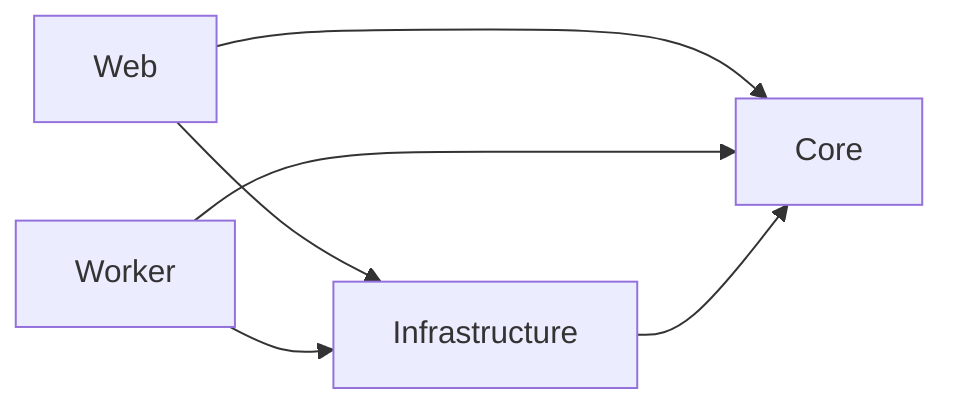

# Source architecture

Source structure includes ADR-0049's Linux App Service Web composition: the
Web host is a framework-dependent Linux x64 `web.zip` deployed to a
`DOTNETCORE|10.0` App Service Web App, while the Worker remains a Flex
Consumption Function App. `infra/modules/platform.bicep` supplies the Web
plan, App Service configuration and managed identity; the release route deploys
the package with `az webapp deploy`. Both hosts configure SQL Server through
`Pegasus.Infrastructure.Persistence.PegasusSqlServer.Configure`, whose
execution strategy retries transient faults outside a store transaction and
runs once inside one (Release 52). Refresh this document when source
structure changes. [Operations](operations.md) owns dated deployed observations
and exact runtime identities.

The corrective change updates intake OCR, estimate import, Contacts, edit
ownership and Case/report workflows; it retains the dependency direction below.

## Components and dependency direction

Core owns policy and ports. Infrastructure implements Core ports. Web and Worker
are composition roots depending on both. No additional application project,
workflow engine or imported source becomes a second business-policy owner.

## Flows and data ownership

- Contacts uses Organization identities with explicit roles and Principal
  associations. Principal policy remains on Principal records; Contacts owns
  the administration routes. Staff accounts have exactly one role.
- Triage and Image Intake records use typed, versioned edit scopes.
  Administration settings use expected-version checks on each save. Case
  editing retains its existing workflow lease and one atomic workspace save
  for data, assessment, damage and image preparation.
- Direct manual Case creation shares the permanent reference allocator with
  receipt acceptance. It creates no intake receipt or invented source provenance.
- Notes and immutable applied guidance share the Case workflow timeline.
  Configured completeness and chase intervals are read by the owning transactions.
- Principal report policy selects Pegasus, EVA ZIP, manual EVA API or automatic
  EVA on Review. A durable automatic intent prevents repeated automatic
  submission; retained outcomes support staff review and an explicit retry.
- Receipt persists original bytes, source identity and durable work before
  publication. Worker owns queued processing and recovery; notification and
  recovery scheduling use the accepted unified queue boundary.
- Staff uploads and retained intake use bounded streams for validation, hashing
  and retention. Custody verifies a temporary file before writing managed content;
  local storage and Box accept streamed writes with explicit length and hash.
  Existing in-memory callers retain their own entry points into the same policy.
- Core route/classification/matching policy determines formal Case, Triage,
  image-origin and Unidentified outcomes. Their identities remain distinct.
- SQL owns application state and provenance. Box owns durable file custody;
  Azure provides processing storage and a derived idle cache.
- Staff, Provider API and Automation callers share Core authorization, state,
  version and policy gates. Automation's unconfirmed writes do not confer
  professional approval or outward-send permission.
- Native engineering and retained report generation use the integrated renderer
  in the existing Web/Infrastructure boundary. EVA is an optional adapter.
- Mail sending tracks attempted operations separately from observed Sent evidence.
- AiWork push and AiJobs pull remain distinct supported integration boundaries.

## Implementation map

| Responsibility | Current source |
| --- | --- |
| Core intake receipt/query/command use cases | `src/Pegasus.Core/Intake/` |
| Core source-download contract and policy | `src/Pegasus.Core/Intake/DownloadIntakeSource.cs`, `src/Pegasus.Core/Intake/IntakeContracts.cs` |
| QDOS extraction policy | `src/Pegasus.Core/Intake/DirectProviders/Qdos/QdosInstructionExtractionPolicy.cs` |
| Evidenced principal mail route, classification, and case-match policies | `src/Pegasus.Core/Intake/PrincipalMailRoutePolicy.cs`, `src/Pegasus.Core/Intake/Classification/PrincipalMailClassificationPolicy.cs`, `src/Pegasus.Core/Intake/CaseMatching/PrincipalCaseMatchPolicy.cs` |
| Core typed classification-to-operational-destination policy (`mail_operational_destination` v1) | `src/Pegasus.Core/Intake/Classification/MailOperationalDestinationPolicy.cs`; every known detailed classification remains in the result, reasoned Other is reserved for novel classifications, and the pure mapping performs no Outlook mutation |
| Core case-match evaluator and `CaseMatchIndex` read model | `src/Pegasus.Core/Intake/CaseMatching/`, `src/Pegasus.Infrastructure/Persistence/CaseMatchEntities.cs` |
| Core image-intake registration, pairing, and lifecycle use cases | `src/Pegasus.Core/ImageIntake/` |
| In-process ONNX VRM recognition engine (ADR-0019) | `src/Pegasus.Infrastructure/Vision/` |
| Multi-format source adapter | `src/Pegasus.Infrastructure/Intake/MimeKitPdfPigOpenXmlIntakeSourceReader.cs` |
| Incoming scanned-instruction OCR | `src/Pegasus.Core/Intake/IntakeOcr.cs` owns receipt/asset-bound operations; `DurableIntake.cs` and `AnalyzeRetainedInstruction.cs` qualify incoming sources and merge selected-page results. Infrastructure implements Azure Document Intelligence; Worker runs durable processing. [ADR-0047](adr/0047-scanned-instruction-ocr-only.md) defines the source boundary. |
| Estimate import | `src/Pegasus.Core/Assessment/EstimateImport.cs` invokes deterministic Infrastructure parsers. Ordinary retained-source recovery remains available; estimates do not enter OCR. |
| Glass's Repair Estimate launch, return and import | `src/Pegasus.Core/Assessment/GlassRepairEstimates.cs` owns the session contract; `src/Pegasus.Infrastructure/Glass/` implements the provider gateway and client (the client's vehicle lookup follows the portal's own stock rule: a stocked registration is searched afresh, an unstocked one is looked up by the stock search itself, a provider "not found" is refused without retry, and a candidate list that is not ready is read three times before it is refused; the gateway writes one warning line with the stage's numbers when a session settles at a failure, refuses a second launch by reading the account's live session before inserting, and keeps every estimate id a session was launched under so a reopened estimate's return is accepted; the session reader also answers the staff member's live session on any Case), built from the four `Glass:*` settings that `src/Pegasus.Web/Program.cs` lists among the Production required keys, so a Web App deployed without them stops at startup. Web callers: the Estimate section of `Pages/Cases/Details.cshtml.cs`, the provider return at `Pages/Integrations/Glass/Callback.cshtml.cs`, and the per-staff credential page at `Pages/Administration/Glass/Index.cshtml.cs`. The estimator opens in its own window (`wwwroot/js/case-workspace.js` names it; the form's `target="_blank"` is the no-script path) and every answer but the estimator itself is `Pages/Shared/_GlassReturn.cshtml`, which hands the Estimate section back to the Case window through `wwwroot/js/glass-return.js`; the provider's cross-site return, which arrives without the SameSite=Strict staff cookie, is first answered with `Pages/Shared/_GlassBounce.cshtml` and `wwwroot/js/glass-bounce.js`, a same-origin re-request of the same address. Bicep supplies the settings to the Web App only. |
| Local artifact adapter | `src/Pegasus.Infrastructure/Intake/FileSystemIntakeArtifactStore.cs` |
| EF receipt, current-association and action-history persistence | `src/Pegasus.Infrastructure/Persistence/EfIntakeReceiptStore.cs`, `src/Pegasus.Infrastructure/Persistence/EfIntakeMutationStore.cs`, `src/Pegasus.Infrastructure/Persistence/EfCaseAcceptanceStore.cs` |
| EF image-intake persistence | `src/Pegasus.Infrastructure/Persistence/EfImageIntakeStore.cs` |
| Database model and migrations | `src/Pegasus.Infrastructure/Persistence/PegasusDbContext.cs`, `src/Pegasus.Infrastructure/Persistence/Migrations/` |
| Web composition, feature gates and route safety | `src/Pegasus.Web/Program.cs` |
| Core retained-mail read model, use cases and freshness policy | `src/Pegasus.Core/Intake/RetainedMail.cs` |
| EF retained-mail store (poll write path and workspace read path) | `src/Pegasus.Infrastructure/Persistence/EfRetainedMailboxMessageStore.cs` |
| Canonical Operations and retained-file viewer callers | `src/Pegasus.Web/Pages/Operations/Index.cshtml.cs`, `src/Pegasus.Web/Pages/Intake/Source.cshtml.cs` |
| Manual upload staging and staged-receipt status callers | `src/Pegasus.Web/Pages/Upload.cshtml.cs`, `src/Pegasus.Web/Pages/UploadStatus.cshtml.cs`, `src/Pegasus.Infrastructure/Persistence/EfQueuedIntakeStatusQueries.cs` |
| Canonical mail-workspace callers (`/Inbox`) | `src/Pegasus.Web/Pages/Mail/Index.cshtml.cs`, `src/Pegasus.Web/Pages/Mail/Message.cshtml.cs` |
| Canonical Triage callers | `src/Pegasus.Web/Pages/Triage/` |
| Case workspace and its capability pages | `src/Pegasus.Web/Pages/Cases/Details.cshtml.cs` owns the one scrolling Case record, its Valuation, Estimate and Report sections, query, edit lease, completeness and saves. `Workflow`, `Tasks`, `Custody`, `Vehicle` and `Closure` `.cshtml.cs` beside it each carry a family of named handlers on the shared `src/Pegasus.Web/Pages/Cases/CaseMutationPageModel.cs`. That base owns the edit-mode state and `HeartbeatLease` handler — `Pages/Shared/_EditHeartbeat.cshtml` posts it at `CaseEditAuthority.HeartbeatInterval` so an open editor is never timed out mid-edit, while the manual `RenewLease` control remains the no-script path and is hidden where script runs. The former `Pages/Cases/Assessment/Index.cshtml.cs` route permanently redirects to the Case record's Estimate section. Partials under `src/Pegasus.Web/Pages/Cases/Shared/` post to the owning page; every mutation redirects back to the workspace, while `Documents/Export` answers with a file from two POST handlers — `?handler=Bundle` for the EVA package, and the unnamed one for a selective export of chosen document versions |
| Genuine-input Web evidence | `tests/Pegasus.IntegrationTests/QdosIntakeWebTests.cs` |
| Route-denial evidence | `tests/Pegasus.IntegrationTests/LocalIntakeAccessTests.cs` |
| Stable persistence and unsupported-source evidence | `tests/Pegasus.IntegrationTests/IntakeStablePersistenceTests.cs` |
| Retained-mail persistence and mail-workspace Web evidence | `tests/Pegasus.IntegrationTests/RetainedMailPersistenceTests.cs`, `tests/Pegasus.IntegrationTests/MailWorkspaceWebTests.cs` |
| LocalDB migration, concurrency, rollback, and retry evidence | `tests/Pegasus.IntegrationTests/IntakePersistenceIntegrationTests.cs` |
| Dependency-direction evidence | `tests/Pegasus.ArchitectureTests/DependencyDirectionTests.cs` |
| Core assessment-report and Estimate document contracts and callers | `src/Pegasus.Core/Reports/AssessmentReportRendering.cs`, `src/Pegasus.Core/Reports/EstimateDocumentRendering.cs` |
| Integrated QuestPDF report adapters, shared governed chrome and embedded fonts (ADR-0050) | `src/Pegasus.Infrastructure/Reports/ReportChrome.cs`, `EstimateDocumentLayout.cs`, `QuestPdfEstimateDocumentRenderer.cs` and the assessment renderer, composed by `src/Pegasus.Infrastructure/DependencyInjection.cs` in the existing Web boundary; page counts are read back with PdfPig |
| Case image tags (vocabulary, per-occurrence assignments, EVA exclusion by the Third party tag) | `src/Pegasus.Core/Documents/ImageTags.cs` owns the vocabulary and the `TagCaseImage`/`UntagCaseImage`/`CreateImageTag` commands; `src/Pegasus.Infrastructure/Persistence/EfDocumentCustodyStore.cs` persists `ImageTags` and `DocumentOccurrenceTags`; `src/Pegasus.Core/Eva/EvaBundleSchema.cs` excludes tagged images. Web callers: `src/Pegasus.Web/Pages/Cases/Custody.cshtml.cs`, `Pages/Cases/Shared/_CaseImages.cshtml`. |
| Case document preview and thumbnail reads (no audit row; cached; `size=thumb` variant) | `src/Pegasus.Core/Documents/CaseDocumentPreview.cs` (`IReadCaseDocumentPreview`, `IReadCaseDocumentThumbnail`); `src/Pegasus.Infrastructure/Custody/CachedDocumentContentStore.cs` (content cache variants, SkiaSharp thumbnail rendering); caller `src/Pegasus.Web/Pages/Cases/Documents/Download.cshtml.cs`. Report and Files use the URL methods in `Details.Files.cs`. The occurrence-scoped preparation read resolves one snapshot; explicit matching `prep` and `renderer` identities permit long-lived private thumbnail caching or 304. Missing/stale identities return current content with `private, no-store`. |
| Focused Case rendering reads | `src/Pegasus.Core/Cases/CaseQueries.cs` owns authorized page-frame, Vehicle, Valuation, Files and Notes readers; `src/Pegasus.Infrastructure/Persistence/EfCaseQueryStore.cs` projects their persisted data. Direct and lazy bodies use the same readers; direct bodies reuse the initial engineering workspace and already-read data/documents. Files' render-only lease validator checks the current holder, expiry and token hash without acquiring or renewing a lease. `wwwroot/js/case-workspace.js` owns Case navigation and lazy mounting; Details alone loads its stylesheet. |
| Request and document-read phase timing | `src/Pegasus.Core/Documents/DocumentReadTelemetry.cs` defines allowlisted phases; the configured production `src/Pegasus.Web/DocumentReadTelemetryBridge.cs` emits phase/duration events through the existing sampled Application Insights pipeline. `WorkspaceRequestTimingFilter` encloses Case/Work Centre activation/execution and separately times result rendering, distinguishing Section/Refresh requests; the handlers, authentication callback, shell filter and report renderer attribute their own work. Nested spans are not additive. It adds no browser SDK or ingestion endpoint. Offline hosting does not compose this bridge or the production Blob document cache. |
| Record edit scopes for Triage and Image Intake records (stale same-holder re-claim, explicit Take over, beacon release) | `src/Pegasus.Core/Workflow/RecordEditScope.cs`, `src/Pegasus.Infrastructure/Persistence/EfEditScopeStore.cs`; `src/Pegasus.Web/wwwroot/js/edit-scope-release.js`. |
| Automatic vehicle lookup at Case creation and the reconciliation sweep | `src/Pegasus.Infrastructure/Persistence/EfVehicleWorkflowStore.cs` (`EnqueueForCase`), called from `EfManualCaseCreationStore.cs` and `EfCaseAcceptanceStore.cs`; provider adapter `src/Pegasus.Infrastructure/Vehicle/DvlaDvsaProductionAdapter.cs`. |
| Administration › Logs: Action logs (acting-principal security events, AI-job record links) and the Intake log (one row per received file, its outcome, and Re-evaluate, Retry allocation and Retry OCR) | `src/Pegasus.Infrastructure/Persistence/EfActionLogQueries.cs`; `src/Pegasus.Core/Operations/IntakeLogQueries.cs` (`IListIntakeLog`, outcome and retryable-failure rules), `src/Pegasus.Infrastructure/Persistence/EfIntakeLogQueries.cs`, `src/Pegasus.Core/Intake/RetryIntakeOcr.cs`; Web `src/Pegasus.Web/Pages/Administration/Logs.cshtml.cs` (the old `ActionLogs` route answers 301 to it), `src/Pegasus.Web/Presentation/AiJobActions.cs`. Operations' failed intake rows post to the Logs handlers. |
| Administration reports (MI-01 to MI-03, the workbook) | `src/Pegasus.Core/Reports/EngineerActivityReport.cs`, `V1ActivityReport.cs`, `AdministrationReportWorkbook.cs` (typed sheets, `IWorkbookWriter`, the month breakdown, `ExportAdministrationReports`); `src/Pegasus.Infrastructure/Persistence/EfEngineerActivityQueries.cs`, `EfV1ActivityReportQueries.cs`, `EfMonthlyReportActivityQueries.cs`; `src/Pegasus.Infrastructure/Reports/OpenXmlWorkbookWriter.cs`; Web `Pages/Administration/Reports.cshtml.cs`. |
| Personal notifications (the bell) | `src/Pegasus.Core/Notifications/` (`StaffNotifications.cs`: causes, recipient rule, 30-day retention, `IMyStaffNotifications`, `PurgeStaffNotifications`; `CaseStaffNotifier.cs`); `src/Pegasus.Infrastructure/Persistence/EfStaffNotificationStore.cs`; Web `src/Pegasus.Web/Pages/Notifications.cshtml.cs`, `Pages/Shared/_ShellDialogs.cshtml`, read per page by `Presentation/RailCountsPageFilter.cs`; the Worker's purge sweep in `src/Pegasus.Worker/IntakeFunctions.cs`. |
| Release notes (What's new) | `src/Pegasus.Core/ReleaseNotes/ReleaseNotes.cs` (`ReleaseNoteAdministration`, `IMyReleaseNotes`, `ReleaseNotePolicy`, `ApplicationBuild`); `src/Pegasus.Infrastructure/Persistence/EfReleaseNoteStore.cs`; Web `Pages/Administration/ReleaseNotes/`, `Pages/ReleaseNotes.cshtml.cs`, the dialog in `Pages/Shared/_ShellDialogs.cshtml`, read per page by `Presentation/RailCountsPageFilter.cs`. |
| Problem reports | `src/Pegasus.Core/Support/ProblemReports.cs` (`ReportProblem`, `RetryProblemReport`, `ListProblemReports`, `ProblemReportPolicy`, the store and sink ports); `src/Pegasus.Infrastructure/Persistence/EfProblemReportStore.cs`; `src/Pegasus.Infrastructure/Support/GitHubIssueProblemReportSink.cs` (the outbound-only sink, chosen in `Program.cs` by configuration); Web `Presentation/ProblemReportRequests.cs`, `Pages/ProblemReports.cshtml.cs`, `Pages/Administration/ProblemReports.cshtml.cs`, the dialog in `Pages/Shared/_ShellDialogs.cshtml` and the form on `Pages/Error.cshtml`. |
| Create audit (the linked Audit Case of an Inspection + Audit) | `src/Pegasus.Core/Lifecycle/CreateAuditCase.cs`; `src/Pegasus.Infrastructure/Persistence/EfCreateAuditCaseStore.cs` (also the Audit/original link and report-generated queries); Box subfolder by `ICaseCustody.CreateLinkedAuditCaseRootAsync` in `src/Pegasus.Infrastructure/Custody/BoxCaseCustody.cs` and `LocalCaseCustody.cs`, run from `EfQueuedCustodyProcessor.cs`; Web `src/Pegasus.Web/Pages/Cases/Details.Frame.cs` (`OnPostCreateAuditAsync`). |
| Work Centre and shell working set | `src/Pegasus.Core/Operations/OperationsSnapshot.cs` (Needs attention, metrics, Office/Mine, due instants, the Operations badge), `src/Pegasus.Core/Operations/RecentCases.cs` (New cases), `src/Pegasus.Core/AiWork/AiDrafts.cs` (`WorkTargets`, AI drafts); Web `src/Pegasus.Web/Pages/Index.cshtml.cs`; the working-set strip `src/Pegasus.Web/Presentation/WorkingSetRecord.cs` with `wwwroot/js/site.js`, and the rail, layout and folded-panel cookies `src/Pegasus.Web/Presentation/ShellPreferences.cs`. |
| Pre-Case image crop and tag, and their prepared tiles | `src/Pegasus.Core/ImageIntake/PreCaseImagePreparation.cs`, `src/Pegasus.Core/ImageIntake/PreCaseImageThumbnail.cs`; `src/Pegasus.Infrastructure/Persistence/EfPreCaseImagePreparationStore.cs` (carried onto the Case occurrence by `EfQueuedCustodyProcessor.cs`), rendering by `ImageThumbnailRenderer` in `src/Pegasus.Infrastructure/Custody/CachedDocumentContentStore.cs`; Web `src/Pegasus.Web/Pages/PreCaseImages/Index.cshtml.cs`, the `size=thumb` read on `Pages/Intake/Asset.cshtml.cs`, `Pages/Shared/_ImageGallery.cshtml` and `_EvidenceViewer.cshtml`. |
| Per-attachment outcomes of a retained message | `src/Pegasus.Core/Intake/RetainedMailAttachmentOutcomes.cs`; Web `src/Pegasus.Web/Pages/Mail/Message.cshtml.cs`. |

## Technical decisions

Read the [ADR index](adr/README.md) and each record's surviving clauses and
successors. Hosting, queued intake, mailbox identity, automation authorization,
renderer packaging and custody each retain their technical owner. Partial
supersession must not be mistaken for whole-record replacement.

## Reference inputs

Provider/principal generators consume supplied evidence and emit review/reference
data. These artifacts do not activate routes. Admitted runtime policy lives in
Core. [Reference authoring](runbook.md)
owns generator commands; supplied vendor specifications live in
[external component documents](external-component-documents/README.md).

## Configuration and deployment

[Configuration](engineering/configuration.md) defines settings. The existing
release skill owns packaging/deployment; one workstation platform produces the
authorized artifacts. A source composition flag or built adapter alone does not
establish the deployed configuration or acceptance. Retired source imports are
described by the [workspace boundary](../workspaces/README.md).
