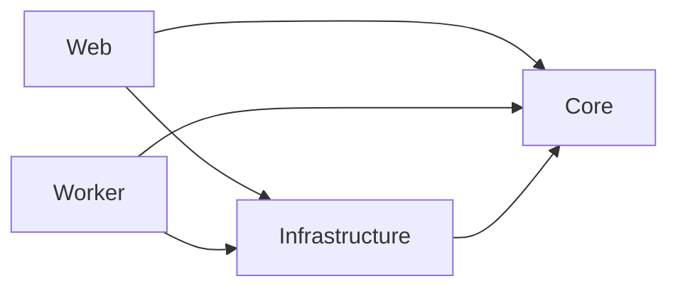

# Source architecture

Source structure includes ADR-0049's Linux App Service Web composition: the
Web host is a framework-dependent, ReadyToRun Linux x64 `web.zip` deployed to a
`DOTNETCORE|10.0` App Service Web App, while the Worker remains a Flex
Consumption Function App. `infra/modules/platform.bicep` supplies the Web
plan, App Service configuration and managed identity; the release route deploys
the package with `az webapp deploy`. Both hosts configure SQL Server through
`Pegasus.Infrastructure.Persistence.PegasusSqlServer.Configure`, whose
execution strategy retries transient faults outside a store transaction and
runs once inside one (Release 52). Refresh this document when source
structure changes. [Operations](operations.md) owns dated deployed observations
and exact runtime identities.

The corrective change updates intake OCR, estimate import, Contacts, edit
ownership and Case/report workflows; it retains the dependency direction below.

## Components and dependency direction

Core owns policy and ports. Infrastructure implements Core ports. Web and Worker
are composition roots depending on both. No additional application project,
workflow engine or imported source becomes a second business-policy owner.

```mermaid
flowchart LR
  Web --> Core
  Web --> Infrastructure
  Worker --> Core
  Worker --> Infrastructure
  Infrastructure --> Core
```

## Flows and data ownership

- Contacts uses Organization identities with explicit roles and Principal
  associations. Principal policy remains on Principal records; Contacts owns
  the administration routes. Staff accounts have exactly one role.
- Triage Cases and Image Intake records use typed, versioned edit scopes; a
  Triage Case's scope is also its authority for Case custody and upload
  association.
  Administration settings use expected-version checks on each save. Case
  editing retains its existing workflow lease and one atomic workspace save
  for data, assessment, damage, image preparation, the Draft repair
  specification, guide cards and valuation adoption.
- Direct manual Case creation shares the permanent reference allocator with
  receipt acceptance and Triage creation. It creates no intake receipt or
  invented source provenance.
- A Case's working values belong to a work of the Case (ADR-0056). The
  persistence context gives every new Case its primary work, whose Id is the
  Case Id; Create audit adds the one Audit work. Writes resolve the current
  work inside their transaction; reads name the current or the primary work.
- Notes and immutable applied guidance share the Case workflow timeline.
  Configured completeness and chase intervals are read by the owning transactions.
- The Case export is a plain staff download on every standard Case. It writes
  one replay-safe history record and changes no Case state.
- Receipt persists original bytes, source identity and durable work before
  publication. Worker owns queued processing and recovery; notification and
  recovery scheduling use the accepted unified queue boundary.
- Staff uploads and retained intake use bounded streams for validation, hashing
  and retention. Custody verifies a temporary file before writing managed content;
  local storage and Box accept streamed writes with explicit length and hash.
  Existing in-memory callers retain their own entry points into the same policy.
  A Box write reads its folder once to prove it, and checks each upload's
  parent from Box's own answer; it never uses the read path's memory. The
  files of one custody work item upload up to three at a time
  (`EfQueuedCustodyProcessor.RetainTogetherAsync`), and the results keep the
  files' order. Once Box has confirmed a file and its record is saved, the
  filer writes the file's read-cache copy through
  `IDocumentContentCachePublisher`, which `CachedDocumentContentStore`
  implements. `EfCaseArtifactCustody` (Case and holding artifacts),
  `ReconcilePendingArtifactCustody`, `EfDocumentCustodyStore` (staff uploads and
  the market research file) and `EfQueuedCustodyProcessor` (Case completions,
  a Vehicle images record's filing and the image fold, from the copy intake
  retained) call it. It never throws,
  gives up on a write after five seconds. Once one write has failed it skips
  the rest of its scope's: a Web request, a queued work item, or a whole run of
  the Worker's reconciliation timer, which can file up to 50 pending versions.
- Core route/classification/matching policy determines formal Case, Triage,
  image-origin and Unidentified outcomes. Their identities remain distinct.
- SQL owns application state and provenance. Box owns durable file custody;
  Azure provides processing storage and a derived idle cache.
- Staff, Principal API and Automation callers share Core authorization, state,
  version and policy gates. Automation's attributed writes do not confer
  professional approval or outward-send permission.
- Native engineering and retained report generation use the integrated renderer
  in the existing Web/Infrastructure boundary.
- Mail sending tracks attempted operations separately from observed Sent evidence.
- The AiJobs pull ledger is the one AI integration boundary; the push hand-off to a channel is retired.

## Implementation map

| Responsibility | Current source |
| --- | --- |
| Core intake receipt/query/command use cases | `src/Pegasus.Core/Intake/` |
| Core source-download contract and policy | `src/Pegasus.Core/Intake/DownloadIntakeSource.cs`, `src/Pegasus.Core/Intake/IntakeContracts.cs` |
| QDOS extraction policy | `src/Pegasus.Core/Intake/DirectPrincipals/Qdos/QdosInstructionExtractionPolicy.cs` |
| Evidenced principal mail route, classification, and case-match policies | `src/Pegasus.Core/Intake/PrincipalMailRoutePolicy.cs`, `src/Pegasus.Core/Intake/Classification/PrincipalMailClassificationPolicy.cs`, `src/Pegasus.Core/Intake/CaseMatching/PrincipalCaseMatchPolicy.cs` |
| Core typed classification-to-operational-destination policy (`mail_operational_destination` v1) | `src/Pegasus.Core/Intake/Classification/MailOperationalDestinationPolicy.cs`; every known detailed classification remains in the result, reasoned Other is reserved for novel classifications, and the pure mapping performs no Outlook mutation |
| Core case-match evaluator and `CaseMatchIndex` read model | `src/Pegasus.Core/Intake/CaseMatching/`, `src/Pegasus.Infrastructure/Persistence/CaseMatchEntities.cs` |
| Core image-intake registration, pairing, and lifecycle use cases | `src/Pegasus.Core/ImageIntake/` |
| In-process ONNX VRM recognition engine (ADR-0019) | `src/Pegasus.Infrastructure/Vision/` |
| Multi-format source adapter | `src/Pegasus.Infrastructure/Intake/MimeKitPdfPigOpenXmlIntakeSourceReader.cs`; `ScanPageClassifier.cs` beside it reads a full-page raster's colour to tell a scanned document page (no image, OCR) from a photograph that fills the page (an ordinary image) ([ADR-0061](adr/0061-ocr-every-scanned-document-page.md)). |
| Incoming scanned-document OCR | `src/Pegasus.Core/Intake/IntakeOcr.cs` owns receipt/asset-bound operations, one per scanned document on every non-Automation source; `IntakeOcrText.cs` turns OCR pages into reader-shaped text; after completion `ProcessIntakeOcr` always runs the third-party report reading (`ThirdPartyReports/RecordThirdPartyReportReading.cs`, one document at a time through `ThirdPartyReportDocuments.cs`) and runs `AnalyzeRetainedInstruction.cs` only while the receipt still needs a Principal. Infrastructure implements Azure Document Intelligence; Worker runs durable processing. [ADR-0061](adr/0061-ocr-every-scanned-document-page.md) defines the boundary. |
| Estimate import | `src/Pegasus.Core/Assessment/EstimateImport.cs` invokes deterministic Infrastructure parsers. Ordinary retained-source recovery remains available; estimates do not enter OCR. |
| Glass's Repair Estimate launch, return and import | `src/Pegasus.Core/Assessment/GlassRepairEstimates.cs` owns the session contract; `src/Pegasus.Infrastructure/Glass/` implements the provider gateway and client (the client's vehicle lookup follows the portal's own stock rule: a stocked registration is searched afresh, an unstocked one is looked up by the stock search itself, a lookup answering no type number is "not found" after that one search and the gateway then launches on an unqualified placeholder vehicle it inserts, re-proves a placeholder by its id, empty registration and recorded type number, and relaxes the export identity check for that session (ADR-0062), and a candidate list that is not ready is read three times before it is refused; the gateway records stage duration/outcome and session/version attempt references, validates current Case authority and unchanged vehicle facts on every continued session and every reopen, and validates named provider vehicle/profile controls before selecting or starting; a repair spec carries the Glass's estimate it belongs to (`CaseRepairSpecifications.Glass*`, migration `20261006160000_RepairSpecificationGlassEstimate`; `GlassRepairEstimateCaseAuthority` reads it), so a launch on that spec reopens the estimate in a new session, ends a colleague's live session on the same stock vehicle through the session store, and its return updates that spec through `ImportRawEstimate`; it writes one warning line with the stage's numbers when a session settles at a failure, refuses a second launch by reading the account's live session before inserting, and keeps every estimate id a session was launched under so a reopened estimate's return is accepted; the session reader also answers the staff member's live session on any Case), built from the four `Glass:*` settings that `src/Pegasus.Web/Program.cs` lists among the Production required keys, so a Web App deployed without them stops at startup. Web callers: the Estimate section of `Pages/Cases/Details.cshtml.cs`, the provider return at `Pages/Integrations/Glass/Callback.cshtml.cs`, and the per-staff credential dialog on `Pages/Administration/Accounts/Index.cshtml.cs`, deep-linked with `?glassStaffId=` beside the account settings dialog. The estimator opens in its own window (`wwwroot/js/case-workspace.js` names it; the form's `target="_blank"` is the no-script path) after a confirmed keep-edit save when the Case is dirty. Each gateway act is split into a prepare half (checks and the durable claim, run in the request) and a continue half (the provider work). The continue half runs in the Web host's own background executor, `src/Pegasus.Web/Background/` (`ProviderWorkQueue`: a bounded channel and the in-process per-session reservations a request takes before its claim and hands to the work it queues, or keeps while it runs the work itself when the queue is full; `ProviderWorkService`: a hosted service that runs one session's work in turn, with one scope per item and an overall time cap), composed by `Pages/Integrations/Glass/GlassSessionWork.cs`, which also lands a held estimate after a return (ADR-0058). The window waits at `Pages/Integrations/Glass/Opening.cshtml`, owner-only through `IGlassRepairEstimateSessionReader.GetOwnAsync`; `wwwroot/js/glass-opening.js` polls its `State` handler, refreshes only the shared Glass controls through the authenticated read-only `GlassSession` handler, then follows its `Go` handler, which settles interrupted work and redirects to the protected provider URL or hands the outcome back. `_GlassReturn.cshtml` uses `wwwroot/js/glass-return.js` to refresh the clean workspace in place or retain a dirty draft and its authority; the provider's cross-site return, which arrives without the SameSite=Strict staff cookie, is first answered with `Pages/Shared/_GlassBounce.cshtml` and `wwwroot/js/glass-bounce.js`, a same-origin re-request of the same address. Bicep supplies the settings to the Web App only. |
| Guide valuation, Glass's and Cazana valuation | `src/Pegasus.Core/Assessment/GuideValuationProviders.cs` owns Get valuation (`FetchGuideValuation`), the provider port, the not-valued answer and its reason (`GuideValuationNotValuedException`) and the filing of a valuation's report (`FileGuideValuationReport`, a Case artifact retained through `ICaseArtifactCustody`, taking no Case version or edit lease). `src/Pegasus.Infrastructure/Glass/GlassGuideValuationProvider.cs` signs in over the same `GlassMvaClient` with the Key Vault-held Glass's valuation account (`GlassValuationAccount`, read on each valuation), reads Retail Transacted and Glass's Trade, saves the vehicle to the account's stock list and hands back the stocked vehicle's PDF report. `AddGlassGuideValuation` composes it in `src/Pegasus.Web/Program.cs`'s Production block only, beside the two `Glass:ValuationAccount:*` Production required keys; `src/Pegasus.Web/Background/GuideValuationReportScheduler.cs` files the report on the provider work queue after the figures have answered (ADR-0060). `src/Pegasus.Infrastructure/Cazana/CazanaGuideValuationProvider.cs` asks Cazana's `valuation/1.0` with the Key Vault-held `CazanaApiKey` as a Bearer header and answers its retail and trade, with no report or VIN; `AddCazanaGuideValuation` composes it in the same Production block beside the `Cazana:ApiKey` required key (ADR-0066). |
| Local artifact adapter | `src/Pegasus.Infrastructure/Intake/FileSystemIntakeArtifactStore.cs` |
| EF receipt, current-association and action-history persistence | `src/Pegasus.Infrastructure/Persistence/EfIntakeReceiptStore.cs`, `src/Pegasus.Infrastructure/Persistence/EfIntakeMutationStore.cs`, `src/Pegasus.Infrastructure/Persistence/EfCaseAcceptanceStore.cs` |
| EF image-intake persistence | `src/Pegasus.Infrastructure/Persistence/EfImageIntakeStore.cs` |
| Database model and migrations | `src/Pegasus.Infrastructure/Persistence/PegasusDbContext.cs`, `src/Pegasus.Infrastructure/Persistence/Migrations/` |
| Web composition, feature gates and route safety | `src/Pegasus.Web/Program.cs` |
| Worker functions and their schedules | `src/Pegasus.Worker/IntakeFunctions.cs` and `EmailEvidenceFunctions.cs` declare five functions. Two run from the work queue: `UnifiedWorkFunction` and `UnifiedWorkPoisonFunction`. Three run on timers: `StagedArtifactReconciliationFunction` (10 seconds), and `PendingWorkRecoveryFunction` and `SentEvidencePollFunction` (one minute, both at second 0, neither with a monitor blob). `PendingWorkRecoveryFunction` also runs the due-work sweep (`RunDueChasers`) and then the approved-inbox recovery on every fifth minute, each with its own 60-second budget; the recovery is `src/Pegasus.Infrastructure/Email/MaintainMailboxChangeSubscriptions.cs` followed by `PollApprovedInbox`. `infra/modules/platform.bicep` holds the schedules, one `Disabled` setting per function and `maximumInstanceCount`; `src/Pegasus.Worker/host.json` filters the host's own log lines. `tests/Pegasus.ArchitectureTests/WorkerTimerContractTests.cs` keeps the function set, the bicep settings, the release scripts' census and the local settings in step. |
| Staff cookie check, page compression and startup readiness | `src/Pegasus.Web/Authentication/StaffPrincipalValidator.cs` checks the account's security stamp, absolute lifetime and enabled state on every request without rebuilding the principal; `tests/Pegasus.ArchitectureTests/StaffAuthorityStampRotationTests.cs` keeps staff authority changes with the owners that rotate the stamp. `Program.cs` compresses `text/html` responses (ADR-0057). `src/Pegasus.Web/Health/StartupWarmup.cs` starts with the host, a few seconds before the `listening` mark, so it overlaps the port binding and never holds it: it loads the data-protection key ring, waits for the Automation OAuth certificates, warms the hot reads, and holds the `ready` health check, and `/health/warm` (the App Service start-up ping, with no database check), until it ends or 45 s pass. It then warms the report renderer through `ReportRenderGate` (`IWarmReportRenderer`) and repeats its reads every three minutes (`Startup:WarmupInterval`) for the life of the process: the Work Centre, the Inbox list, the newest Case's page and the renderer. None of it writes. `DatabaseReadinessHealthCheck` reads the migration history until a probe finds the schema current, then only connects. No remote read holds the port: `StartupServiceCollectionExtensions` in `StartupTimeline.cs` removes the framework's start-up key-ring load, `src/Pegasus.Web/Mcp/OAuthCertificateStore.cs` loads the Key Vault certificates in the background behind a 503 gate, and the verification account reconciles after `ApplicationStarted`. `StartupTimeline` prints the phase timings to stdout, with marks between "host built" and "pipeline built" that name the step holding that time ([runbook § Web start](runbook.md)). The `/health` endpoints are not redirected to HTTPS. |
| Designed case refusals kept out of the exception index | `src/Pegasus.Web/Pages/Cases/DesignedCaseRefusal.cs` is the one classifier; `CaseMutationPageModel.cs` logs a designed refusal with type and message only. Core `src/Pegasus.Core/Workflow/CaseWorkflowContracts.cs` owns the refusal types. |
| Concurrent page reads | `src/Pegasus.Web/Presentation/BoundedReads.cs` runs one request's independent reads, at most four at a time; only readers on their own context-factory context use it. Callers: the Case page phases in `Pages/Cases/Details.cshtml.cs`, whose first two reads (frame, workspace) start together; the Case page, its section fragments, its Glass controls and the Cases queue detail take the assessment access answer from the workflow they already read (`AssessmentAccessPolicy.For` in `src/Pegasus.Core/Assessment/AssessmentWorkspace.cs`). Without it, the Work Centre sections in `Pages/Index.cshtml.cs` start together and share one read of the open AI jobs and the workflow configuration; the Inbox list in `Pages/Mail/Index.cshtml.cs` starts the mailboxes, the list, the scope counts and the freshness together; and `Presentation/RailCountsPageFilter.cs` starts the shell counts, the notifications and the release note together. |
| Core retained-mail read model, use cases and freshness policy | `src/Pegasus.Core/Intake/RetainedMail.cs` |
| EF retained-mail store (poll write path and workspace read path) | `src/Pegasus.Infrastructure/Persistence/EfRetainedMailboxMessageStore.cs` |
| Inbox Dismiss and Restore store and its Web grant | `src/Pegasus.Infrastructure/Persistence/EfRetainedMailDismissalStore.cs` (takes the message row first, then reads history at read committed); the Web role's UPDATE on `RetainedMailboxMessages` is migration `20260929091000_GrantWebRetainedMailDismissal`. |
| Retained-file viewer callers, and Send Unidentified to AI | `src/Pegasus.Web/Pages/Intake/Source.cshtml.cs`; the Unidentified record's `Send Unidentified to AI` handler is `src/Pegasus.Web/Pages/Unidentified/Details.cshtml.cs`; a Draft ready job's review link is Core's `StaffNotificationPolicy.AiDraftRoute`, the route the Work Centre and the Case Next action use |
| Manual upload staging and staged-receipt status callers | `src/Pegasus.Web/Pages/Upload.cshtml.cs`, `src/Pegasus.Web/Pages/UploadStatus.cshtml.cs`, `src/Pegasus.Infrastructure/Persistence/EfQueuedIntakeStatusQueries.cs` |
| Canonical mail-workspace callers (`/Inbox`) | `src/Pegasus.Web/Pages/Mail/Index.cshtml.cs`, `src/Pegasus.Web/Pages/Mail/Message.cshtml.cs`. The list's preview pane and its Preview handler read through `GetRetainedMailPreview` (`src/Pegasus.Core/Intake/RetainedMail.cs`, `EfRetainedMailboxMessageStore.GetPreviewAsync`): the list row is the summary, and only the attachments, the current classification and the folder scope are read besides. The full message page keeps `GetRetainedMail`. |
| Triage Case page and Triage persistence | Core `src/Pegasus.Core/Triage/`; `src/Pegasus.Infrastructure/Persistence/EfTriageStore.cs` creates the Case and its Triage record together and implements the Principal gate. Web `src/Pegasus.Web/Pages/Cases/Details.Triage.cs` and `Pages/Cases/Shared/_TriageCase.cshtml`, dispatched by `Pages/Cases/Details.cshtml.cs` through the Case-kind query; `TriageCaseRouteFilter`, registered in `src/Pegasus.Web/Program.cs`, answers Not found for a Triage id on the other Case capability pages. There is no `Pages/Triage/` route. |
| Case workspace and its capability pages | `src/Pegasus.Web/Pages/Cases/Details.cshtml.cs` owns the one scrolling Case record, its Inspection and Audit views (`?view=`, read through the primary or current work), its Valuation, Estimate and Report sections, query, edit lease, completeness and saves. `Workflow`, `Tasks`, `Custody`, `Vehicle` and `Closure` `.cshtml.cs` beside it each carry a family of named handlers on the shared `src/Pegasus.Web/Pages/Cases/CaseMutationPageModel.cs`. That base owns the edit-mode state and `HeartbeatLease` handler — the Case record's hidden `data-case-heartbeat` form (`Pages/Cases/Shared/_CaseRibbon.cshtml`), beaten by `wwwroot/js/case-workspace.js`, posts it at `CaseEditAuthority.HeartbeatInterval` so an open editor is never timed out mid-edit; it answers the Case version, from which the script catches up with system work that moved the Case under the lease. Partials under `src/Pegasus.Web/Pages/Cases/Shared/` post to the owning page; every mutation redirects back to the workspace, except a save-as-you-go commit that `wwwroot/js/case-workspace.js` posts with its fetch header, which `Pages/Cases/Details.CommitResult.cs` answers with `Shared/_CaseCommitResult.cshtml`, loaded by `LoadCommitResultAsync` under the `web.case.commit` phase, drawing only the notices, the ribbon, the aside, the dialogs and the Save form the script swaps (partials the full page renders too), and the Files section only after a commit that recorded staged crops or rotations (FRD-16); `Documents/Export` answers its one POST handler, `?handler=Bundle`, with the Case export ZIP |
| Genuine-input Web evidence | `tests/Pegasus.IntegrationTests/QdosIntakeWebTests.cs` |
| Route-denial evidence | `tests/Pegasus.IntegrationTests/LocalIntakeAccessTests.cs` |
| Stable persistence and unsupported-source evidence | `tests/Pegasus.IntegrationTests/IntakeStablePersistenceTests.cs` |
| Retained-mail persistence and mail-workspace Web evidence | `tests/Pegasus.IntegrationTests/RetainedMailPersistenceTests.cs`, `tests/Pegasus.IntegrationTests/MailWorkspaceWebTests.cs` |
| LocalDB migration, concurrency, rollback, and retry evidence | `tests/Pegasus.IntegrationTests/IntakePersistenceIntegrationTests.cs` |
| Dependency-direction evidence | `tests/Pegasus.ArchitectureTests/DependencyDirectionTests.cs` |
| Report-requirement ownership evidence | `tests/Pegasus.ArchitectureTests/ReportRequirementOwnershipTests.cs` |
| Core assessment-report and Estimate document contracts and callers | `src/Pegasus.Core/Reports/AssessmentReportRendering.cs`, `src/Pegasus.Core/Reports/EstimateDocumentRendering.cs` |
| Integrated QuestPDF report adapters, shared governed chrome and embedded fonts (ADR-0050) | `src/Pegasus.Infrastructure/Reports/ReportChrome.cs`, `EstimateDocumentLayout.cs`, `QuestPdfEstimateDocumentRenderer.cs`, the assessment renderer, `ReportPhotoPreparation.cs` (one-transform image print and PNG scanline read) and `ReportRenderGate.cs` (admission that counts a render until it stops; report images open one at a time through `ReportImageContent`; their lookups are made together, on the first open, by `IReadLogicalDocumentVersion.PrepareAsync`, and cost three SQL calls for any number of images), composed by `src/Pegasus.Infrastructure/DependencyInjection.cs` in the existing Web boundary; page counts are read back with PdfPig |
| The printed report's wording | `src/Pegasus.Core/Reports/AssessmentReportWording.cs` owns every label, heading, row and tile the report and fee note print outside the narrative; `src/Pegasus.Core/Reports/ReportWording.cs` (`ReportWordingComposition`) owns the narrative blocks and their composed sentences. The layout under `src/Pegasus.Infrastructure/Reports/` prints from both |
| Vehicle plan geometry | `src/Pegasus.Core/Assessment/DamagePlanGeometry.cs` (the car, van and motorbike drawings, embedded from `Assessment/VehiclePlans/`, their hit outlines, the shared body box, the drawing a Vehicle type picks and the comic burst a damage draws as) over `DamageAreaGeometry.cs` (areas, bands and discs). The Case page's `src/Pegasus.Web/Pages/Cases/Shared/_CaseDamage.cshtml` and the report's `src/Pegasus.Infrastructure/Reports/DamagePlanDrawing.cs` both draw from it |
| Report template conformance evidence | `tests/Pegasus.IntegrationTests/Reports/AssessmentReportTemplateConformanceTests.cs` renders the four `reference/rendererref1` sample jobs (`TemplateSampleJobs.cs`) and measures them against the template PDFs (`PrintedPages.cs`); `tests/Pegasus.ArchitectureTests/ReportLayoutWordingTests.cs` proves the layout holds no printed text of its own; CI keeps the rendered PDFs as `rendered-reports-*` |
| Report generation, and settling a report whose file is filed later | `src/Pegasus.Core/Reports/CaseReportGeneration.cs` (`GenerateCaseReport`, where a document's file stands in `CaseReportArtifactFiling`, and the port `ISettleFiledCaseReportArtifacts`); `src/Pegasus.Infrastructure/Persistence/EfCaseReportGenerationStore.cs` (freeze, confirm and recorded outcome) and the port's adapter `EfSettleFiledCaseReportArtifacts.cs`, which confirms through the store's own confirmation; file custody in `src/Pegasus.Infrastructure/Custody/EfCaseArtifactCustody.cs`. The Worker calls the port from `StagedArtifactReconciliationFunction` in `src/Pegasus.Worker/IntakeFunctions.cs`, after pending-custody reconciliation on the same timer. Migration `20260928090000_GrantWorkerGeneratedCaseArtifactUpdate` gives the Worker role its update grant |
| Case image tags (vocabulary, per-occurrence assignments, Case export exclusion by the Third party tag) | `src/Pegasus.Core/Documents/ImageTags.cs` owns the vocabulary and the `TagCaseImage`/`UntagCaseImage`/`CreateImageTag` commands; `src/Pegasus.Infrastructure/Persistence/EfDocumentCustodyStore.cs` persists `ImageTags` and `DocumentOccurrenceTags`; `CaseExportPolicy.SelectEligibleImages` in `src/Pegasus.Core/CaseExport/` excludes tagged images. Web callers: `src/Pegasus.Web/Pages/Cases/Custody.cshtml.cs`, `Pages/Cases/Shared/_CaseImages.cshtml`. |
| Case export | `src/Pegasus.Core/CaseExport/` owns the 13-field mapping (`CaseExportMapping`), the archive (`CaseExportArchive`, `{reference}.zip` holding `{reference}.json` and `Images/`) and image eligibility (`CaseExportPolicy.SelectEligibleImages`) behind `IExportCaseBundle`; `src/Pegasus.Infrastructure/Persistence/EfCaseExportStore.cs` implements it with `CaseExportEvidenceReader` and `CaseExportImageReader` and writes the `case_exported` history record. Web caller: `src/Pegasus.Web/Pages/Cases/Documents/Export.cshtml.cs`, posted from the Case ribbon's Actions menu. |
| Case document preview and thumbnail reads (no audit row; cached; `size=thumb` variant) | `src/Pegasus.Core/Documents/CaseDocumentPreview.cs` (`IReadCaseDocumentPreview`, `IReadCaseDocumentThumbnail`); `src/Pegasus.Infrastructure/Custody/CachedDocumentContentStore.cs` (content cache variants, SkiaSharp thumbnail rendering); caller `src/Pegasus.Web/Pages/Cases/Documents/Download.cshtml.cs`. Report and Files use the URL methods in `Details.Files.cs`. The occurrence-scoped preparation read resolves one snapshot; explicit matching `prep` and `renderer` identities permit long-lived private thumbnail caching or 304. Missing/stale identities return current content with `private, no-store`. |
| Focused Case rendering reads | `src/Pegasus.Core/Cases/CaseQueries.cs` owns authorized page-frame, Vehicle, Valuation, Files and Notes readers; `src/Pegasus.Infrastructure/Persistence/EfCaseQueryStore.cs` projects their persisted data. Direct and lazy bodies use the same readers; direct bodies reuse the initial engineering workspace and already-read data/documents, and the Vehicle body takes the workspace's latest observation, even none. The Case page hands the report snapshot source its frame, whose works count at the same version (`ReportProjectionReuse` in `src/Pegasus.Core/Reports/CaseReportGeneration.cs`), and reads the Case's AI jobs once for the Next action's drafts and the Valuation section's pending research (`AiDraftPolicy`, `MarketResearchPolicy.PendingOf`). Pages that need only a Case's identity, workflow and lease read `IGetCaseHeader` (Inbox message, Compose, Triage linked-Case checks, the Work Centre's assignment dialog, the Case page's Send to AI and estimate edit and import checks, Glass's held-estimate landing); pages that also need the accepted data read `IGetCaseEditBasis` (Cases queue detail, the Work Centre's assign commands, Save); the lease the Case, Custody and Vehicle pages reclaim after a Save or an immediate post reads only the workflow row (`ICaseWorkflowQueries`); `ICaseDocumentQueries` reads a Case's documents alone for the mail attachment lists and the estimate import. No reader loads every body of a Case at once. Files' render-only lease validator checks the current holder, expiry and token hash without acquiring or renewing a lease. `wwwroot/js/case-workspace.js` owns Case navigation and lazy mounting; Details alone loads its stylesheet. |
| Request and document-read phase timing | `src/Pegasus.Core/Documents/DocumentReadTelemetry.cs` defines allowlisted phases; the configured production `src/Pegasus.Web/DocumentReadTelemetryBridge.cs` emits phase/duration events through the existing sampled Application Insights pipeline. `WorkspaceRequestTimingFilter` encloses Case/Work Centre activation/execution and separately times result rendering, distinguishing Section/Refresh requests; the handlers, authentication callback, shell filter and report renderer attribute their own work. Nested spans are not additive. It adds no browser SDK or ingestion endpoint. Runtime diagnostics sit beside it ([runbook § Runtime diagnostics](runbook.md)): `src/Pegasus.Infrastructure/Persistence/ConnectionOpenTimingInterceptor.cs` records connection opens of 100 ms or more and `DeadlockLoggingInterceptor.cs` logs a deadlock victim with its statement, both registered by `PegasusSqlServer`; `src/Pegasus.Web/Health/RequestRuntimeStamps.cs` stamps page requests with thread-pool, garbage-collection and page-fault figures; `RuntimeHeartbeat.cs` logs the container's memory picture every five minutes; `RuntimeCounters.cs` lists the twelve event counters; and `src/Pegasus.Web/QuietRequestTelemetryFilter.cs` drops probe, ping and static-file rows unless they failed. Offline hosting does not compose this bridge or the production Blob document cache. |
| Record edit scopes for Image Intake records (same-holder re-claim, colleague Take over, beacon release) and Triage Cases (held for one save) | `src/Pegasus.Core/Workflow/RecordEditScope.cs`, `src/Pegasus.Infrastructure/Persistence/EfEditScopeStore.cs`; `src/Pegasus.Web/wwwroot/js/edit-scope-release.js`; `src/Pegasus.Web/Presentation/TriageWriteAuthority.cs` claims a Triage scope for one staff save and releases it when the save is refused. `src/Pegasus.Infrastructure/Persistence/CaseMutationAuthority.cs` gives Case custody and upload association the Case workflow or, for a Triage Case, its Triage edit scope. |
| Automatic vehicle lookup at Case creation and the reconciliation sweep | `src/Pegasus.Infrastructure/Persistence/EfVehicleWorkflowStore.cs` (`EnqueueForCase`), called from `EfManualCaseCreationStore.cs` and `EfCaseAcceptanceStore.cs`; provider adapter `src/Pegasus.Infrastructure/Vehicle/DvlaDvsaProductionAdapter.cs`; what an answer fills and records is `src/Pegasus.Core/Vehicle/VehicleLookupFillPolicy.cs` (with `VehicleTypePolicy.cs` and `VehicleMotExpiryPolicy.cs`), applied inside the outcome transaction by `src/Pegasus.Infrastructure/Persistence/EfVehicleLookupWorkStore.cs`. |
| An Audit's Original report cells filled from its filed report (v28 P51, #840, #901) | `src/Pegasus.Core/Assessment/OriginalReportPrefill.cs` (`OriginalReportPrefillPolicy`: printed words to cell codes, the intake-verdict fallback, the recorder id the Extracted tag keys on) and `ReadOriginalReport.cs` (reads the one report file through `IIntakeSourceReader` and `ThirdPartyReportExtraction`, and says whether a filed intake file is a recognised report); the writer that fills only cells staff have not recorded, `src/Pegasus.Infrastructure/Persistence/OriginalReportPrefillWriter.cs`, applied inside the acceptance transaction by `EfCaseAcceptanceStore.cs` (the read happens first, in `src/Pegasus.Core/Intake/AcceptIntake.cs`; a fileless Principal API Audit has no report to read, so the store reads the declared verdict from the retained submission through `EfPrincipalSubmissionStore.ReadDeclaration` and fills from it alone), inside the Mark transaction by `EfDocumentCustodyStore.cs` (read first in `src/Pegasus.Core/Documents/MarkAsOriginalReport.cs`, whose `OriginalReportPolicy` also owns Original report missing), and inside the recognition transaction by the same store's `IRecogniseOriginalReportStore` (read first in `src/Pegasus.Core/Documents/RecogniseFiledOriginalReport.cs`, called by `src/Pegasus.Core/Intake/PromoteAssociatedIntakeCaseEvidence.cs` after it files a receipt); Worker grant `20260928160000_GrantWorkerDocumentOccurrenceUpdate`; Web tag `src/Pegasus.Web/Presentation/OperatorLabels.cs`. |
| A Principal's salvage matrix, which fills the Case salvage value (#945) | `src/Pegasus.Core/Assessment/SalvageMatrix.cs` (the bands, their normalisation and the value for an Engineer's Value and category; `IPrincipalSalvageMatrixQueries`); the update command in `src/Pegasus.Core/Cases/OrganizationAdministration.cs`; `src/Pegasus.Infrastructure/Persistence/EfPrincipalSalvageMatrixQueries.cs` and `EfOrganizationAdministration.cs` over `Principals.SalvageMatrixJson` (migration `20260930090000_PrincipalSalvageMatrix`); Web `Pages/Administration/Contacts/Edit.cshtml` with `wwwroot/js/contacts-edit.js`, and the Case settlement fill in `wwwroot/js/case-workspace.js` (`bindSalvageMatrix`). |
| A Principal's default fee, which a new Case takes as its agreed fee | `src/Pegasus.Core/Cases/PrincipalDefaultFeePolicy.cs` (the standard £180.00, the fee rule and the recorder id); the report-settings command in `src/Pegasus.Core/Cases/OrganizationAdministration.cs`; `src/Pegasus.Infrastructure/Persistence/PrincipalDefaultFeeWriter.cs`, called by `EfCaseAcceptanceStore`, `EfManualCaseCreationStore` and `EfLinkedCaseReplacementStore`, over `Principals.DefaultFee` (migration `20261005150000_PrincipalDefaultFee`); Web `Pages/Administration/Contacts/Edit.cshtml`. |
| Administration › Logs: Action logs (acting-principal security events, AI-job record links) and the Intake log (one row per received file, its outcome, and Re-evaluate, Retry allocation and Retry OCR) | `src/Pegasus.Infrastructure/Persistence/EfActionLogQueries.cs`; `src/Pegasus.Core/Operations/IntakeLogQueries.cs` (`IListIntakeLog`, outcome and retryable-failure rules), `src/Pegasus.Infrastructure/Persistence/EfIntakeLogQueries.cs`, `src/Pegasus.Core/Intake/RetryIntakeOcr.cs`; Web `src/Pegasus.Web/Pages/Administration/Logs.cshtml.cs` (the old `ActionLogs` route answers 301 to it), `src/Pegasus.Web/Presentation/AiJobActions.cs`. |
| Management Reports (MI-01 to MI-04, the workbook, the Case list and its presets) | `src/Pegasus.Core/Reports/EngineerActivityReport.cs`, `V1ActivityReport.cs`, `AdministrationReportWorkbook.cs` (typed sheets, `IWorkbookWriter`, the month breakdown, `ExportAdministrationReports`), `CaseListColumns.cs` (the column catalogue), `CaseListReport.cs` (`CaseListPolicy`, `GetCaseList`, `WorkbookSheetCsv`, `ExportCaseList`), `CaseListPresets.cs`; `src/Pegasus.Infrastructure/Persistence/EfEngineerActivityQueries.cs`, `EfV1ActivityReportQueries.cs`, `EfMonthlyReportActivityQueries.cs`, `EfCaseListQueries.cs` (report figures read with `JSON_VALUE`), `EfCaseListPresetStore.cs`; `src/Pegasus.Infrastructure/Reports/OpenXmlWorkbookWriter.cs`; Web `Pages/Administration/Reports.cshtml.cs` and `Presentation/OperatorCaseListLabels.cs`. |
| Personal notifications (the bell) | `src/Pegasus.Core/Notifications/` (`StaffNotifications.cs`: causes, recipient rule, 30-day retention, `IMyStaffNotifications`, `PurgeStaffNotifications`; `CaseStaffNotifier.cs`); `src/Pegasus.Infrastructure/Persistence/EfStaffNotificationStore.cs`; Web `src/Pegasus.Web/Pages/Notifications.cshtml.cs`, `Pages/Shared/_ShellDialogs.cshtml`, read per page by `Presentation/RailCountsPageFilter.cs`; the Worker's purge sweep in `src/Pegasus.Worker/IntakeFunctions.cs`. |
| Release notes (What's new) | `src/Pegasus.Core/ReleaseNotes/ReleaseNotes.cs` (`ReleaseNoteAdministration`, `IMyReleaseNotes`, `ReleaseNotePolicy`, `ApplicationBuild`); `src/Pegasus.Infrastructure/Persistence/EfReleaseNoteStore.cs`; Web `Pages/Administration/ReleaseNotes/`, `Pages/ReleaseNotes.cshtml.cs`, the dialog in `Pages/Shared/_ShellDialogs.cshtml`, read per page by `Presentation/RailCountsPageFilter.cs`. |
| Problem reports | `src/Pegasus.Core/Support/ProblemReports.cs` (`ReportProblem`, `RetryProblemReport`, `ListProblemReports`, `ProblemReportPolicy`, the store and sink ports); `src/Pegasus.Infrastructure/Persistence/EfProblemReportStore.cs`; `src/Pegasus.Infrastructure/Support/GitHubIssueProblemReportSink.cs` (the outbound-only sink, chosen in `Program.cs` by configuration); Web `Presentation/ProblemReportRequests.cs`, `Pages/ProblemReports.cshtml.cs`, `Pages/Administration/ProblemReports.cshtml.cs`, the dialog in `Pages/Shared/_ShellDialogs.cshtml` and the form on `Pages/Error.cshtml`. |
| E-mail templates (Administration) | `src/Pegasus.Core/Operations/EmailTemplates.cs` (`EmailTemplates`: placeholders, validation, rendering and built-in bodies per purpose; `GetEmailTemplate`, `UpdateEmailTemplate`, `RenderEmailTemplate`, `IEmailTemplateStore`); `src/Pegasus.Core/Triage/TriageOutcomeReply.cs` (a Triage's values), `src/Pegasus.Core/Tasks/CaseChaserFacts.cs` (a Case's chaser values and subject) and `src/Pegasus.Core/Tasks/CaseChaserRecipients.cs` (`ICaseChaserRecipientQueries`, `CaseChaserAddressing`); `src/Pegasus.Infrastructure/Persistence/EfEmailTemplateStore.cs`, `EfCaseChaserRecipientQueries.cs`; Web `Pages/Administration/EmailTemplates/`, `wwwroot/js/email-templates.js`. The Triage Case page opens Reply with finding, and the Case ribbon's Send chaser opens `Pages/Mail/Compose.cshtml.cs` with `purpose=chaser`, through `RenderEmailTemplate`; a `CaseChaser` send that reaches Sent records the chase in `EfStaffMailSendStore.RecordSentChaserAsync`. |
| Create audit (the Audit of an Inspection + Audit Case) | `src/Pegasus.Core/Lifecycle/CreateAudit.cs` (`AuditPolicy`, `ICreateAudit`); `src/Pegasus.Infrastructure/Persistence/EfCreateAuditStore.cs` (the Audit work, the copy of the Inspection's values and the audit-folder custody work); the `a.` Box subfolder through the audit-reference custody path in `EfQueuedCustodyProcessor.cs`; Web `src/Pegasus.Web/Pages/Cases/Details.Frame.cs` (`OnPostCreateAuditAsync`). |
| Case works, references and type codes (ADR-0056) | `src/Pegasus.Core/Cases/CaseWork.cs` (`CaseWorkSet`, `CaseWorkSelector`, `CaseWorkPolicy`), `src/Pegasus.Core/Cases/CaseReferenceFormat.cs` (the one reference formatter and prefix rule); `src/Pegasus.Infrastructure/Persistence/CaseWorkEntities.cs`, `CaseWorkModelConfiguration.cs`, `CaseWorkScope.cs` (current and primary work resolution, as an id or inside a read's own command), `PegasusDbContext.cs` (the primary work added with each Case), `CaseTypeCodes.cs`, `CaseIdentityAllocator.cs` and `CaseAllocationRetry.cs` (locked, retried allocation), `CaseCustodyFolders.cs` (the Case or audit custody folder of a document). |
| Work Centre and shell preferences | `src/Pegasus.Core/Operations/OperationsSnapshot.cs` (Needs attention, metrics including Triages, Office/Mine, due instants), `src/Pegasus.Core/Operations/RecentCases.cs` (New cases), `src/Pegasus.Core/Operations/WorkCentreAiJobs.cs` (AI jobs), `src/Pegasus.Core/Operations/WorkCentreDismissals.cs` (Dismiss: `WorkCentreDismissalPolicy`, `DismissWorkCentreItem`, `IWorkCentreDismissalStore`), `src/Pegasus.Core/Operations/WorkCentreActivity.cs` (the Activity figures: `WorkCentreActivityPolicy`, `GetWorkCentreActivity`, `IWorkCentreActivityQueries`), `src/Pegasus.Core/AiWork/AiDrafts.cs` (`WorkTargets`, AI drafts); `src/Pegasus.Infrastructure/Persistence/EfWorkCentreDismissalStore.cs` (migration `20261002105641_WorkCentreDismissals`), `EfWorkCentreActivityQueries.cs` and the New cases filter in `EfRecentCaseQueries.cs`; Web `src/Pegasus.Web/Pages/Index.cshtml.cs`; the rail, layout and folded-panel cookies `src/Pegasus.Web/Presentation/ShellPreferences.cs`. There is no working-set strip. |
| Background plain thumbnails and the Box read memory | `src/Pegasus.Core/Documents/PrepareDocumentThumbnails.cs` (use case and `IListDocumentThumbnailCandidates`); `src/Pegasus.Infrastructure/Custody/EfDocumentThumbnailCandidates.cs` lists confirmed, current images with no live plain thumbnail. The Worker runs it from `StagedArtifactReconciliationFunction` in `src/Pegasus.Worker/IntakeFunctions.cs`, a few per run as the system worker, through `IReadCaseDocumentThumbnail`. The Box read path's 10-minute folder-ancestry memory and the `Retry-After` wait are in `BoxContentClient` (`src/Pegasus.Infrastructure/Custody/BoxCaseCustody.cs`) and `BoxDocumentContentStore.ReadGatedWithRetryAsync`. The same client asks for a file's content beside its metadata. Its write side proves a folder before it uploads: `ProveCaseFolderAsync` reads a Case folder once, and `ProveFolderAsync` reads any other folder and then each folder above it up to the approved root, one read each. It uploads only into a proved folder, and checks the parent Box names in the upload's answer; `BoxCaseCustody` keeps that proof for the life of the root object a piece of work carries. `BoxTokenRenewalService` (`src/Pegasus.Infrastructure/Custody/BoxTokenRenewalService.cs`) renews the token that `BoxJwtAuthorizationHeaderProvider` holds. The Case export and the report preview read photographs cache first through `IReadCachedDocumentVersions`. Generate looks its pinned images up together through `IReadLogicalDocumentVersion.PrepareAsync` (`EfCaseReportContentSource`) and opens each one's bytes as it is printed. Intake image addresses and their browser caching rule are `src/Pegasus.Web/Presentation/IntakeImageAddress.cs`. |
| Filed-estimate recognition | `src/Pegasus.Core/Assessment/RecogniseFiledEstimates.cs` (use case and `IEstimateRecognitionCandidates`) and `EstimateFormats` in `src/Pegasus.Core/Assessment/EstimateImport.cs`, the one rule the import and this sweep share for what an estimate document is; `src/Pegasus.Infrastructure/Custody/EfEstimateRecognitionCandidates.cs` lists confirmed, current versions whose `DocumentVersions.IsRecognisedEstimate` is still NULL (migration `20261001090000_DocumentVersionEstimateRecognition`). The Worker runs it from `StagedArtifactReconciliationFunction` in `src/Pegasus.Worker/IntakeFunctions.cs`, a few per run as the system worker, through `IReadLogicalDocumentVersion`. The Case Files row offers Import as repair spec only on a version recorded as an estimate (`IsImportableEstimate` in `src/Pegasus.Web/Pages/Cases/Details.cshtml.cs`). |
| Pre-Case image crop and tag, and their prepared tiles | `src/Pegasus.Core/ImageIntake/PreCaseImagePreparation.cs`, `src/Pegasus.Core/ImageIntake/PreCaseImageThumbnail.cs`; `src/Pegasus.Infrastructure/Persistence/EfPreCaseImagePreparationStore.cs` (carried onto the Case occurrence by `EfQueuedCustodyProcessor.cs`), rendering by `ImageThumbnailRenderer` in `src/Pegasus.Infrastructure/Custody/CachedDocumentContentStore.cs`; Web `src/Pegasus.Web/Pages/PreCaseImages/Index.cshtml.cs`, the `size=thumb` read on `Pages/Intake/Asset.cshtml.cs`, `Pages/Shared/_ImageGallery.cshtml` and `_EvidenceViewer.cshtml`. |
| Per-attachment outcomes of a retained message | `src/Pegasus.Core/Intake/RetainedMailAttachmentOutcomes.cs`; Web `src/Pegasus.Web/Pages/Mail/Message.cshtml.cs`. |

## Technical decisions

Read the [ADR index](adr/README.md) and each record's surviving clauses and
successors. Hosting, queued intake, mailbox identity, automation authorization,
renderer packaging and custody each retain their technical owner. Partial
supersession must not be mistaken for whole-record replacement.

## Reference inputs

Principal generators consume supplied evidence and emit review/reference
data. These artifacts do not activate routes. Admitted runtime policy lives in
Core. [Reference authoring](runbook.md)
owns generator commands; supplied vendor specifications live in
[external component documents](external-component-documents/README.md).

## Configuration and deployment

[Configuration](engineering/configuration.md) defines settings. The existing
release skill owns packaging/deployment; one workstation platform produces the
authorized artifacts. A source composition flag or built adapter alone does not
establish the deployed configuration or acceptance. Retired source imports are
described by the [workspace boundary](../workspaces/README.md).
