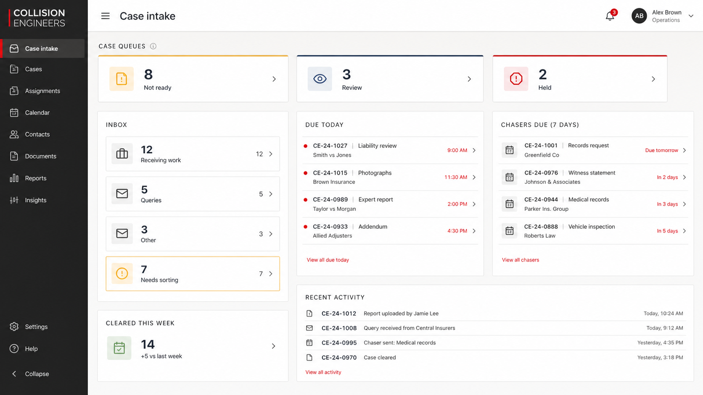

# Concept 1: operations cockpit

## Intent

Answer the start-of-day question in a few seconds: where is work accumulating, what is due, and what needs intervention?

## Keep

- Queue hierarchy remains close to the operator-supplied dashboard reference.
- Left navigation makes the application feel like one workspace rather than a collection of pages.
- Due and chaser lists reveal actual work, not only counts.
- Recent activity helps a small office coordinate without a separate monitoring screen.

## Change before implementation

- Replace all invented sample references/providers with approved local fixtures.
- Navigation must reflect actual first-MVP scope; remove Reports, Insights, or other items until a real caller exists.
- Implement the settled queue split: Review is complete work awaiting approval; Held is a reasoned manual pause that blocks progression and chasers while keeping the due date visible.
- Add the manual Blocked intake inbox filter with its reason, warning, and retry path; it must never look like a created case.
- Design unavailable/stale counts and refresh failure, not just populated success.
- Avoid a notification centre unless real in-product notifications are in scope.
