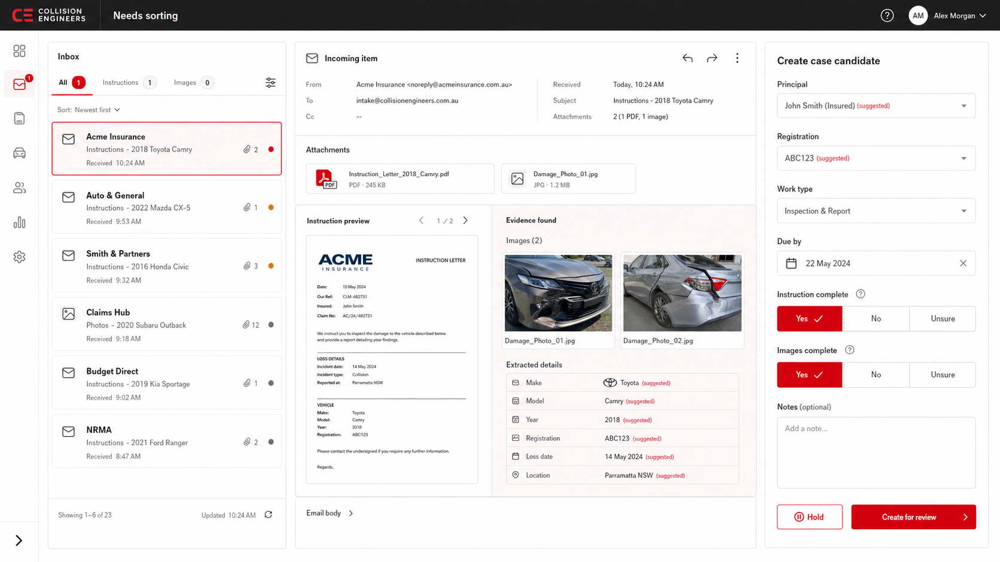

# Concept 2: intake workbench

## Intent

Put incoming transport evidence, document/image evidence, and operator confirmation in one view. This is the strongest candidate for the first QDOS workflow because it exposes why the application proposes a value.

## Keep

- All / Instructions / Images filters.
- Attachment and document preview next to evidence found.
- Suggested values are visually distinct from confirmed values.
- Separate instruction and image completeness decisions.
- Block intake, Create incomplete, and Create for review are explicit actions. Block intake requires a reason and leaves the source in the inbox without a case/reference. Create incomplete accepts a case into `Not ready`; Create for review accepts a case into `Review` after the operator separately judges instructions and images complete. The configurable completeness gate is applied later at Engineer assignment, not at case creation.

## Change before implementation

- The generated Australian providers, addresses, dates, registration, and document content are visual filler.
- Principal must be a work provider, not a claimant/insured name.
- Show evidence source for each suggestion and contradictions across email, PDF, filename, and image.
- Make unsupported/corrupt files and transient extraction failures recoverable.
- Confirm when reference allocation occurs; creating a candidate must not silently consume a number unless that is the accepted rule.
