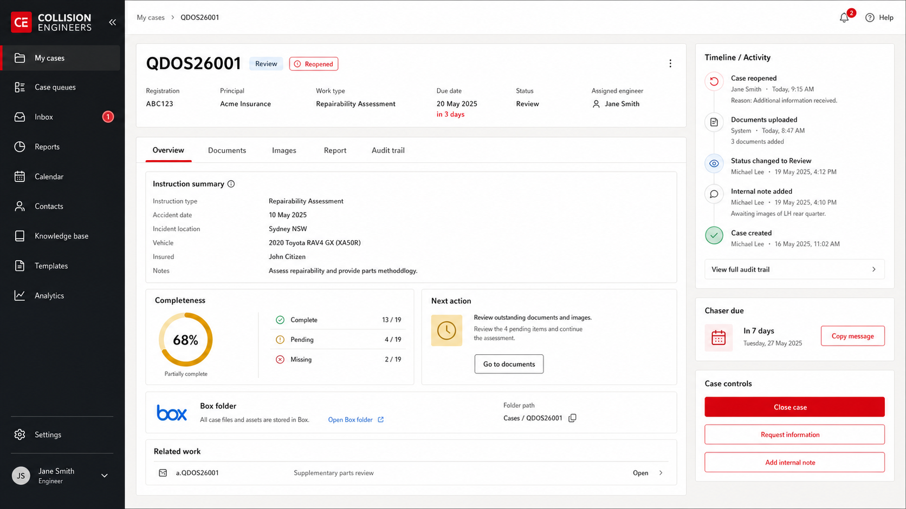

# Concept 3: case workspace

## Intent

Create one durable home for the case after intake, keeping identity, next action, history, Box, and related audit work visible.

## Keep

- Persistent `QDOS26001` header and a visible reopened state.
- Overview, Documents, Images, Report, and Audit trail tabs.
- Timeline with actor and reason.
- Manual seven-day chaser with Copy message.
- Related `a.QDOS26001` shown without replacing the parent reference.
- No delete control.

## Change before implementation

- Sample case details and work type are illustrative, not requirements.
- Completeness should use separate instruction/image dimensions rather than a decorative percentage unless a transparent scoring rule is approved.
- Close case must present the three named terminal outcomes and capture reason/actor.
- Related audit UI must also handle `ap.` and inspection-plus-audit creation rules.
- Box folder state needs missing, pending creation, inaccessible, and conflict states.
