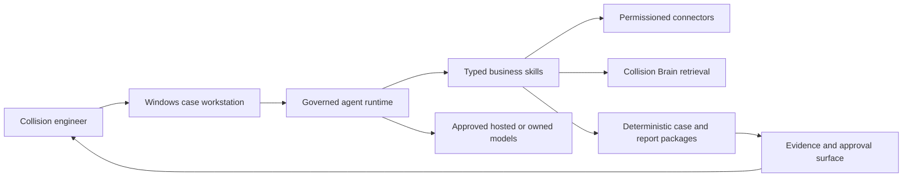

# Collision AI Centre

Collision AI Centre is the engineering home for a full Windows AI workstation built specifically
for collision engineers and remote vehicle assessment.

The intended product combines a case-centred desktop experience with governed agents that can
assemble instructions and evidence, work with Outlook, support assessment and valuation, retrieve
cited technical knowledge, draft correspondence, and produce reviewable reports and PDFs. The
engineer remains the decision-maker and author of record.

## Current state

This repository is at foundation stage.

- `services/collision-brain` is an implemented, tested provider-neutral ingestion and retrieval
  service with MCP interfaces.
- `ml-ops/reports` and `ml-ops/strategy` contain the opportunity assessment, governance analysis,
  training strategy, evaluation framework, and phased delivery research.
- The desktop app, connectors, shared packages, and model pipelines described by the imported
  source are not implemented here and are not Pegasus application authority. `Pegasus.Core`
  owns case policy; `design/` owns the product UI; `workspaces/report-renderer` owns document
  rendering.
- Private corpus material remains outside this repository under the ignored, immutable `corpus/`
  boundary. Box and Outlook archives are not imported. The historical data-use authorisation
  records permitted evaluation use only; it does not override repository source-role, custody,
  publication, external-operation, or caller gates.

## Product shape

## Start here

- [Delivery plan](PLAN.md)
- [System architecture](docs/architecture/system-overview.md)
- [Data boundaries](docs/governance/data-boundaries.md)
- [Data-use authorisation](docs/governance/data-authorisation.md)
- [Repository decisions](docs/adr/0001-repository-and-runtime-boundaries.md)
- [ML operations](ml-ops/README.md)
- [Collision Brain](services/collision-brain/README.md)

Repository contributors and coding agents must read [the workspace instructions](../AGENTS.md).
