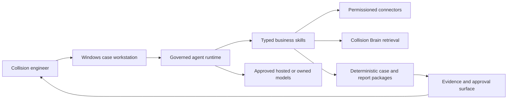

# Collision AI Centre

Collision AI Centre is the engineering home for a full Windows AI workstation built specifically
for collision engineers and remote vehicle assessment.

The intended product combines a case-centred desktop experience with governed agents that can
assemble instructions and evidence, work with Outlook, support assessment and valuation, retrieve
cited technical knowledge, draft correspondence, and produce reviewable reports and PDFs. The
engineer remains the decision-maker and author of record.

## Current state

This repository is at foundation stage.

- `services/collision-brain` is an implemented, tested provider-neutral ingestion and retrieval
  service with MCP interfaces.
- `ml-ops/reports` and `ml-ops/strategy` contain the opportunity assessment, governance analysis,
  training strategy, evaluation framework, and phased delivery research.
- The desktop app, production business agents, connectors, shared packages, and model pipelines are
  scaffolded but not yet implemented.
- The inspected source corpus is under `ml-ops/data/private/raw`. Collision Engineers has explicitly
  authorised use and sharing of this corpus and the complete Box and Outlook archives for repository
  inclusion, ingestion, retrieval, dataset construction, training, fine-tuning, and evaluation.
- This data permission is recorded in
  [the data-use authorisation](docs/governance/data-authorisation.md); live sending, case-system writes,
  report issuance, deployment, and spending remain separately controlled actions.

## Product shape

## Start here

- [Delivery plan](PLAN.md)
- [System architecture](docs/architecture/system-overview.md)
- [Data boundaries](docs/governance/data-boundaries.md)
- [Data-use authorisation](docs/governance/data-authorisation.md)
- [Repository decisions](docs/adr/0001-repository-and-runtime-boundaries.md)
- [ML operations](ml-ops/README.md)
- [Collision Brain](services/collision-brain/README.md)

Repository contributors and coding agents must read [AGENTS.md](AGENTS.md).
