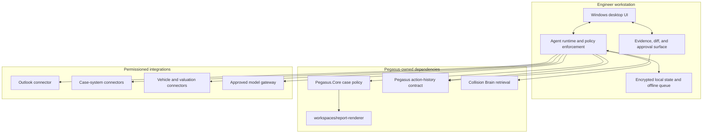

# AI Centre architecture and data boundaries

AI Centre is currently a source-only development and evaluation workspace. The repository records granted data-use authorisation and defines development, evaluation and long-term product direction; it does **not** prove an active Pegasus caller, model activation, agent runtime, Collision Brain integration, desktop application or deployed AI Centre service.

Intended, implemented, caller-proved, deployed and accepted are distinct evidence states. Documentation or code may express intent without proving implementation; an implementation does not prove a real Pegasus caller; a caller does not prove deployment or acceptance; and acceptance must come from the appropriate product, architecture and operational authority.

Product scope is owned by [requirements](../../../docs/prd/README.md) and [capabilities](../../../docs/capabilities.md). Unresolved choices remain in [open decisions](../../../docs/open-decisions.md).

The retained source-workspace decisions are
[ADR-0001: repository and runtime boundaries](adr/0001-repository-and-runtime-boundaries.md)
and [ADR-0002: Windows desktop stack](adr/0002-windows-desktop-stack.md).
They are superseded proposal evidence, not current Pegasus architecture.

## Product and runtime boundary

A future AI Centre surface may give a Collision Engineer one case-centred place for evidence review, retrieval, assisted drafting, valuation and report preparation. The engineer remains the decision-maker and author of record.

It must not become a second product, policy, case-data, audit or document-rendering authority.

| Owner | Responsibility | Boundary |
|---|---|---|
| Pegasus Web application and the root [design contract](../../../docs/design.md) | Product interaction and approval | A future desktop composition must reuse this contract rather than create an independent product owner. |
| `Pegasus.Core` | Business policy, immutable case identities, accepted structured facts, versions and business mutations | Agents and other AI Centre components may act only through accepted Core ports. |
| Agent runtime, if activated | Orchestration and proposals | It does not own case policy, and its existence is not currently caller-proved. |
| Skills | Bounded reusable AI operations and validation | They do not own case policy. |
| Activated connectors | Implement accepted Pegasus ports | They must not expose credentials to models. A connector must not be duplicated merely for AI Centre. |
| Collision Brain | Bounded ingestion, retrieval, citations and deletion | It does not generate answers and may be used only through an accepted, caller-backed retrieval port. It remains a non-caller development workspace. |
| `workspaces/report-renderer` | Deterministic document assembly | It does not infer facts and must not be duplicated here. |
| Pegasus action-history contract | Audit ownership and integration contract | AI Centre may emit required events but must not create a competing audit model. |
| ML operations | Training, evaluation and promotion evidence | It does not approve application releases. |

No case domain, desktop shell, renderer, audit model or connector may be duplicated in this workspace. Any activated agent or Collision Brain integration must call an accepted `Pegasus.Core` port.

## Proposed runtime shape

The following is the imported source proposal, retained to show intended boundaries. It is not current Pegasus architecture and creates no runtime caller or model activation.

The diagram describes trust boundaries rather than deployed components:

- workstation-local state would require encryption plus a defined offline queue and threat model;
- Pegasus services remain authoritative for case policy and accepted state;
- integrations are permissioned external boundaries;
- an approved model gateway would still require separate activation, provider, residency and operational approval;
- credentials remain inside connector or platform security boundaries and are never model context.

The repository deliberately does not lock a desktop framework or hosted topology. Any provider or deployment decision must preserve local development, contract-testable connectors, portable services, explicit data residency and an engineer-appropriate offline/degraded mode.

## Proposal, approval and audit invariants

If a runtime is accepted and activated:

1. Every material generated statement must reference evidence or an accepted fact.
2. Proposed changes must be presented as diffs before acceptance.
3. Generated content and agent proposals do not become case facts merely because they were produced.
4. External actions must be separate tool calls with visible approval.
5. Report preview must precede explicit issue approval.
6. Every case access, proposal, acceptance, connector mutation and export must emit a redacted audit event.
7. The engineer remains responsible for professional judgement and the issued work product.

These controls do not themselves authorise live actions, deployment or model use.

## Deferred desktop direction

The long-term direction permits a Windows-installed shell, local integration and an offline or degraded experience around accepted Pegasus capabilities. It is not implemented or activated; no `apps/` directory exists in this imported tree, and the desktop remains documentation-only intent.

A future desktop composition must reuse:

- `Pegasus.Core` policy and immutable case identities;
- the root [design contract](../../../docs/design.md);
- accepted Pegasus application and service APIs;
- `workspaces/report-renderer`; and
- Collision Brain only through an accepted, caller-backed retrieval port.

The implementation technology remains undecided. WebView packaging, a native shell, a progressive web application or another desktop-capable composition remain options until a reviewed decision establishes the caller, update model, security boundary and deployment path.

The intended surface may support:

1. case and instruction review;
2. evidence, image and document inspection;
3. cited knowledge retrieval;
4. engineer-controlled drafting and comparison;
5. report preview and explicit issue approval;
6. permissioned Outlook and vehicle-data integrations; and
7. clear online, offline and degraded-state behaviour.

Desktop implementation remains deferred until all of the following exist:

- a root product allocation and accepted architecture decision;
- an exercised Pegasus caller and API contract;
- a design mapping under root `design/`;
- an installation, update, identity and local-data threat model;
- an offline/degraded-state contract; and
- end-to-end evidence that business policy, the case store, audit model and renderer have not been duplicated.

## Data-use authority and non-authorisations

Collision Engineers, confirmed directly by the repository owner, granted the recorded authorisation on **21 July 2026** for bounded evaluation and development use of the named private corpus. Relevant Box and Outlook material is included only subject to separate, exact-target access approval.

This authority permits development and ML-operations activities such as inventory, extraction, deduplication, dataset construction, evaluation and approved model experiments. It does not make source material product authority or application state.

It does **not** authorise:

- repository inclusion or publication of private material;
- complete or bulk archive import;
- live-system access;
- external transfer;
- sending email;
- altering a live case system;
- issuing or signing a professional report;
- deploying a service; or
- incurring external cost.

Those actions retain separate product, security, operational and financial approval gates.

Private material remains outside Git history under the ignored repository-root `corpus/ai-centre/` boundary. Complete Box and Outlook archives remain in their source systems. Any bounded extract must preserve source custody, provenance, case isolation and source-role rules. Generated results belong under root `artifacts/`.

Authorisation does not make every statement authoritative or every artifact suitable for every model task. Pipelines must preserve enough context to interpret material correctly, including:

- provenance and sender/source role;
- client and case boundaries;
- purpose and evidential authority;
- report version and evidence cutoff;
- third-party licence metadata;
- retention and deletion lineage; and
- source custody and permitted task.

## Data classes and permitted movement

| Class | Examples | Git | External model or service | Training |
|---|---|---|---|---|
| Public or synthetic | Schemas, fake fixtures, public-domain examples | Allowed after review | Per approved provider policy | Only with a recorded licence |
| Internal approved knowledge | CE-authored playbooks and approved templates | Usually a private repository; minimise | Only for an approved deployment and purpose | Only when the dataset manifest permits it |
| Authorised case or archive data | Instructions, email, images, reports, registrations and personal data | Never; retain under ignored `corpus/ai-centre/` custody | Only within a separately approved technical and provider boundary | Bounded extracts only through a versioned dataset manifest |
| Licensed ephemeral material | Per-job OEM, repair or valuation material | Never persist beyond applicable terms | Only when both the licence and provider permit it | Never by default |
| Secrets and credentials | Tokens, passwords, certificates and portal credentials | Never | Never | Never |

Credentials, tokens, passwords, private keys, malware and executable payloads are not training data. The known `Manufacturers.ods` credential sheet must remain blocked from ingestion, and its credentials should be rotated. This control does not prevent authorised use of the remainder of the archives.

## Corpus contract

The repository-root `corpus/ai-centre/` subtree is the common local input boundary for development and ML operations. It contains owner-provisioned approved source snapshots and bounded evaluation inputs. It is ignored by Git and treated as immutable input, never as repository content.

Workspace-local `ml-ops/data/` paths are not used.

### Source mapping

| Former location | Repository-root corpus location |
|---|---|
| `ml-ops/data/private/raw/Reports-selected/` | `corpus/ai-centre/raw/Reports-selected/` |
| `ml-ops/data/private/raw/Documents/` | `corpus/ai-centre/raw/Documents/` |

A narrower case or knowledge-library path must resolve beneath `corpus/ai-centre/`. Code and manifests must accept the corpus root as configuration instead of embedding a workstation-specific absolute path.

Raw files remain immutable. Tests and documentation use synthetic or redacted examples rather than copying operational content into tracked files. Derived datasets must be reproducible from versioned manifests and written outside `corpus/`, normally under root `artifacts/`.

The intended repository layout is (of these, only root `artifacts/` and the
ignored corpus boundary exist today; `ml-ops/datasets/` and `models/` are
unrealised intent):

- `corpus/ai-centre/` — ignored, immutable approved development and ML-operations inputs and owner-provisioned bounded evaluation extracts;
- `ml-ops/datasets/` — versioned recipes, schemas, manifests, cards and synthetic fixtures only;
- root `artifacts/` — generated run, dataset and evaluation outputs;
- `models/` — model cards, configurations, manifests and artifact references, never a private training corpus.

Provisioning or refreshing `corpus/ai-centre/` is an owner-controlled local data operation. Repository automation must:

- fail closed when a required corpus path or manifest is absent;
- never download corpus content;
- never commit corpus content; and
- never rename, rewrite or delete corpus content.

## Dataset and experiment promotion gate

Every bounded training or evaluation dataset requires a versioned manifest identifying:

- purpose and owner;
- the recorded authorisation;
- sources and source roles;
- licence classes;
- permitted tasks and excluded material;
- minimisation and pseudonymisation;
- lineage and deduplication;
- case and time split;
- retention and deletion propagation;
- access and location;
- review date; and
- approval.

Training code must fail closed when the manifest is missing. This is a reproducibility and control gate, not a new request for permission to use the named archives.

An approved dataset or experiment does not activate a model, prove a Pegasus caller, approve a provider, deploy a service or authorise operational use. Model training, evaluation and promotion evidence remains separate from application release approval.

## Logging, tests and demonstrations

Use opaque synthetic case identifiers in tests and documentation. Screenshots and demonstrations must use deliberately designed synthetic cases.

Logs should contain hashes, counts, classifications, durations and redacted error codes where possible. They must not contain message bodies, report text or image content.

## Historical provenance

The imported system proposal and desktop direction remain useful only as historical rationale. The two unchanged superseded workspace ADRs covering those proposals remain under [docs/adr/](adr/) in this workspace; each self-declares its supersession for Pegasus integration by root ADR-0009. Superseded records do not establish current acceptance, implementation, deployment, a Pegasus caller or model activation.
