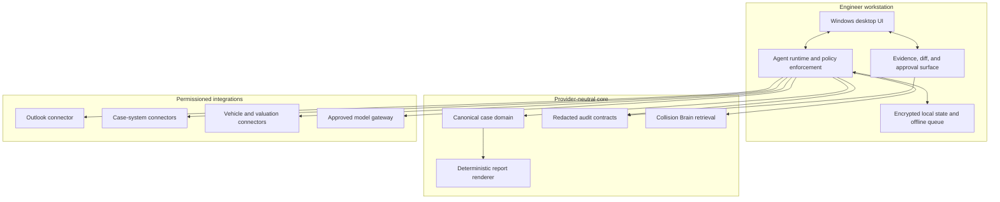

# System overview

## Architectural intent

Collision AI Centre is a case-centred, evidence-first Windows workstation. A desktop shell composes
governed agents; agents call typed skills; skills use deterministic domain packages, permissioned
connectors, Collision Brain, and approved models. No model receives ambient authority.

## Ownership boundaries

- The desktop owns interaction and approval, not domain truth.
- The case domain owns accepted structured facts and versions.
- Agents own orchestration and proposals, never silent mutation.
- Skills own reusable operations and validation.
- Connectors own authentication/provider translation and never expose credentials to models.
- Collision Brain owns ingestion, retrieval, citations, and deletion; it does not generate answers.
- The renderer owns deterministic document assembly; it does not infer facts.
- ML operations owns training/evaluation/promotion evidence, not application release approval.

## Non-negotiable flows

All material generated statements reference evidence or an accepted fact. Proposed changes are shown
as diffs before acceptance. External actions are separate tool calls with visible approval. Every
case access, proposal, acceptance, connector mutation, and export emits a redacted audit event.

## Deployment shape

The repository deliberately does not yet lock the desktop framework or hosted topology. Provider
decisions must preserve local development, contract-testable connectors, portable services, explicit
data residency, and an offline/degraded mode appropriate for engineers. See the proposed desktop ADR.
