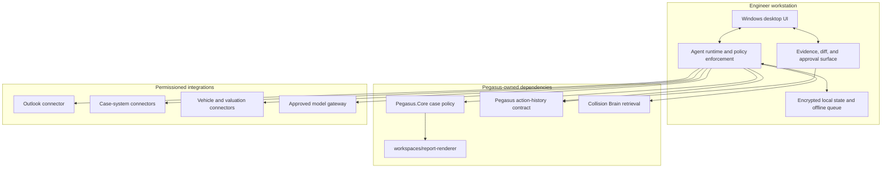

# System overview

## Source proposal and current boundary

This diagram preserves the imported AI Centre proposal; it is not current Pegasus architecture
and creates no runtime caller. Any activated agent or Collision Brain integration must call an
accepted `Pegasus.Core` port. The Pegasus UI remains under `design/`, and deterministic document
assembly remains owned by `workspaces/report-renderer`. No case domain, desktop shell, renderer,
audit model, or connector may be duplicated in this workspace.

## Ownership boundaries

- The Pegasus Web application and `design/` own interaction and approval.
- `Pegasus.Core` owns accepted structured facts, versions, and business mutations.
- Agents may own orchestration and proposals only through accepted Core ports.
- Skills own bounded reusable AI operations and validation, not case policy.
- Activated connectors implement accepted Pegasus ports and never expose credentials to models.
- Collision Brain owns its bounded ingestion, retrieval, citations, and deletion; it does not generate answers.
- `workspaces/report-renderer` owns deterministic document assembly; it does not infer facts.
- ML operations owns training/evaluation/promotion evidence, not application release approval.

## Non-negotiable flows

All material generated statements reference evidence or an accepted fact. Proposed changes are shown
as diffs before acceptance. External actions are separate tool calls with visible approval. Every
case access, proposal, acceptance, connector mutation, and export emits a redacted audit event.

## Deployment shape

The repository deliberately does not yet lock the desktop framework or hosted topology. Provider
decisions must preserve local development, contract-testable connectors, portable services, explicit
data residency, and an offline/degraded mode appropriate for engineers. See the proposed desktop ADR.
