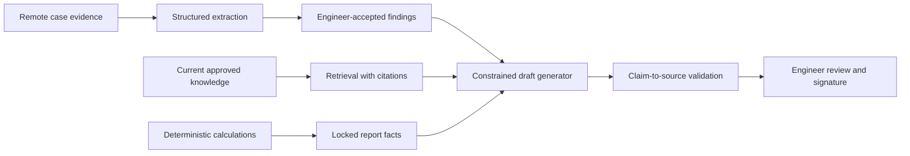

# Report Generation, Style and Expert Opinion

## Executive conclusion

The report corpus is well suited to a controlled drafting assistant that reproduces Collision Engineers' structure, terminology and tone. It is not suitable evidence that a language model can independently form or sign an expert opinion.

The recommended design generates prose only from engineer-accepted structured findings, calculations and retrieved references. Each material sentence should be traceable to an image, document, calculation, external result or explicit engineer inference. A named engineer reviews and approves the complete report.

## What can be learned

Approved reports can teach:

- section order and template selection;
- preferred terminology;
- concise descriptions of visible damage;
- ways of expressing remote-evidence limitations;
- repairable and total-loss narrative patterns;
- valuation and estimate explanations;
- query-response style;
- standard caveats;
- document formatting.

Original, audit and amended versions are particularly useful for learning common drafting defects. They should be represented as version history, not treated as three independent equally correct answers.

## Ground-truth rules

Only include a document as a positive drafting target when:

- it is authored or approved by Collision Engineers;
- its version and approval state are known;
- the input evidence available at that point is known;
- any later correction is linked;
- personal or client-specific material has been handled under the approved governance policy.

Incoming instructions, solicitors' positions, repairer estimates and copied third-party wording are context. They are not the firm's style or professional conclusion.

## Recommended generation architecture



The drafting model should not receive an unlabelled inbox dump and be asked to “write the report”. The structured boundary reduces source confusion and makes unsupported statements detectable.

## Templates, retrieval and fine-tuning

Use templates for:

- required sections;
- fixed declarations;
- tabular schedules;
- calculation presentation;
- mandatory remote-assessment limitations;
- signature and version metadata.

Use retrieval for:

- current technical methods;
- legal and professional guidance;
- approved stock explanations;
- client-specific contractual requirements;
- versioned internal policies.

Use fine-tuning for:

- tone and concision;
- terminology selection;
- converting a stable fact schema into approved prose;
- selecting the right approved paragraph pattern;
- rejecting irrelevant third-party language.

Fine-tuning should not be used to memorise current prices, legal tests or manufacturer procedures.

## Style replication

Style can be learned with paired examples:

```json
{
  "input": {
    "section": "damage_assessment",
    "accepted_findings": [],
    "limitations": [],
    "audience": "instructing_party"
  },
  "target": {
    "approved_text": "",
    "template_version": "",
    "author_role": "collision_engineer"
  }
}
```

Where several engineers have materially different styles, use an explicit approved style profile rather than allowing the model to infer author identity from personal or client features. A single house style may be easier to govern.

## Expert evidence and legal context

Where reports may be used as expert evidence, governance must reflect the engineer's overriding duty and the applicable procedural requirements. [Civil Procedure Rules Part 35](https://www.justice.gov.uk/courts/procedure-rules/civil/rules/part35) and [Practice Direction 35](https://www.justice.gov.uk/courts/procedure-rules/civil/rules/part35/pd_part35) should be treated as controlled reference sources, with legal review of the implemented workflow.

The system should preserve:

- who prepared, reviewed and approved the report;
- the model and prompt/template versions;
- the evidence and reference versions used;
- all material edits;
- calculations;
- unresolved contradictions;
- the exact final document.

AI must not be described as the expert. It is a drafting and checking tool used under the engineer's control.

## Factuality and provenance checks

Before a draft reaches the engineer, automated checks should:

- map every material fact to a source;
- reject vehicle-identity conflicts;
- reconcile monetary tables;
- verify that visible, reported and inferred facts are described differently;
- compare report component/side labels with the accepted findings;
- detect statements based only on later evidence;
- identify missing mandatory sections;
- highlight retrieved material with an expired or superseded effective date;
- scan for copied third-party instructions presented as the firm's conclusion.

Unsupported sentences should be removed or clearly marked for completion, not hidden behind a generic confidence score.

## Evaluation

Use a blinded human review plus automatic checks:

- factual consistency;
- unsupported-assertion rate;
- source-citation correctness;
- required-section completion;
- calculation consistency;
- tone and terminology;
- preservation of uncertainty;
- edit distance and engineer review time;
- audit correction and amendment rate;
- inadvertent personal-data leakage;
- inappropriate copying of third-party language.

A high “accepted without edits” rate is not sufficient. It may indicate automation bias. Periodic detailed audit is required even when engineers accept drafts quickly.

## Deployment controls

- Never auto-sign, auto-issue or silently amend a report.
- Lock the accepted structured facts separately from generated prose.
- Display source links during review.
- Require explicit resolution of contradictions and high-risk warnings.
- Use a document hash and version identifier for each final report.
- Keep a rollback path to the prior approved template and model.
- Prevent live emails or new evidence from changing an already issued report without a new version.
- Sample reports for independent QA after deployment.

## Recommended pilot

Start with one stable report type and generate only two or three narrative sections from engineer-accepted facts. Use the existing template for everything else. Run in shadow mode against a time-held-out case set, then with a small engineer group.

The pilot should stop if it increases unsupported statements, hides uncertainty, introduces source-role confusion or produces a higher audit-correction rate even when drafting time falls.

## Conclusion

The reports can be used to replicate Collision Engineers' presentation style and reduce drafting effort. The defensible boundary is clear: structured systems and engineers establish the opinion; the model expresses accepted content, cites its basis and remains fully reviewable.
