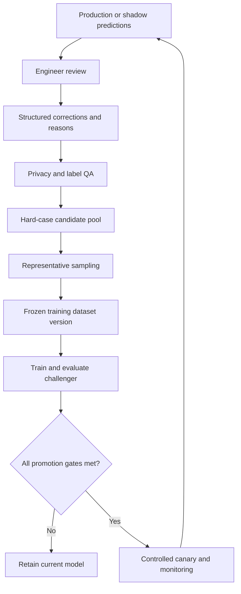

# Human Oversight, Active Learning and Feedback

## Executive conclusion

“Human in the loop” is not sufficient if the human is shown a polished conclusion without its evidence, lacks time to challenge it or learns that acceptance is expected. Oversight must be meaningful: the engineer needs source access, uncertainty, edit controls and authority to reject the entire output.

The same review process can create excellent training data. Corrections, abstentions and disagreement reasons should feed a governed active-learning loop, but only after review and version control.

## Oversight by risk

### Low-risk automation

Examples:

- file conversion;
- exact duplicate detection;
- arithmetic;
- formatting;
- known-reference extraction.

These can run automatically when failure monitoring and exception queues exist.

### Assisted decisions

Examples:

- case matching;
- view and quality classification;
- operation proposals;
- comparable ranking;
- report drafting;
- query-response drafting.

Users should see the source, confidence and alternatives and be able to correct the result.

### High-consequence professional conclusions

Examples:

- incident-relatedness;
- economic total-loss conclusion;
- roadworthiness wording;
- salvage categorisation;
- final PAV;
- signed report;
- material amendment.

These require explicit review and approval by an appropriately competent engineer. The system must not default an unanswered review to acceptance.

## Review interface requirements

For every proposed finding, show:

- the exact supporting images or text;
- source role and timestamp;
- observation status: visible, reported or inferred;
- model/rule version;
- confidence and known limitation;
- conflicting evidence;
- retrieved reference and effective date;
- the effect on calculations and narrative.

Review controls should support:

- approve;
- edit;
- reject;
- request evidence;
- mark not assessable;
- identify wrong source/case;
- record a concise reason.

Batch acceptance should be limited for high-risk content.

## Feedback taxonomy

Free-text comments are useful but difficult to learn from. Use structured reasons such as:

- wrong component;
- wrong side;
- damage not visible;
- damage unrelated/uncertain;
- evidence insufficient;
- wrong vehicle identity;
- operation unsupported;
- method or value outdated;
- third-party statement treated as fact;
- duplicated evidence;
- wording overstated;
- correct but incomplete;
- new evidence changed conclusion;
- client-specific requirement;
- model abstention appropriate.

Retain the engineer's free-text explanation alongside the code.

## Active-learning loop

Candidate selection should include:

- high uncertainty;
- model disagreement;
- engineer rejection;
- rare classes;
- new vehicle types;
- evidence-source shifts;
- safety-relevant errors;
- representative ordinary cases.

Sampling only model failures can distort the dataset; retain a representative baseline.

## Avoiding feedback contamination

Do not automatically train on every accepted suggestion. Acceptance may reflect time pressure or automation bias. Before promotion:

- sample accepted outputs for independent audit;
- resolve conflicting engineer labels;
- identify whether later information changed the answer;
- confirm authorisation to use the example;
- remove test-set cases and near duplicates;
- freeze and hash the training snapshot;
- document inclusion rules.

Keep model-generated prose marked as such. It should not later re-enter the dataset as apparent human-authored ground truth without approval metadata.

## Measuring meaningful oversight

- time spent reviewing by risk level;
- percentage of suggestions expanded to inspect evidence;
- accept/edit/reject rates;
- independent audit error rate after acceptance;
- override reasons;
- disagreement between engineers;
- automation-bias challenge tests;
- model abstention acceptance;
- number of reports issued with unresolved warnings;
- correction recurrence after retraining.

Very fast approval of complex output may be a warning, not a success metric.

## Roles

- **Engineer:** accepts professional findings and final reports.
- **Auditor/quality lead:** reviews material errors and samples accepted cases.
- **Data steward:** governs data eligibility, lineage and retention.
- **Domain lead:** owns taxonomy and approved references.
- **ML owner:** trains, evaluates and packages models.
- **Release approver:** decides promotion against documented gates.
- **Security/privacy owner:** reviews access, incidents and DPIA controls.

One person may hold more than one role in a small organisation, but the decisions should remain explicit.

## Data-protection considerations

The oversight design should be reviewed against the [ICO's AI and data-protection guidance](https://ico.org.uk/for-organisations/uk-gdpr-guidance-and-resources/artificial-intelligence/guidance-on-ai-and-data-protection/), including fairness, transparency, minimisation and risks from automated decisions. The applicable legal position and client obligations should be confirmed by qualified advisers before live use.

## Recommended pilot

Instrument one low-risk assistant and one engineer-facing proposal task. Capture structured corrections for a defined period without retraining. Audit whether:

- reasons are usable;
- reviewers inspect evidence;
- labels are consistent;
- the interface encourages appropriate abstention;
- accepted output is actually accurate.

Only then create the first active-learning dataset and evaluate a challenger offline.

## Conclusion

Good oversight both protects the professional decision and creates a defensible learning system. The key is to capture why the engineer changed or rejected a suggestion, not merely whether a button was clicked.
