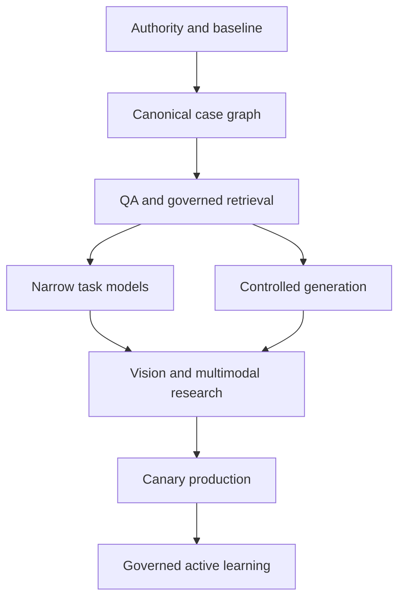

# Phased Delivery Plan

## Executive conclusion

A credible programme should move from rights and data lineage to measurable low-risk assistance, then to vision and multimodal reasoning. Each phase has an exit gate; no phase assumes that access to more data automatically grants permission or makes the labels reliable.

The sequence below can be run incrementally. Timings should be estimated only after the corpus size, team, infrastructure and source-system constraints are measured.

## Phase 0 — Authority, purpose and baseline

### Objectives

- define the business purposes and prohibited uses;
- map controller/processor and client obligations;
- establish rights to reports, images, reference documents and email;
- complete or initiate the DPIA and security threat model;
- define human decision ownership;
- measure the current workflow and quality baseline.

### Deliverables

- data-source and rights register;
- approved initial use cases;
- prohibited-use list;
- retention and deletion policy;
- access model;
- baseline metrics;
- pilot governance and stop criteria;
- decision register.

### Exit gate

No live case data enters a training environment until the source, purpose, lawful basis/contractual authority, access and retention rules are documented.

## Phase 1 — Canonical data foundation

### Objectives

- ingest case folders and a controlled mailbox sample;
- parse PDFs, email and images;
- content-address artifacts;
- deduplicate while preserving receipt lineage;
- link instruction, evidence, estimates, reports and versions;
- label source role and evidence cutoff.

### Deliverables

- canonical case schema and event model;
- parser/OCR benchmark;
- artifact and case manifests;
- source-role taxonomy;
- version/supersession graph;
- privacy/minimisation transformations;
- data-quality dashboard;
- frozen evaluation cohort.

### Exit gate

Case-link precision, attachment recall and cross-case isolation meet the agreed thresholds. A domain reviewer can reconstruct a sample report from its source timeline.

## Phase 2 — No-training and low-risk assistance

### Objectives

- implement deterministic QA;
- index approved knowledge with version/effective-date metadata;
- provide case search and evidence timelines;
- establish workflow and evidence-completeness analytics;
- create human review and correction capture.

### Deliverables

- identity/arithmetic/version/citation rules;
- permission-aware RAG;
- source-linked case summary;
- queue/deadline dashboard;
- structured feedback reasons;
- audit and monitoring events.

### Exit gate

QA finds useful historical defects at an acceptable alert burden; retrieval citations are correct; no cross-case or permission leakage occurs in the test suite.

## Phase 3 — Narrow pretrained models

### Objectives

- view and image-quality classification;
- identifier OCR and conflict detection;
- message purpose, source-role and case-match classification;
- estimate-line normalisation;
- comparable relevance ranking.

### Deliverables

- versioned labelled datasets;
- case/time/source-aware splits;
- baseline and challenger metrics;
- calibrated thresholds and abstention;
- portable model bundles;
- offline inference smoke tests.

### Exit gate

Each model beats simple baselines on a sealed holdout and meets task-specific false-ready, cross-case, safety and calibration limits.

## Phase 4 — Controlled generation

### Objectives

- draft evidence requests;
- draft selected report sections from accepted facts;
- create issue maps and technical query responses;
- validate every material sentence against a source;
- measure human review behaviour.

### Deliverables

- locked input schemas;
- approved templates and style guide;
- prompt/RAG evaluation suite;
- optional style fine-tune;
- pre-send/pre-issue validation;
- complete generation audit trail.

### Exit gate

Unsupported assertions, cross-case leakage, source-role confusion and material audit corrections remain below approved limits. The system never auto-sends or signs.

## Phase 5 — Vision and multimodal research

### Objectives

- component/damage localisation;
- multi-image evidence aggregation;
- proposed repair operations;
- supplement-risk estimation;
- total-loss triage and visible safety prompts.

### Deliverables

- COCO-style detection/segmentation annotations;
- case-level evidence-grounded targets;
- temporal amendment labels;
- rare-condition challenge sets;
- finding-to-image interface;
- comparison of pipeline and VLM approaches.

### Exit gate

The model demonstrates evidence-grounded incremental value in shadow mode, including calibrated abstention and acceptable performance on rare/high-consequence slices. A safety case defines exactly what it may and may not do.

## Phase 6 — Controlled production and learning

### Objectives

- canary deployment with a small authorised group;
- active monitoring;
- independent sample audits;
- feedback governance;
- challenger evaluation;
- incident and rollback rehearsal.

### Deliverables

- release checklist;
- live model dashboard;
- weekly high-risk error review;
- active-learning candidate pool;
- data/model cards;
- rollback evidence;
- post-pilot decision.

### Exit gate

The pilot meets quality, service, human-factor, privacy and economic criteria over a representative period. Expansion is a recorded decision, not an automatic consequence of usage.

## Workstreams across every phase

### Domain

Taxonomy, labels, source authority, adjudication, report requirements and professional limits.

### Data

Ingestion, lineage, quality, splits, minimisation, deletion and manifests.

### ML

Baselines, training, evaluation, calibration, artifact packaging and drift monitoring.

### Product

Evidence-first interface, feedback controls, workflow integration and usability.

### Governance

Privacy, security, client obligations, human oversight, independence and release approval.

## Programme metrics

Maintain a balanced scorecard:

- evidence completeness and time to completeness;
- cross-case and identity errors;
- material QA defects prevented;
- unsupported finding rate;
- engineer preparation and review time;
- amendment/query rates by reason;
- model calibration and abstention;
- privacy/security incidents;
- user overrides and trust;
- infrastructure and annotation cost per case.

No phase should be judged solely by model accuracy or time saved.

## Dependencies

## Team shape

At minimum, the programme needs named responsibility for:

- collision-engineering domain decisions;
- data stewardship/privacy;
- data engineering;
- ML/evaluation;
- product/workflow design;
- application/security engineering;
- quality and release approval.

External specialists can supply parts of the work, but taxonomy, promoted datasets, evaluation evidence and portable model artifacts should remain under Collision Engineers' control.

## Conclusion

The plan creates value at every stage and avoids a long speculative “train a model” programme. If a later multimodal system fails to justify deployment, the firm still retains a clean case corpus, stronger QA, searchable knowledge and improved operations.
