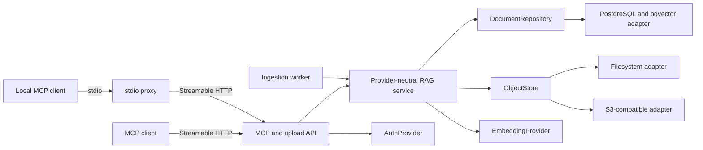

# Architecture

## Responsibilities

The service owns ingestion, source retention, indexing, retrieval, citations, and deletion. It does
not own answer generation. Retrieved text is untrusted data and never acquires tool authority.

## Data flow

1. `POST /uploads` validates an extension, stages bytes, and returns an HMAC-signed, expiring
   reference. The worker removes expired unconsumed uploads.
2. `write` accepts either inline text or that reference, calculates a SHA-256 content hash,
   deduplicates, writes the source through `ObjectStore`, and creates a document plus ingestion job.
3. The worker atomically claims a job, extracts text, normalises and chunks it, creates embeddings,
   and replaces the document's derived chunks.
4. `lookup` embeds the query and asks `DocumentRepository` for weighted vector/full-text results.
   Only `ready` documents are eligible.
5. `remove` marks the record as deleting, removes its source object, deletes active database
   content, and writes a content-free tombstone.

## Portability boundaries

- The package-local `Core.cs` owns domain policy and ports; adapters and hosts depend on those interfaces, never the reverse.
- PostgreSQL is accessed through standard SQL plus the open pgvector extension.
- Source storage supports filesystem and the S3 protocol; other protocols can implement
  `ObjectStore`.
- Authentication validates configurable OIDC issuer/audience/JWKS values rather than a named
  identity provider.
- Embedding identity, model, dimensions, and version are persisted per document.
- Runtime components are standard OCI containers and communicate through environment variables.

## Known v1 constraints

- The initial PostgreSQL migration fixes vector dimensions at 384. Changing models requires a
  migration and full re-index.
- Local feature-hash embeddings are deterministic test/prototype infrastructure, not a selected
  production retrieval model.
- PDF extraction handles text PDFs only. OCR and image understanding are deferred.
- PostgreSQL is authoritative; vector chunks are derived from retained source objects and can be
  rebuilt unless the document has been purged.
